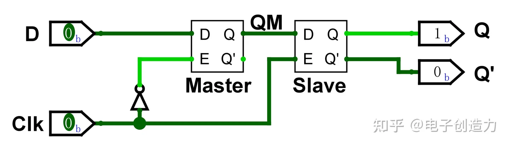

# 数字电路基础

## 数字电路

利用两种不连续的电位来表示信息的电子电路

- 1 = 电源电压 = H / 高电平
- 0 = 接地电压 = L / 低电平
- 大部分数字电路是基于叫做 MOSFET（Metal-Oxide-Semiconductor Field-Effect Transistor，金属氧化物半导体场效应管）的场效应管实现的

## 数值表达

- 数字电路的设计基于二进制数
- **有符号二进制数**
	- **补码**表示法，最高位为 0 时是正数，最高位为 1 时是负数
	  
	- 如何取补码？全反，+1
	- 设计初衷：相加时无需考虑符号的处理，能够和其相反数相加通过**溢出**从而使计算机内计算结果变为 0 的二进制码

**比特和字节**

- 二进制中的一个数字位称为 binary digit，简称比特（bit）。一个字节（byte）代表 8 比特
- 绝大多数 CPU 都是以字节为单位处理数据的
- 内存地址大多也是为每字节赋予一个地址，称为**字节编址方式**

## MOSFET 的结构

MOSFET 有 P 型 MOSFET 和 N 型 MOSFET 两种。

MOSFET 有源极（Source，电流输入）、漏极（Drill，电流输出）和栅极（Gate，电流控制）3 个电极

> [!quote]
> 下面以 N 型 MOSFET 为例说明其工作原理。在不给控制电流的栅极施加电压时， 源极和漏极间填充了异种半导体材料，因此电流无法流过。当给栅极施加正电压时，源极和漏极中 N 型半导体材料里的自由电子被栅极吸引，使通道中充满电子，源极和漏极间的电流从而能够流动
> 
> Note. 具体可参考 SI100B 笔记

N 型 MOSFET 在栅极施加电源电压（H）时电流可以流通，接地（L）时电流无法流通。反之，P 型 MOSFET 的栅极接地时电流可以通过，施加电源电压时电流无法流过。

### CMOS

这种持有相反特性的 N 型 MOSFET 和 P 型 MOSFET 互补使用形成的门电路称为 **CMOS** （Complementary Metal Oxide Semiconductor，互补金属氧化物半导体）。CMOS 可以用来制作各种各样的逻辑电路。

## 逻辑运算

逻辑运算是只用“真”（对应 H / 1）、“假”（对应 L / 0）二值进行的运算

三种基本运算：AND, OR, NOT

## CMOS 基本逻辑门电路

### 两种 MOSFET

| N 型 MOSFET | P 型 MOSFET |
| :---: | :---: |
|  |  |
| 施加电源电压可流通，接地无法流通 | 接地可以流通，施加电源电压无法流通 |

### NOT 门的 MOSFET 级实现

	

### MIL（美军标准）逻辑符号

具体实现见 SI100B 笔记及 Turing Complete（逃

## 存储元件

### 锁存器（Latch）

#### 简单的循环回路锁存器

#### Data Latch / D-Latch

**AKA.** 通过型锁存器

4 个 NAND 门构成，两个输入（Data / Enable）
- `Enable = 0`
	- 输出维持前一个数据
- `Enable = 1`
	- 输出更新为 `Data`

#### SR Latch

###  触发器（Flip-Flop）

#### D Flip-Flop

D 锁存器和 NOT 门组合，可以实现**依据时钟信号同步并保存数据**的 D 触发器

拥有两个输入（Data / Clock），两个输出

- `Clock = 0`
	- Master 启用：读取当前输入并传递给 Slave
	- Slave 禁用：不会影响 Slave 本身的值
- `Clock = 1`
	- Master 禁用：此时的输入不会导致 Slave 接收到的数据变化
	- Slave 启用：读取之前的 Master 值并成功更新输出
- 检测时钟信号**上升** 

> [!note] 建立时间 / 保持时间
> 
> 
> 
> D 触发器是由**时钟信号的边沿**来触发数据的存储动作的。因此，需要在时钟沿前后一段时间内将输入信号**稳定下来**。如果在时钟变化时输入信号也在变化，很可能无法正确存储数据。
> 因此，为了让 D 触发器正确存储数据，需要有建立时间（setup time）和保持时间（hold time）两个基本条件。
> 
> **建立时间**是在时钟变化前必须稳定输入信号的时间，而**保持时间**是时钟变化后必须稳定输入信号的时间。 
> 
> 图 1-32 说明了建立时间和保持时间的关系。同时遵守建立时间和保持时间，就可以让 D 触发器正确的存储数据。
> 

### 组合电路和时序电路

- **组合逻辑电路**是指输出值仅由输入信号的状态决定的电路
	- 输出不依赖于过去的输入
	- 不含有存储元件
- **时序电路**是指输出值同时依赖于现在和过去输入信号的逻辑电路
	- 含有用于保持输入的存储元件

## 时钟同步设计

一种数字电路的设计技术，区别现在和过去

- **时钟信号**：周期性在 H / L 之间变化
	- 时钟变化**边沿** （上升沿或下降沿）之前被称为**过去**，之后被称为**现在**
- 由时钟边沿触发同步更新电路的状态