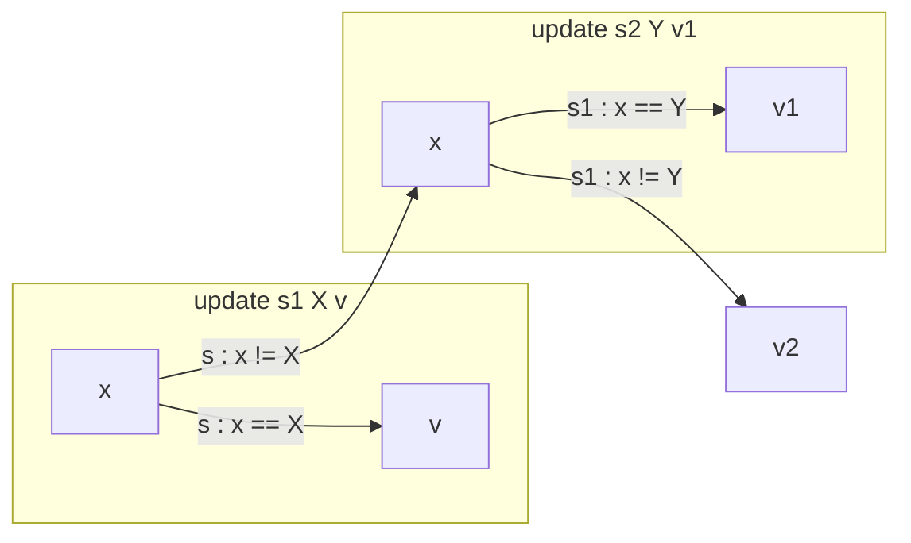

# 编译原理 - Lecture 1

## Introductions: Compilers, Interpreters, and OCaml

> 本笔记适用于
> 
> - UPENN CIS 3410/7000
> - ShanghaiTech CS 131 2024+
> - Havard CS 153

## AST

来看看我们演示中设计的 SIMPLE 语言的语法

```txt
 *  <exp> ::= 
 *         |  <X>                       // variables
 *         |  <exp> + <exp>             // addition
 *         |  <exp> * <exp>             // multiplication
 *         |  <exp> < <exp>             // less-than
 *         |  <integer constant>        // literal
 *         |  (<exp>)
 *
 *  <cmd> ::= 
 *         |  skip
 *         |  <X> = <exp>
 *         |  ifNZ <exp> { <cmd> } else { <cmd> }
 *         |  whileNZ <exp> { <cmd> }
 *         |  <cmd>; <cmd>
```

我们可以用如下的方式表达

```ocaml
type var = string

type exp =
  | Var of var
  | Add of exp * exp
  | Mul of exp * exp
  | Lt  of exp * exp
  | Lit of int

type cmd =
  | Skip
  | Assn of var * exp
  | IfNZ of exp * cmd * cmd
  | WhileNZ of exp * cmd
  | Seq of cmd * cmd
```

现在，假设我们的程序需要完成一个阶乘的人物，它用别的语言看起来可能如下：

```c
X = 6;
ANS = 1;
whileNZ (X) {
	ANS = ANS * X;
	X = X + -1;
}
```

我们使用我们构建的语法来表达就会是这样 ~~哇哦，真是回调地狱呢，Promise? Monad? 救一下啊~~

```ocaml
let factorial : cmd =
  let x = "X" in
  let ans = "ANS" in
  Seq(Assn(x, Lit 6),
      Seq(Assn(ans, Lit 1),
          WhileNZ(Var x,
                  Seq(Assn(ans, Mul(Var ans, Var x)),
                      Assn(x, Add(Var x, Lit(-1)))))))
```

## Interpreters and State

通过 AST 确定好需要的“功能”之后，我们编写一个简单的解释器，让他能够解释简单的代码，并且具有记忆状态。

我们可以定义一个 `state` 类型用于传递，这就相当于程序的“记忆”，需要用状态来传递，本质上就是在传递一个能从不同的变量名映射到不同值的函数

```ocaml
type state = var -> int
```

这个状态本质上就是一个 `var` (`string`) 到 `int` 的映射（函数），通过传入变量名获得变量的当前值

首先需要一个初始状态，也就是 `var -> 0`

```ocaml
let init_state : state = 
  fun x -> 0
```

接下来需要一个抽象的更新函数，用来更新状态量

```ocaml
let update (s:state) (x:var) (v:int) : state =
  fun (y:var) ->
    if x = y then v else s y
```

这个 `update` 将会对于变量名 `x` 将一个旧的状态 `s : x -> old` 更新为新的状态 `'s : x -> v` ，新的状态只会在当以后“取值”操作时需要的变量名等于此次更新的变量名时才会返回当前的新值，而在其他情况会继续去旧的状态寻找变量名。

也就是说，我们赋值/更新一个变量的时候，实际上是对状态更新了一层递归结构，这个递归结构是一层一层的 `if` 构成，直到找到需要且最新的变量名并传出，否则会继续从旧的状态中递归查找。

例如：



那么如何查找呢？我们定义了 `lookup` 来查找

```ocaml
let lookup (s:state) (x:var) : int = s x
```

`lookup` 用来将状态中的变量名递归查找。

接下来是表达式的解析，我们使用了 `rec` 关键字来标记这是一个递归操作：

```ocaml
let rec interpret_exp (s:state) (e:exp) : int =
  begin match e with
    | Var x -> lookup s x
    | Add(e1, e2) -> (interpret_exp s e1) + (interpret_exp s e2)
    | Mul(e1, e2) -> (interpret_exp s e1) * (interpret_exp s e2)
    | Lt(e1, e2) -> if (interpret_exp s e1) < (interpret_exp s e2) then 1 else 0
    | Lit i -> i
  end
```

注意解析表达式的返回类型为 `int`，实际上，我们可以将它理解为“化简表达式”，通过递归的方式不断化简，直到计算出具体的整数值  
具体实现上我们知道，表达式 (`exp`) 本质上是 变量名/字面值/元组，对 `e` 模式匹配即可。

接下来是解释命令部分：

```ocaml
let rec interpret_cmd (s:state) (c:cmd) : state =
  begin match c with
    | Skip -> s
    | Assn(x, e) -> update s x (interpret_exp s e)
    | IfNZ(e, c1, c2) ->
      if (interpret_exp s e) <> 0 then interpret_cmd s c1 else interpret_cmd s c2
    | WhileNZ(e, c) ->
      interpret_cmd s (IfNZ(e, Seq(c, WhileNZ(e, c)), Skip))
    | Seq(c1, c2) ->
      let s1 = interpret_cmd s c1 in
      interpret_cmd s1 c2
  end
```

这里依然是状态变量的传递。这里也用到了递归，这里递归的目的更像是是“化简控制流”。其中有意思的地方是 `WhileNZ` 和 `Seq` 的实现

- `WhileNZ` 用递归的方式，执行循环体的内容，即，若条件满足，则先执行循环体，再递归判断是否为 `0`，否则（最终）用一连串 `Skip` 来跳出。正如注释所说，"`WhileNZ` "unfolds" the loop into a conditional that either runs the loop body once and the coninues as another `WhileNZ`, or just Skip"
- `Seq` 用了变量的方式，先定义了第一步的结果状态 `s1` 然后递归返回执行 `c2` 的结束状态

### Optimizations

这里的优化有许多 Tricky 的地方，包括匹配的顺序也是重要的一环：

```ocaml
let rec loop : cmd =
  WhileNZ (Lit 1, Skip)
```

```ocaml
let rec optimize_cmd (c:cmd) : cmd = 
  match c with
  | Assn(x, Var y) -> if x = y then Skip else c (* Self-assignment *)
  | Assn(_, _) -> c (* Others no optimization *)
  | WhileNZ (Lit 0, c) -> Skip (* Skip unnecessary IfNZ *)
  | WhileNZ(Lit _, c) -> loop (* Infinite loop detection and optimization *)
  | WhileNZ(e, c) -> WhileNZ(e, optimize_cmd c) (* Optimize loop body only if necessary *)
  | Skip -> Skip (* No optimization *)
  | IfNZ(Lit 0, c1, c2) -> optimize_cmd c2 (* Zero *)
  | IfNZ(Lit _, c1, c2) -> optimize_cmd c1 (* Non-zero *)
  | IfNZ(e, c1, c2) -> IfNZ(e, optimize_cmd c1, optimize_cmd c2) (* Optimize condition body *)
  | Seq(c1, c2) ->
    begin match (optimize_cmd c1, optimize_cmd c2) with
      | (Skip, c2') -> c2' (* Jump over unnecessary skip *)
      | (c1', Skip) -> c1'
      | (c1', c2') -> Seq(c1', c2') (* Others no optimization*)
    end
```