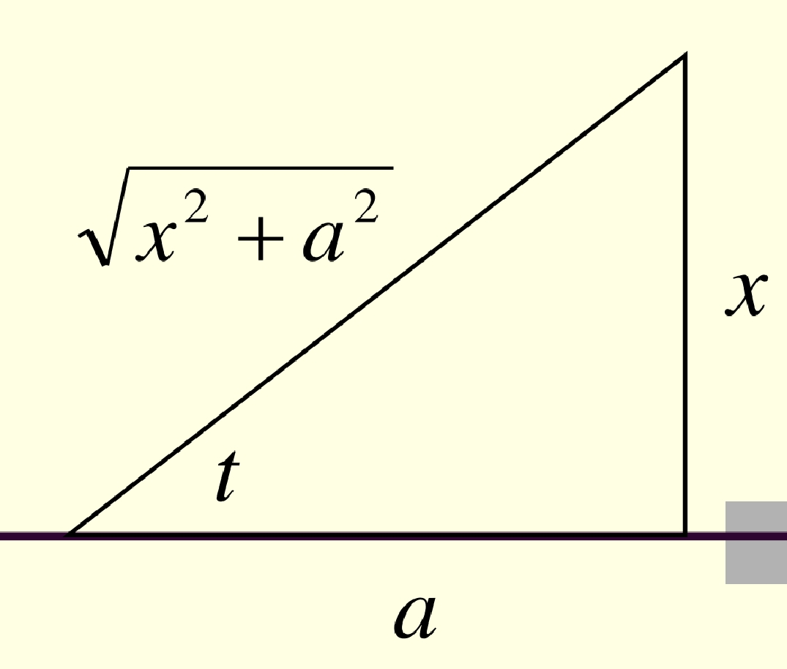

### 一、基本概念

#### 原函数
> [!definition]原函数
> 设 $f(x): I \rightarrow \mathrm{R}$, 若 $\exists F(x)$ 使得 $F^{\prime}(x)=f(x)(\forall x \in I)$, 则称 $F(x)$ 是 $f(x)$ 在 $I$ 上的一个**原函数**.

##### 全体原函数
> [!theorem]全体原函数
> 设 $F(x)$ 是 $f(x)$ 在 $I$ 上的一个原函数, 则 $F(x)+C(C$ 为任意常数)为 $f(x)$ 在 $I$ 上的**全体原函数**.

> ***Proof:***
> $(F(x)+c)^{\prime}=F^{\prime}(x):=f(x)$
> 令$G(x)$ 为$f(x)$任意原函数
> $\therefore G^{\prime}(x)=f(x)=F^{\prime}(x) \quad(x \in I)$
> 
> $\xRightarrow{\exists C \in \mathbb{R}}\quad G(x)=F(x)+C$

#### 不定积分
> [!definition]不定积分
> 设 $f(x)$ 存在原函数, 则 $f(x)$ 的全体原函数称为 $f(x)$ 的**不定积分**, 记作 $$\displaystyle \int f(x) \mathrm{d} x$$

- $\displaystyle \int$ 一不定积分号
- $f(x)$ 一被积函数
- $x$ 一积分变量

##### 被积表达式

> [!theorem] 被积表达式
> 设 $F(x)$ 是 $f(x)$ 在 $I$ 上的一个原函数, 则
> $$
> \int f(x) \mathrm{d} x=F(x)+C \text {. }
> $$

##### 不定积分与微分运算互逆

> [!theorem] 不定积分与微分运算互逆
> 即：左边不积分$=$右边求导数

> ***Proof:***
> $(*)$ 若$f$可导, 则 $$\displaystyle \int f^{\prime}(x) d x=f(x)+C$$
> 即: $$\displaystyle \int d(f(x)+C)=f(x)+C$$
> 若 $f$ 存在原函数, 则 $$\left(\int f(x) d x\right)^{\prime}=f(x)$$
> 即: $$d \int f(x) d x=f(x) d x$$

##### 不定积分的线性运算
> [!theorem] 线性运算
> 若 $f, g$ 在 $I$ 上存在原函数, 则对任意 $a \in \mathbf{R}$ 有
> $$
> \begin{gathered}
> \int a f(x) \mathrm{d} x=a \int f(x) \mathrm{d} x \
> \int[f(x) \pm g(x)] \mathrm{d} x=\int f(x) \mathrm{d} x \pm \int g(x) \mathrm{d} x
> \end{gathered}
> $$
#### 不定积分表
1. $\displaystyle \int k \mathrm{~d} x=k x+C\quad\left(\int 0 \mathrm{~d} x=C\right)$;

2. $\displaystyle \int x^\alpha \mathrm{d} x=\frac{1}{\alpha+1} x^{\alpha+1}+C \quad(\alpha \neq-1)$;
   *常用形式：*
	- $\displaystyle \int x\mathrm d x=\frac{1}{2}x^{2}$ 
   
	- $\displaystyle \int \sqrt{x} \mathrm d  x=\frac{2}{3} x^{\frac{3}{2}}+C$
	  
	- $\displaystyle \int \frac{\mathrm d  x}{\sqrt{x}}=2 x^{\frac{1}{2}}+C=2 \sqrt{x}+C$
	  
	- $\displaystyle \int \frac{\mathrm d  x}{x^2}=-x^{-1}+C=-\frac{1}{x}+C$

3. $\displaystyle \int \frac{1}{x} \mathrm{~d} x=\ln |x|+C$;
   
   - $\displaystyle \int \frac1{ax+b}\mathrm dx=\frac{\ln(ax+b)}{a}$

4.  $\displaystyle \int a^x \mathrm{~d} x=\frac{a^x}{\ln a}+C \quad(0<a \neq 1)$;
   
5. $\displaystyle \int \mathrm{e}^x \mathrm{~d} x=\mathrm{e}^x+C$;
   
6. $\displaystyle \int \sin x \mathrm{~d} x=-\cos x+C$;
   
7. $\displaystyle \int \cos x \mathrm{~d} x=\sin x+C$;
   
8. $\displaystyle \int \sec ^2 x \mathrm{~d} x=\tan x+C$;
   
   - $\displaystyle \int \sec x \mathrm d x=\ln\left|\sec x+\tan x\right|$
   
9. $\displaystyle \int \csc ^2 x \mathrm{~d} x=-\cot x+C$;
   - $\displaystyle \int \csc x \mathrm d x = \ln\left(\tan \frac{x}{2}\right)$
   
10. $\displaystyle \int \frac{\mathrm{d} x}{a^2+x^2}=\frac{1}{a} \arctan \frac{x}{a}+C(a \neq 0)$;
    
    ***P.S.*** $\left(\frac{1}{a} \arctan \frac{x}{a}\right)^{\prime}=\frac{1}{a} \cdot \frac{1}{a} \frac{1}{1+\left(\frac{x}{a}\right)^2}=\frac{1}{a^2+x^2}$
    
    - $\displaystyle \int\frac{\mathrm dx}{1+x^{2}}=\arctan x+C$
	  
11.  $\displaystyle \int \frac{\mathrm{d} x}{x^2-a^2}=\frac{1}{2 a} \ln \left|\frac{x-a}{x+a}\right|+C\quad(a \neq 0)$;
    
     - $\displaystyle \int \frac{d x}{a^2-x^2}=\frac{1}{2 a} \ln \left|\frac{x+a}{x-a}\right|+C$
	  
12. $\displaystyle \int \frac{\mathrm{d} x}{\sqrt{a^2-x^2}}=\arcsin \frac{x}{a}+C(a>0)$;
    
13. $\displaystyle \int \frac{\mathrm{d} x}{\sqrt{x^2 \pm a^2}}=\ln \left|x+\sqrt{x^2 \pm a^2}\right|+C$.

##### 补充不定积分

-  $\int \tan(x) \mathrm d x=\ln(\cos(x))$
- 

##### 例题
> [!example]
> 例1 求 $\displaystyle \int\left(\frac{1}{\sqrt{x}}-\frac{1}{\sqrt{1-x^2}}\right) \mathrm{d} x$

> ***Solution***
> $$
> \begin{flalign}
> = & \int \frac{d x}{\sqrt{x}}-\int \frac{d x}{\sqrt{1-x^2}} \\\\\\\\
> = & 2 \sqrt{x}-\arcsin x+c&
> \end{flalign}
> $$

> [!example]
> 例 2 求 $\displaystyle \int \frac{1}{\sin ^2 x \cos ^2 x} \mathrm{~d} x$

> ***Solution***
> $$
> \begin{flalign}
> & =\int \frac{\sin ^2 x+\cos ^2 x}{\sin ^2 x \cos ^2 x} d x \\\\\\\\
> & =\int\left(\frac{1}{\sin ^2 x}+\frac{1}{\cos ^2 x}\right) d x \\\\\\\\
> & =\int\left(\csc ^2 x+\sec ^2 x\right) d x \\\\\\\\
> & =-\cot x+\tan x+C&
> \end{flalign}
> $$

> [!example]
> 例3 求 $\displaystyle \int \frac{1}{x^2\left(1+x^2\right)} \mathrm{d} x$

> ***Solution***
> $$
> \begin{flalign}
> & =\int\left(\frac{1}{x^2}-\frac{1}{1+x^2}\right) d x \\\\\\\\
> & =-\frac{1}{x}-\arctan x+C&
> \end{flalign}
> $$

### 二、换元积分法

#### 第一代换法 / 凑微分法
> [!theorem]凑微分法
> 若 $\displaystyle \int f(u) \mathrm{d} u=F(u)+C$, 而 $\varphi(x)$ 可导, 则
> $$
> \int f(\varphi(x)) \textcolor{orange}{\varphi^{\prime}(x) \mathrm{d} x}=F(\varphi(x))+C,
> $$
> $$
> \text { 或 } \int f(\varphi(x)) \textcolor{orange}{\mathrm{d} \varphi(x)}=F(\varphi(x))+C.
> $$

- 分析
	> ***Analysis***
	> $$
	> \begin{flalign}
	> & {[F(\varphi(x))]^{\prime}=f(\varphi(x)) \varphi^{\prime}(x) } \\\\\\\\
	> \Rightarrow & \int f(\varphi(x)) \varphi^{\prime}(x) d x=F(\varphi(x))+C&
	> \end{flalign}
	> $$
- 运算步骤
	$$
	\begin{flalign}
	\int f(\varphi(x)) \textcolor{orange}{\varphi^{\prime}(x) \mathrm{d} x}&=\int f(\varphi(x)) \textcolor{orange}{\mathrm{d} \varphi(x)} \\\\\\\\
	&\xlongequal{u=\textcolor{orange}{\varphi(x)}}\int f(\textcolor{orange}u) \mathrm{d} \textcolor{orange}u=F(u)+C \\\\\\\\
	&\xlongequal{\text{回代}}F(\textcolor{orange}{\varphi(x)})+C .
	\end{flalign}
	$$

##### 例题
> [!example]
> 例4 求下列不定积分
> 1. $\displaystyle \int \tan x d x$

> ***Solution***
> $$
> \begin{flalign}
> & =\int \frac{\textcolor{orange}{\sin x}}{\cos x} \textcolor{orange}{d x} \\\\\\\\
> & =\int \frac{\textcolor{orange}{-d \cos x}}{\cos x}\\\\\\\\
> & \xlongequal{u=\textcolor{orange}{-\cos x}} -\int \frac{d u}{u} \\\\\\\\
> & =-\ln |u|+C \\\\\\\\
> & =-\ln |\cos x|+C&
> \end{flalign}
> $$

> [!example]
> 2. $\displaystyle \int(2 x-1)^{10} d x$
$$
\begin{flalign}
&= \int\textcolor{orange}{(2 x-1)}^{20}\cdot \textcolor{orange}{\frac{1}{2}}d\textcolor{orange}{(2 x-1)} \\\\\\\\
& \xlongequal{u=\textcolor{orange}{2 x-1}} \frac{1}{2} u^{10} d u \\\\\\\\
&= \frac{u^{11}}{22}+C \\\\\\\\
&= \frac{(2 x-1)^{11}}{22}+C&
\end{flalign}
$$

> [!example]
> 3. $\displaystyle \int \frac{d x}{a^2+x^{2}}$

> ***Solution***
> $$
> \begin{flalign}
> = & \frac{1}{a} \int \frac{\textcolor{orange}{\frac{1}{a} d x}}{1+\left(\frac{x}{a}\right)^2} \\\\\\\\
> = & \frac{1}{a} \int \frac{d \textcolor{orange}{\frac{x}{a}}}{1+\left(\frac{x}{a}\right)^2} \\\\\\\\
> = & \frac{1}{a} \int \frac{d u}{1+u^2} \\\\\\\\
> = & \frac{1}{a} \arctan \frac{x}{a}+C&
> \end{flalign}
> $$

> [!example]
> 4. $\displaystyle \int \frac{d x}{x^2-a^2}$

> ***Solution***
> $$
> \begin{flalign}
> = & \int \frac{d x}{(x-a)(x+a)} \\\\\\\\
> = & \frac{1}{2 a} \int\left(\frac{1}{x-a}-\frac{1}{x+a}\right) d x \\\\\\\\
> = & \frac{1}{2 a}\left(\int \frac{d\textcolor{orange}{(x-a)}}{x-a}-\int \frac{d\textcolor{orange}{(x+a)}}{x+a}\right) \\\\\\\\
> = & \frac{1}{2 a}[\ln |x-a|-\ln |x+a|] \\\\\\\\
> = & \frac{1}{2 a} \ln \left|\frac{x-a}{x+a}\right|+C&
> \end{flalign}
> $$

> [!example]
> 5. $\displaystyle \int \sec x d x$

> ***Solution*** *凑微分*
> $$
> \begin{flalign}
> = & \int \frac{1}{\cos x} d x \\\\\\\\
> = & \int \frac{\textcolor{orange}{\cos x}}{\textcolor{Cyan}{\cos ^2 x}} \textcolor{orange}{d x} \quad\rightarrow  \text { 凑 } \sin x \\\\\\\\
> = & \int \frac{\textcolor{orange}{d \sin x}}{\textcolor{Cyan}{1-\sin ^2 x}} \quad\rightarrow\tiny{\int \frac{\mathrm{d} x}{a^2-x^2}=\frac{1}{2 a} \ln \left|\frac{x+a}{x-a}\right|+C\quad(a \neq 0)}\\\\\\\\
> = & \frac{1}{2} \ln \left|\frac{1+\sin x}{1-\sin x}\right|+C \\\\\\\\
> = & \frac{1}{2} \ln \frac{(1+\sin x)^2}{\cos ^2 x}+C \\\\\\\\
> = & \ln \left|\frac{1+\sin x}{\cos x}\right|+C \\\\\\\\
> = & \ln |\sec x+\tan x|+C&
> \end{flalign}
> $$

> [!example]
> 6. $\displaystyle \int\frac{\ln x}{x\sqrt{1+\ln x}}dx$

> ***Solution*** *添项*
> $$
> \begin{flalign}\\\\\\\\
> &\int\dfrac{\ln x}{\textcolor{orange}x\sqrt{1+\ln x}}\textcolor{orange}{dx}\\\\\\\\
> & =\int\dfrac{\ln x \cdot\textcolor{orange}{d \ln x}}{\sqrt{1+\ln x}}\\\\\\\\ 
> & \xlongequal{u=\ln x}\int \frac{\textcolor{Cyan}{(1+u-1) d u}}{\sqrt{1+u}} \\\\\\\\
> & =\int\left(\sqrt{1+u}-\frac{1}{\sqrt{1+u}}\right) \textcolor{Cyan}{d(1+u)} \\\\\\\\
> & =\frac{2}{3}(1+u)^{3 / 2}-2 \sqrt{1+u}+C \\\\\\\\
> & =\frac{2}{3}(1+\ln x)^{3 / 2}-2 \sqrt{1+\ln x}+C &
> \end{flalign}
> $$

> [!example]
> 7. $\displaystyle \int \frac{2 x-1}{x^2-4 x+5} d x$

> ***Solution*** *配方*
> $$
> \begin{flalign}
> = & \int \frac{2 x-4+3}{x^2-4 x+5} d x \\\\\\\\
> = & \int \frac{d\left(x^2-4 x+5\right)}{x^2-4 x+5}+\int \frac{3}{(x-2)^2+1} d(x-2) \\\\\\\\
> = & \ln \left|x^2-4 x+5\right|+3 \arctan (x-2)+C&
> \end{flalign}
> $$

> [!example]
> 例 5 求 $\displaystyle \int \frac{x^2+1}{x^4+x^2+1} \mathrm{~d} x$.

> ***Solution***
> 
> 分式上下同时除去$x^2$，凑微分+配方：
> $$
> \begin{flalign}
> & =\int \frac{\textcolor{orange}{\left(1+\frac{1}{x^2}\right) d x}}{x^2+1+\frac{1}{x^2}} \\\\\\\\
> & =\int \frac{\textcolor{orange}{d\left(x-\frac{1}{x}\right)}}{\left(x-\frac{1}{x}\right)^2+\sqrt{3}^2} \\\\\\\\
> & =\frac{1}{\sqrt{3}} \arctan \frac{x-\frac{1}{x}}{\sqrt{3}}+C&
> \end{flalign}
> $$
> 
> > [!warning] 注意到，该式在$x=0$时无意义，继续补充
> 
> 设 $f(x)=\dfrac{x^2+1}{x^4+x^2+1}$ 原函数为 $F(x)$
> $$
> \therefore F(x)= \begin{cases}\frac{1}{\sqrt{3}} \arctan \frac{x-\frac{1}{x}}{\sqrt{3}}+C_1, & x>0 \\\\\\\\\\\\\\\\ C, & x=0\\\\\\\\\\\\\\\\\frac{1}{\sqrt{3}} \arctan \frac{x-\frac{1}{x}}{\sqrt{3}}+C_2, &x<0\end{cases}
> $$
> 
> $$
> \begin{flalign}
> & \because F(x) \text { 在 } x=0 \text { 连续. } \\\\\\\\
> & \therefore F(0+0)=F(0)=F(0-0),~\text{此时}x-\frac 1x \text{趋近正负无穷}\\\\\\\\
> & \Rightarrow\frac{1}{\sqrt{3}} \cdot (-\frac{\pi}{2})+C_{1}=C=\frac{1}{\sqrt{3}} \cdot \frac{\pi}{2}+C_{2} \\\\\\\\
> & \therefore C_1=C+\frac{1}{\sqrt{3}}\cdot \frac{\pi}{2} \\\\\\\\
> & C_2=C-\frac{1}{\sqrt{3}}\cdot \frac{\pi}{2}&
> \end{flalign}
> $$
> 
> 从而原函数 $F(x)=\begin{cases}\dfrac{1}{\sqrt{3}} \arctan \dfrac{x-\frac{1}{x}}{\sqrt{3}}+\dfrac{1}{\sqrt{3}} \cdot \dfrac{\pi}{2}+C, &x \geq0\\\\\\\\ \dfrac{1}{\sqrt{3}} \arctan \dfrac{x-\frac{1}{x}}{\sqrt{3}}-\dfrac{1}{\sqrt{3}} \cdot \dfrac{\pi}{2}+C,&x<0\end{cases}$
> 
> 下说明 $F^{\prime}(x)\big|_{x=0}=f(0)$
> 由于 $\lim _{x \rightarrow 0} F^{\prime}(x)=\lim _{x \rightarrow 0} f(x)=f(0)=1$
> 又$\because F(x)$ 在 $x=0$ 连续：
> $\Rightarrow F^{\prime}(0)=f(0)=1$ （运用导数极限定理:导函数极限->导数极限）

#### 第二代换法/换元积分法

已知右端求左端积分为第一代换法; 已知左端, 能否求右端积分呢? 此即下面的第二换元法.

> [!theorem]换元积分法
> 若 $\displaystyle \int f(\varphi(t)) \varphi^{\prime}(t) \mathrm{d} t=G(t)+C$, 又 $x=\varphi(t)$, 且 $\varphi^{\prime}(t) \neq 0$, 则
> $$
> \int f(x) \mathrm{d} x=G\left(\varphi^{-1}(x)\right)+C
> $$

- 运算步骤
$$\begin{flalign}
\int f(\textcolor{orange}{x}) \mathrm{d} x&\xlongequal{x=\textcolor{orange}{\varphi(t)}}\int f(\textcolor{orange}{\varphi(t)}) \textcolor{orange}{\varphi^{\prime}(t) \mathrm{d} t} \\\\\\\\&\xlongequal{\text { 已知 }}G(t)+C \\\\\\\\&\xlongequal{\text { 回代 }}G\left(\varphi^{\textcolor{red}{-1}}(x)\right)+C .
\end{flalign}
$$
- 证明
> ***Proof***
> $$
> \begin{flalign}
> & \frac{d}{d x} G\left(\varphi^{-1}(x)\right)\\\\\\\\&\xlongequal{t:=\varphi^{-1}(x)}G^{\prime}(t) \frac{d t}{d x}\\\\\\\\&=\textcolor{Cyan}{G^{\prime}(t)} \cdot\frac{1}{\frac{d x}{d t}} \\\\\\\\
> &=\textcolor{Cyan}{f(\varphi(t)) \varphi^{\prime}(t)} \cdot \frac{1}{\varphi^{\prime}(t)}=f(\varphi(t))\\\\\\\\&=f(x)&
> \end{flalign}
> $$

##### 例题

######三角代换去根号

> [!tip] 含无理式 $\sqrt{a^2-x^2}, \sqrt{x^2+a^2}$ 和 $\sqrt{x^2-a^2}$ 时, 可采用 $x=a \sin t, x=a \tan t$ 和 $x=a \sec t$ 等三角代换去根号.

> [!example] 
> 例6 求 $\displaystyle \int \frac{\mathrm{d} x}{\sqrt{x^2+a^2}},(a>0)$.

> ***Solution***
> 
> $\text{令 } x =a \tan t,|t|<\frac{\pi}{2}$
> $$
> \begin{flalign}
> \int \frac{\textcolor{orange}{\mathrm d x}}{\sqrt{\textcolor{orange}{x^2}+a^2}} & =\int \frac{\textcolor{orange}{a \sec ^2 t \mathrm d t}}{\sqrt{\textcolor{orange}{a^2 \tan ^2 t}+a^2}} \\\\\\\\
> & =\int \frac{\sec ^2 t}{\sqrt{\sec ^2 t}} d t \\\\\\\\
> & =\int \sec t d t \\\\\\\\
> & =\ln |\sec t+\tan t|+C \\\\\\\\
> & =\ln \left|\frac{\sqrt{x^2+a^2}}{a}+\frac{x}{a}\right|+C \\\\\\\\
> & =\ln \left|x+\sqrt{x^2+a^2}\right|+C_1&
> \end{flalign}
> $$
> 
> ***Tip***
> 
> 

> [!example]
> 例7 求 $\displaystyle \int \sqrt{a^2-x^2} \mathrm{~d} x,(a>0)$.

> ***Solution***
> $$
> \begin{flalign}
> 令~x & =a \sin t \\\\\\\\
> 原式& =\int \sqrt{a^2-a^2 \sin ^2 t}(a \cos t d t) \\\\\\\\
> & =a^2 \int \cos ^2 t d t \\\\\\\\
> & =\frac{a^2}{2} \int\left(1+\cos ^2 t\right) d t \\\\\\\\
> & =\frac{a^2}{2}\left(t+\frac{\sin 2 t}{2}\right)+c \\\\\\\\
> & =\frac{a^2}{2} t+\frac{a^2}{2} \sin t \cos t+c \\\\\\\\
> & =\frac{a^2}{2} \arcsin \frac{x}{a}+\frac{a^2}{2} \cdot \frac{x}{a} \cdot \sqrt{1-\frac{x^2}{a^2}}+C \\\\\\\\
> & =\frac{a^2}{2} \arcsin \frac{x}{a}+\frac{x}{2} \sqrt{a^2-x^2}+c&
> \end{flalign}
> $$

> [!example]
> 例8 求 $\displaystyle \int \frac{\mathrm{d} x}{\sqrt{x(1-x)}}$.

> ***Solution***
> 
> **法I.配方**
> $$
> \begin{flalign}
> 原式& =\int \frac{d\left(x-\frac{1}{2}\right)}{\sqrt{\left(\frac{1}{2}\right)^2-\left(x-\frac{1}{2}\right)^2}} \\\\\\\\
> & =\arcsin (2 x-1)&
> \end{flalign}
> $$
> 
> 或: 
>
>**法II.灵机一动** 
> ~~注意到：~~ $\sin^{2}x+\cos^{x}=x+(1-x)=1$
> $令~x=\sin ^2 t, t \in\left(0, \frac{\pi}{2}\right)$
> $$
> \begin{flalign}
> \therefore \text { 原式 } & =\int \frac{2 \sin t \cos t \mathrm d  t}{\sqrt{\sin ^2 t \cos ^2 t}} \\\\\\\\
> & =2 \int \mathrm d t \\\\\\\\
> & =2 t+C \\\\\\\\
> & =2 \arcsin \sqrt{x}+C&
> \end{flalign}
> $$
>
>***Tip***
>上述例子很好地说明了原函数可不唯一（$C$不同）

######倒数代换

> [!tip] 分母含因子 $x$ 时, 可用倒代换 $x=1 / t$.

> [!example]
> 例9 求 $\displaystyle \int \frac{\mathrm{d} x}{x \sqrt{x^2+x+1}}$.

> ***Solution***
> $$
> \begin{flalign}
> &\xlongequal[t>0]{x=1 / t}  \int \frac{-\frac{1}{t^2} d t}{\frac{1}{t} \sqrt{\frac{1}{t^2}+\frac{1}{t}+1}} \\\\\\\\
> & =-\int \frac{d t}{\sqrt{1+t+t^2}} \\\\\\\\
> & =-\int \frac{d\left(t+\frac{1}{2}\right)}{\sqrt{\left(t+\frac{1}{2}\right)^2+\frac{3}{4}}} \\\\\\\\
> & =-\ln \left|t+\frac{1}{2}+\sqrt{1+t+t^2}\right|+C \\\\\\\\
> & =-\ln \left|\frac{1}{x}+\frac{1}{2}+\frac{\sqrt{x^2+x+1}}{x}\right|+C&
> \end{flalign}
> $$

### 三、分部积分法

> [!theorem]分部积分法
> 若 $u^{\prime}(x), v^{\prime}(x)$ 连续, 则
> $$
> \int u(x) v^{\prime}(x) \mathrm{d} x=u(x) v(x)-\int v(x) u^{\prime}(x) \mathrm{d} x .
> $$

- 记忆 
	- $\displaystyle \int u(x) \mathrm{d} v(x)=u(x) v(x)-\int v(x) \mathrm{d} u(x)$.
	- 前后相乘 - ∫ 交换位置
- 凑微分函数依次是: 指数函数, 三角函数, 幕函数,对数函数, 反三角函数.
- 证明
> ***Proof***
> $$
> \begin{flalign}
> & (u(x) v(x))^{\prime}=u^{\prime}(x) v(x)+u(x) v^{\prime}(x) \\\\\\\\
> & \text { 有 } \int\left[u^{\prime}(x) v(x)+u(x) v^{\prime}(x)\right]=u(x) v(x)+c \\\\\\\\
> & \text { 即: } \int u(x) d v(x)=u(x) v(x)-\int v(x) d u(x)&
> \end{flalign}
$$

##### 例题

> [!example]
例 10 求 $\displaystyle \int \ln x \mathrm{~d} x$.

> ***Solution***
> $$
> \begin{flalign}
> & =x \ln x-\int x d \ln x \\\\\\\\
> & =x \ln x-\int x \cdot \frac{1}{x} d x \\\\\\\\
> & =x \ln x-x+C&
> \end{flalign}
> $$

> [!example]
> 例11 求 $\displaystyle I=\int \mathrm{e}^x \sin x \mathrm{~d} x$.

> ***Solution***
> $$
> \begin{flalign}
> I&=\int \textcolor{orange}{\mathrm{e}^x} \sin x \textcolor{orange}{\mathrm{~d} x}&e^{x},\mathrm d x合并\\\\\\\\
> & =\int \sin x \mathrm d  \textcolor{orange}{e^x} &分部积分\\\\\\\\
> & =e^x \sin x-\int e^x \mathrm d  \sin x &e^{x},\mathrm d x合并\\\\\\\\
> & =e^x \sin x-\int \cos x \mathrm d  e^x &分部积分\\\\\\\\
> & =e^x \sin x-e^x \cos x+\int e^x \mathrm d  \cos x \\\\\\\\
> & =e^x(\sin x-\cos x)-\underbrace{\int \sin x \mathrm d  e^{x}} \\\\\\\\
> \therefore I & =e^{x}(\sin x-\cos x)-\qquad I \\\\\\\\
> \therefore 2 I & =e^x(\sin x-\cos x)+C \\\\\\\\
> I & =\frac{1}{2} e^x(\sin x-\cos x)+C&
> \end{flalign}
> $$

> [!example]
> 例12 求 $\displaystyle I_{n}=\int \frac{\mathrm{d} x}{\left(x^{2}+a^{2}\right)^{n}},(a>0, n \in \mathbb{N})$.

> ***Solution***
> $$
> \begin{flalign}
> I_{n} & =\frac{\alpha}{\left(x^{2}+a^{2}\right)^{n}}-\left(-2 \int \frac{\left(x^{2}+a^{2}-a^{2}\right.}{\left(x^{2}+a^{2}\right)^{n+1}} d x\right) \\\\\\\\
> & =\frac{x}{\left(x^{2}+a^{2}\right)}+2 n I_{n}-2 n a^{2} I_{n+1} \\\\\\\\
> \Rightarrow I_{n} & =\frac{x}{2 n a^{2}\left(x^{2}+a^{2}\right)^{n}}+\frac{2 n-1}{2 n a^{2}} I_{n}&
> \end{flalign}
> $$
> 
> 其中: $I_{1}=\frac{1}{a} \arctan \frac{x}{a}$

> [!example]
> 例13 求 $\displaystyle\int x \mathrm{e}^{x}\left(1+\mathrm{e}^{x}\right)^{\frac{-3}{2}} \mathrm{~d} x$.

> ***Solution***
> $$
> \begin{flalign}
> & I=\int x\left(1+e^{x}\right)^{-\frac{3}{2}} d\left(e^{x}+1\right) \\\\\\\\
> & =-2 \int x d\left(1+e^{x}\right)^{-\frac{1}{2}} \\\\\\\\
> & =-\frac{2 x}{\sqrt{1+e^{x}}}+2 \int \frac{1}{\sqrt{1+e^{x}}} d x \\\\\\\\
> & \text { 其中 } \int \frac{1}{\sqrt{1+e^{x}}} d x
> \end{flalign}
> $$
> 
> 故原式 $=-\frac{2 x}{\sqrt{1+e^{x}}}+2 \int \frac{1}{\sqrt{1+e^{2}}} d x$
> 
> $=-\frac{2 x}{\sqrt{1+e^{-2}}}+\ln \left|\frac{\sqrt{10 x-1}-1}{\sqrt{1+c^{2}+1}}\right|+c$

> [!example] Intro
> $\displaystyle\int \frac{x}{\left(x^2+1\right)^{3/2}} \, dx$

> [!wolframalpha]

> ***Soution***
> 
> $$
> \begin{array}{l}
>  
> \begin{array}{l}
>  \text{Take the integral:} \\\\\\\\
>  \int \frac{x}{\left(x^2+1\right)^{3/2}} \, dx \\\\\\\\
> \end{array}
>  \\\\\\\\
> \hline
>  
> \begin{array}{l}
>  \text{For }\text{the }\text{integrand }\frac{x}{\left(x^2+1\right)^{3/2}}, \text{substitute }u=x^2+1 \text{ and }du=2 x\, dx: \\\\\\\\
>   \text{= }\frac{1}{2}\int \frac{1}{u^{3/2}} \, du \\\\\\\\
> \end{array}
>  \\\\\\\\
>  
> \begin{array}{l}
>  \text{The }\text{integral }\text{of }\frac{1}{u^{3/2}} \text{is }-\frac{2}{\sqrt{u}}: \\\\\\\\
>   \text{= }-\frac{1}{\sqrt{u}}+\text{constant} \\\\\\\\
> \end{array}
>  \\\\\\\\
>  
> \begin{array}{l}
>  \text{Substitute }\text{back }\text{for }u=x^2+1: \\\\\\\\
>  \fbox{$
> \begin{array}{ll}
>  \text{Answer:} &  \\\\\\\\
>  \text{} &  \text{= }-\frac{1}{\sqrt{x^2+1}}+\text{constant} \\\\\\\\
> \end{array}
> $} \\\\\\\\
> \end{array}
>  \\\\\\\\
> \end{array}
> $$

> [!example]
> =>习题P154.3.(6) $\displaystyle\int \frac{x \log (x)}{\left(x^2+1\right)^{3/2}} \, \mathrm d x$

> [!wolframalpha]

> ***Solution***
> $$\begin{array}{l}
> \begin{array}{l}
>  \text{For }\text{the }\text{integrand }\frac{x \log (x)}{\left(x^2+1\right)^{3/2}}, \text{integrate }\text{by }\text{parts, }\int f \, dg=f
>    g-\int g \, df, \text{where }\\\\\\\\f=\log (x),    dg=\frac{x}{\left(x^2+1\right)^{3}{2}}\, dx,df=\frac{1}{x}\, dx,  \\\\\\\\   g=\frac{1}{\sqrt{x^2+1}}: \\\\\\\\
>   \text{= }-\frac{\log (x)}{\sqrt{x^2+1}}+\int \frac{1}{x \sqrt{x^2+1}} \, dx \\\\\\\\
> \end{array}
>  \\\\\\\\\\\\\\\\
> \begin{array}{l}
>  \text{For }\text{the }\text{integrand }\frac{1}{x \sqrt{x^2+1}}, \text{substitute }x=\tan (u) \text{and }dx=\sec ^2(u)\, du.\\\\\\\\ \text{Then
>    }\sqrt{x^2+1} \text{= }\sqrt{\tan ^2(u)+1} \text{= }\sec (u) \text{and }u=\tan ^{-1}(x): \\\\\\\\
>   \text{= }-\frac{\log (x)}{\sqrt{x^2+1}}+\int \csc (u) \, du \\\\\\\\
> \end{array}
>  \\\\\\\\\\\\\\\\
> \begin{array}{l}
>  \text{Multiply }\text{numerator }\text{and }\text{denominator }\text{of }\csc (u) \text{by }\cot (u)+\csc (u): \\\\\\\\
>   \text{= }-\frac{\log (x)}{\sqrt{x^2+1}}+\int -\frac{-\cot (u) \csc (u)-\csc ^2(u)}{\cot (u)+\csc (u)} \, du \\\\\\\\
> \end{array}
>  \\\\\\\\\\\\\\\\
> \begin{array}{l}
>  \text{For }\text{the }\text{integrand }-\frac{-\cot (u) \csc (u)-\csc ^2(u)}{\cot (u)+\csc (u)}, \text{substitute }s=\cot (u)+\csc (u) \text{and
>    }\\\\\\\\ds=\left(-\csc ^2(u)-\cot (u) \csc (u)\right)\, du: \\\\\\\\
>   \text{= }-\frac{\log (x)}{\sqrt{x^2+1}}+\int -\frac{1}{s} \, ds \\\\\\\\
> \end{array}
>  \\\\\\\\\\\\\\\\
> \begin{array}{l}
>  \text{Factor }\text{out }\text{constants:} \\\\\\\\
>   \text{= }-\frac{\log (x)}{\sqrt{x^2+1}}-\int \frac{1}{s} \, ds \\\\\\\\
> \end{array}
>  \\\\\\\\\\\\\\\\
> \begin{array}{l}
>  \text{The }\text{integral }\text{of }\frac{1}{s} \text{is }\log (s): \\\\\\\\
>   \text{= }-\log (s)-\frac{\log (x)}{\sqrt{x^2+1}}+\text{constant} \\\\\\\\
> \end{array}
>  \\\\\\\\\\\\\\\\
> \begin{array}{l}
>  \text{Substitute }\text{back }\text{for }s=\cot (u)+\csc (u): \\\\\\\\
>   \text{= }-\log (\cot (u)+\csc (u))-\frac{\log (x)}{\sqrt{x^2+1}}+\text{constant} \\\\\\\\
> \end{array}
>  \\\\\\\\\\\\\\\\
> \begin{array}{l}
>  \text{Substitute }\text{back }\text{for }u=\tan ^{-1}(x): \\\\\\\\
>   \text{= }-\frac{\log (x)}{\sqrt{x^2+1}}-\log \left(\cot \left(\tan ^{-1}(x)\right)+\csc \left(\tan ^{-1}(x)\right)\right)+\text{constant} \\\\\\\\
> \end{array}
>  \\\\\\\\\\\\\\\\
> \begin{array}{l}
>  \text{Simplify }\text{using }\cot \left(\tan ^{-1}(z)\right)=\frac{1}{z} \text{and }\csc \left(\tan ^{-1}(z)\right)=\frac{\sqrt{z^2+1}}{z}: \\\\\\\\
>   \text{= }-\frac{\log (x)}{\sqrt{x^2+1}}-\log \left(\frac{\sqrt{x^2+1}+1}{x}\right)+\text{constant} \\\\\\\\
> \end{array}
>  \\\\\\\\\\\\\\\\
> \begin{array}{l}
>  \text{An }\text{alternative }\text{form }\text{of }\text{the }\text{integral }\text{is:} \\\\\\\\
>   \text{= }-\frac{\log (x)}{\sqrt{x^2+1}}-\text{csch}^{-1}(x)+\text{constant} \\\\\\\\
> \end{array}
>  \\\\\\\\\\\\\\\\
> \begin{array}{l}
>  \text{Which }\text{is }\text{equivalent }\text{for }\text{restricted }x \text{values }\text{to:} \\\\\\\\
>  \fbox{$
> \begin{array}{ll}
>  \text{Answer:} &  \\\\\\\\
>  \text{} &  \text{= }-\frac{\log (x)}{\sqrt{x^2+1}}-\log \left(\sqrt{x^2+1}+1\right)+\log (x)+\text{constant} \\\\\\\\
> \end{array}
> $} \\\\\\\\
> \end{array}
>  \\\\\\\\
> \end{array}$$
> 
> ***TIP***
> 实际上可以使用三角代换$x=\tan t$ 配合万能变换$u=\tan(t/2)$
> 简略过程如下：
> $令x=\tan t,|t|<\frac \pi2$
> $$\begin{flalign}
> \text{原式}&= \cdots+\int\frac 1{\sqrt{\tan^{2t+1}}\tan t}\mathrm d t\\\\\\\\
> &= \int \csc t ~\mathrm d t
> \end{flalign}$$