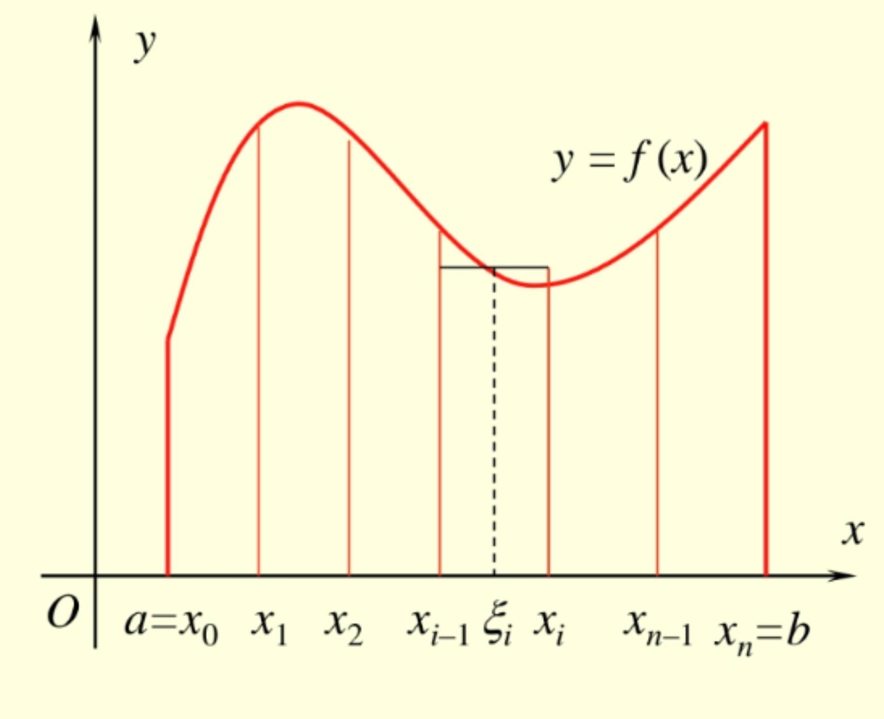
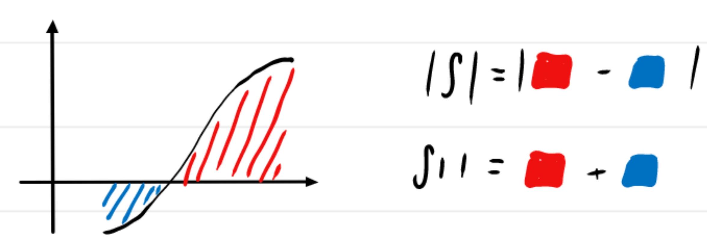

### 一、定积分的定义

##### 曲边梯形面积

- **(1) 分割**
用分点 $a=x_{0}<x_{1}<\ldots<x_{n}=b$ 将 $[a, b]$ 分为 $n$ 个小区间 $\left[x_{i-1}, x_{i}\right](i=1,2, \ldots, n)$, 其长度记为 $\Delta x_{i}=x_{i}-x_{i-1}$

- **(2) 作近似和** 
$\forall \xi_{\mathrm{i}} \in\left[x_{i-1}, x_{i}\right]$,第 $i$ 个小曲边梯形面积 $\Delta S_{i} \approx$ $f\left(\xi_{\mathrm{i}}\right) \Delta x_{i}$, 故曲边梯形面积
$$
A=\sum_{i=1}^{n} \Delta S_{i} \approx \sum_{i=1}^{n} f\left(\xi_{i}\right) \Delta x_{i}
$$

- **(3) 取极限**
记 $\|T\|=\max _{1 \leq i \leq n} \Delta x_{i}$, 则曲边梯形面积
$$
A=\lim _{\|T\| \rightarrow 0} \sum_{i=1}^{n} f\left(\xi_{i}\right) \Delta x_{i}
$$

##### 变速直线运动位移

> [!question]
> 质点以速度 $v=v(t)(\in C[a, b])$ 作直线运动,
> 如何求 $[a, b]$ 内质点的位移 $s ?$

- **(1) 分割** 用分点 $a=t_{0}<t_{1}<\ldots<t_{n}=b$ 将 $[a, b]$ 分为 $n$ 个小区间 $\left[t_{i-1}, t_{i}\right](i=1,2, \ldots, n)$, 其长度记为 $\Delta t_{i}=t_{i}-t_{i-1}$

- **(2) 作近似和** $\forall \xi_{\mathrm{i}} \in\left[t_{i-1}, t_{i}\right]$, 时段 $\left[t_{i-1}, t_{i}\right]$ 经过路程 $\Delta s_{i}$ $\approx v\left(\xi_{\mathrm{i}}\right) \Delta t_{i}$, 故 $[a, b]$ 内经过路程
$$
s=\sum_{i=1}^{n} \Delta s_{i} \approx \sum_{i=1}^{n} v\left(\xi_{i}\right) \Delta t_{i}
$$

- **(3) 取极限** 记 $\|T\|=\max _{1 \leq i \leq n} \Delta t_{i}$, 则时间 $[a, b]$ 内路程

$$
s=\lim _{\|T\| \rightarrow 0} \sum_{i=1}^{n} v\left(\xi_{i}\right) \Delta t_{i}
$$

> [!question] 
> 设一个线密度为 $\ln x$ 的木棒，
> 计算木棒质量?

> 

#### 定积分

> [!definition] <b class="md-tag">定积分</b>
> 分割 $T: a=x_{0}<x_{1}<\ldots<x_{n}=b$. 其模 $\|T\|=\max _{1 \leq i \leq n}\left\{\Delta x_{i}\right\}$
> 
> 设 $f:[a, b] \rightarrow \mathbf{R}$. 任取 $[a, b]$ 分割 $T$ 及 $\forall \xi_{\mathrm{i}} \in\left[x_{i-1}, x_{i}\right]$ $\left(\left\{\xi_{1}, \xi_{2}, \ldots, \xi_{n}\right\}=\xi(T)\right.$ 称为分割 $T$ 下介点集), 作和
> 
> $$
> S_{n}(T)=\sum_{i=1}^{n} f\left(\xi_{i}\right) \Delta x_{i}
> $$
> 若
> $$
> \lim _{|T| \rightarrow 0} \sum_{i=1}^{n} f\left(\xi_{i}\right) \Delta x_{i}=I
> $$
> 
> 则称 $f$ 在 $[a, b]$ 上可积, $I$ 称为 $f$ 在 $[a, b]$ 上的定积分, 记为
> $$I=\int_{a}^{b} f(x) \mathrm d x$$

- $f\left(\xi_{i}\right) \rightarrow f(x) ; \Delta x_{i} \rightarrow d x ; \quad \lim \sum \rightarrow \int$

- $\int$ 一积分号; $a, b$ 一积分下、上限; $[a, b]$ 一积分区间;

- $f(x)$ 一被积函数; $x$ 一积分变量.

##### Riemann和或积分和

$\Leftrightarrow$ Riemann 可积，Riemann积分
> [!definition] <b class="md-tag">Riemann和</b>
> $$
> S_{n}(T)=\sum_{i=1}^{n} f\left(\xi_{i}\right) \Delta x_{i}
> $$

##### $f ∈ R[a, b]$ 的含义?

$[a, b] \leqslant$ Riemann 可积的函数集合

#### 可积与不可积的 “$ε-δ$” 表述 ?

> [!definition] <b class="md-tag">可积</b>
> $f \in R[a, b]$, 即
> 
> $\exists I \in \mathbb{R}, \forall \varepsilon>0, \exists \delta>0, \forall\|T\|<\delta, \forall \xi(T)$
> $$\left|\sum_{i=1}^{n} f\left(\xi_{i}\right) x_{i} \cdot I\right|<\varepsilon$$

> [!definition] <b class="md-tag">不可积</b>
> $f \notin R[a, b]$ 即
> 
> $\forall I \in \mathbb{R}, \exists \varepsilon>0, \forall \delta>0, \exists\|T\|<\delta, \exists \xi(T)$
> 
> $$\left|\sum_{i=1}^{n} f\left(\xi_{i}\right) x_{i} \cdot I\right| \geqslant \varepsilon$$

-  定积分值与**积分区间**和**被积函数**有关, 与 $[a, b]$ 的**分割**和**介点集**无关, 也与**积分变量**无关, 即$$\int_{\textcolor{orange}a}^{\textcolor{orange}b} \textcolor{orange}f(x) \mathrm{d} x=\int_{a}^{b} f(t) \mathrm{d} t=\int_{a}^{b} f(u) \mathrm{d} u$$

- 若存在两分割或同一分割下不同介点集, 使**积分和的极限不同**, 则 $f$ 在 $[a, b]$ **不可积**!
	- i.e. 不同黎曼和(分割可不同), 但极限不同 $\Rightarrow$ 不可积

##### 例题

> [!example] 例 1
> 证明Dirichlet函数 $D(x)=\left\{\begin{array}{l}1, &x \in Q \\ 0, &\text { 其它 }\end{array}\right.$ 在 $[0,1]$ 不可积

> ***Tips***
> (介点集+稠密性)
> 注意到Dirichlet函数的取值和自变量是否为有理数相关，据此构造不同的介点
> 
> ***Solution***
> $\forall$ 取 $[0,1]$ 分割 $T$ ，取 $\xi_{1}\in\left[x_{i-1}, x_{i}\right] \cap \mathbb{Q}$ 则 
> 
> $$
> \sum_{i=1}^{n} D\left(\xi_{i}\right) \Delta x_{i}=\sum_{i=1}^{n} \cdot 1 \Delta x_{i}=1\xrightarrow{\|T\| \rightarrow 0} 1
> $$
> 
> 再取 $\eta_{i} \in\left[x_{i-1}, x_{i}\right] \cap \mathbb{Q}^{C}$ 则
> 
> $$
> \sum_{i=1}^{n} D\left(\eta_{i}\right) \Delta x_{i}=\sum_{i=1}^{n} 0 \cdot \Delta x_{i}=0 \xrightarrow{\|T\|\rightarrow0}0
> $$
> 
> 矛盾

### 二、可积函数类

> [!theorem] 可积的必要条件
> 若 $f \in R[a, b]$, 则 $f$ 在 $[a, b]$ 有界

- 有界是可积的必要不充分条件
- **无界不可积, 可积必有界**
- 有界$\not\Rightarrow$可积: Dirichlet函数

> ***Tips***
> 先由条件入手，橙色字体由逆推之后获得
> 
> ***Proof***
> **反证**
> 
> 若 $f$ 在 $[a, b]$ 无界:
> $\forall I \in \mathbb{R},$ 取 $\varepsilon=\textcolor{orange}1$, $\forall \delta>0$, 取 $\|T\|<\delta$
> 
> 由于 $f$ 在 $[a . b]$ 无界
> 故 $f$ 在该分割下**至少一个子区间无界**
> 
> 不妨为第 $n$ 个区间: $\left[x_{n-1}, x_{n}\right]$:
> 取 $\xi_{i}=x_{i}(1 \leq i \leq n-1)$, $\xi_{n} \in\left[x_{n-1}, x_{n}\right]$ 满足
> $$
> \color{orange}\left|f\left(\xi_{n}\right)\right|>\frac{1+\left|\sum_{i=1}^{n-1} f\left(\xi_{i}\right)-I\right|}{\Delta x_{n}} $$
> 
> $$
> \begin{flalign}
> \left|\sum_{i=1}^{n} f\left(\xi_{i}\right) \Delta x_{i}-I\right|&=\left|f\left(\xi_{n}\right) \Delta x_{n}+\sum_{i=1}^{n-1} f\left(\xi_{i}\right) \Delta x_{i}-I\right| \newline &\geqslant\left|f\left(\xi_{n}\right)\right| \Delta x_{n}-\left|\sum_{i=1}^{n-n} f\left(\xi_{i}\right) \Delta \alpha_{i} \cdot I\right| \newline &\geqslant \varepsilon \ldots 取~\color{orange} \varepsilon_{0}=1&
> \end{flalign}
> $$
> 
> 故 $f \notin R[a, b]$

##### 常见的可积条件==（闭区间）==

> [!theorem] 闭区间连续必有界
> 若 $f \in C[a, b]$, 则 $f \in R[a, b]$.

> [!theorem] 闭区间有限间断有界
> 若 $f$ 在 $[a, b]$ 有界, 且仅有限个间断点, 则 $f \in R[a, b]$

- 无限个间断 $\not\Rightarrow$ 不可积(是否为可数无限)

> [!theorem] 闭区间单调必有界
> 若 $f$ 在 $[a, b]$ 单调, 则 $f \in R[a, b]$

##### 例题

> [!example] 例2
> 函数 $f(x)=\left\{\begin{array}{cc}\frac{1}{n}, & \frac{1}{n+1}<x \leq \frac{1}{n},(n=1,2, \cdots) \\ 0, & x=0\end{array}\right.$ 在 $[0,1]$ 可积

> ***Analysis***
> 画图可知间断点全为跳跃间断点：$0 ; \frac{1}{2} \cdot \frac{1}{3} \ldots \frac{1}{n}$
> 
> 单增=>可积

> [!example] 例3
> $\int_{a}^{b} c \mathrm{~d} x=c(b-a)$

> [!example] 例4
> 证明 $\int_{a}^{b} x^{2} \mathrm{~d} x=\frac{1}{3}\left(b^{3}-a^{3}\right)$

> ***Tips***
> 取特殊的分割/介点集
> 
> ***Proof***
> 将 $[a, b]$ $n$ 等分
> $x_{k}=a+k h$, 其中 $h=\dfrac{b-a}{n}$
> 
> 取 $\xi_{k}=x_{k}$ (右端点)
> 则
> $$
> \begin{flalign}
> \sum\limits_{k=1}^{n} x_{k}^{2} \cdot h & =\sum_{k=1}^{n}(a+k h)^{2} h \newline & =h \sum_{k=1}^{n}\left(a^{2}+2 a k h+k^{2} h^{2}\right) \newline & =n a^{2} h+2 a h^{2} \cdot \frac{n(n+1)}{2}+h^{3} \frac{n(n+1)(2 n+1)}{6} \newline & =a^{2}(b-a)+a \cdot \frac{n(n+1)}{n^{2}}(b-a)^{2}+\frac{(n+1)(2 n+1)}{6 n^{3}}(b-a)^{3} \newline & \xrightarrow{n \rightarrow \infty}a^{2}(b-a)+a(b-a)^{2}+\frac{1}{3}(b-a)^{3}\\&= \frac{1}{3}\left(b^{3}-a^{3}\right)&
> \end{flalign}
> $$
> 
> 故 $\displaystyle\int_{a}^{b} x^{2} d x=\frac{1}{3}\left(b^{3}-a^{3}\right)$

> [!example] 例5
> $\bigstar$设 $c \in[a, b] . J(x)=\left\{\begin{array}{lc}0, & x \in[a, b] \backslash\{c\}, \\ 1, & x=c .\end{array}\right.$ 证明
> $$
> \int_{a}^{b} J(x) \mathrm{d} x=0
> $$

> ***Proof***
> 
> $$
> \begin{flalign}
> &\forall T \quad \forall \xi(T)\newline & 0 \leq \sum_{i=1}^{n} J\left(\xi_{i}\right) \Delta x_{i} \leq \textcolor{orange}{2}\|T\| \rightarrow 0 \newline & \text { c可能在分界点中: 至多\textcolor{orange}{两}项 } \newline & \text { 故: } \int_{a}^{b} J(x) d x=0&
> \end{flalign}
> $$

> [!corollary]
> $J(x)$ 有限个点值不为0，结论不变

### 四、积分的基本性质

> [!tip]
> 规定
> $$\int_{a}^{b} f(x) \mathrm{d} x=-\int_{b}^{a} f(x) \mathrm{d} x, \int_{a}^{a} f(x) \mathrm{d} x=0$$

> ***Analysis***
> $\xrightarrow{a\quad x_{i-1}\quad x_{i} \quad b}$ = $\xrightarrow{b\quad x_{i}\quad x_{i-1} \quad a}$
> $$
> \begin{aligned}
> & \int_{a}^{b} {{f}(x) d x=\lim _{\| T\|\rightarrow 1} \sum_{i=1}^{n}} f\left(\xi_{i}\right)\left(x_{i}-x_{i-1}\right) \newline & \int_{b}^{a} f(x) d x=\lim _{\| T\| \rightarrow 0} \sum_{i=1}^{n} f\left(\xi_{i}\right)\left(x_{i-1}-x_{i}\right)
> \end{aligned}
> $$

#### 可加性

> [!theorem] <b class="md-tag">积分/可加性</b>
> 设 $f \in R[a, b]$, 则 $f$ 在 $[a, c]$ 和 $[c, b]$ 可积, 且
> 
> $$
> \int_{a}^{b} f(x) \mathrm{d} x=\int_{a}^{c} f(x) \mathrm{d} x+\int_{c}^{b} f(x) \mathrm{d} x .
> $$
>  
- 且
  $\begin{flalign}\int_{a}^{c} f(x) d x&=\int_{a}^{b} f(x) d x-\int_{c}^{b} f(x) dx \\&=\int_{a}^{b} f(x) d x+\int_{b}^{c} f(x) d x\end{flalign}$
- $\Rightarrow$ 无需限定 $c$ 在 $[a, b]$ 内

#### ※子区间可积

> [!corollary]
> 若 $f \in R[a, b]$, 则对 $[\alpha, \beta] \subset[a, b]$ 有 $f \in R[\alpha, \beta]$

#### 线性性

> [!theorem] <b class="md-tag">积分/线性性</b> 
>  若 $f, g \in R[a, b]$, 则 $\alpha f \pm \beta g \in R[a, b]$, 且
> 
> $$
> \int_{a}^{b}[\alpha f(x) \pm \beta g(x)] \mathrm{d} x=\alpha \int_{a}^{b} f(x) \mathrm{d} x \pm \beta \int_{a}^{b} g(x) \mathrm{d} x
> $$

$\Rightarrow$ 改变有限点不改变可积性一S积分值

- 数乘、加法线性组合

#### ※改变有限点不改变可积性与积分值

> [!corollary]
> 设 $f \in R[a, b]$, 除有限点外 $g(x)=f(x)$. 有
> $$g\in R[a,b]~且~\int_{a}^{b}g(x)\mathrm d x=\int_{a}^{b}f(x)\mathrm d x$$

- $g$ 相当于 $f$ 修改有限个点得到
- 改变有限点不改变可积性与积分值
- 不可积若可以，则改回去（矛盾）
- 应用: 可知$\displaystyle\int_{a}^{b} \frac{\sin x}{x} d x$ 存在, 由于可补充定义 $x=0$ 时

> ***Proof***
> 
> 令 $J(x):=g(x)-f(x)$ 则
> $J(x)$ 除有限点外均为$0$
> 故 $J \in R[a, b]$ 且 $\int_{a}^{b} J(x) d x=0$
> 
> 又 $g(x)=f(x)+J(x)$
> 故 $g \in R[a, b]$ 且 $\int_{a}^{b} g(x) d x=\int_{a}^{b} f(x) d x+\int_{a}^{b} J(x) d x=\int_{a}^{b} f(x) d x$
 
#### 保号性
> [!theorem] <b class="md-tag">积分/保号性</b>
> 若 $f \in R[a, b]$, 且 $f(x) \geq 0$, 则 $\int_{a}^{b} f(x) \mathrm{d} x \geq 0$

- ***Tips***
  出现 $[a, b]$ ，默认 $a \leqslant b$

根据保号性可推出以下推论:

#### 单调性

> [!corollary] <b class="md-tag">积分/单调性</b>
> 若 $f, g \in R[a, b]$, 且 $f(x) \leq g(x)$, 则
> $$\int_{a}^{b} f(x) \mathrm{d} x \leq \int_{a}^{b} g(x) \mathrm{d} x$$

> ***Proof***
> $$
> \begin{flalign}
> \text { 令 } &F(x)=g(x)-f(x) \geqslant 0 \text {. 且FeR[a,b] } \newline \text { 故 } &\int_{a}^{b} F(x)=\int_{a}^{b} g(x)-\int_{a}^{b} f(x) \geqslant 0 \newline \therefore &\int_{a}^{b} f(x) \mathrm d x \leq \int_{a}^{b} g(x) \mathrm d x&
> \end{flalign}
> $$

#### 估值性

> [!corollary] <b class="md-tag">积分/估值性</b> 
> 若 $f \in R[a, b]$, 且 $m \leq f(x) \leq M$, 则
> $$
> m(b-a) \leq \int_{a}^{b} f(x) \mathrm{d} x \leq M(b-a)
> $$

> ***Analysis***
> 取 $g(x)=M \text{ or } m$ 即可

#### ※积分绝对值不超过绝对值的积分

> [!corollary] <b class="md-tag">积分/绝对值</b>  积分绝对值不超过绝对值的积分
> 若 $f \in R[a, b]$, 则 $|f| \in R[a, b]$, 且
> $$
> \left|\int_{a}^{b} f(x) \mathrm{d} x\right| \leq \int_{a}^{b}|f(x)| \mathrm{d} x
> $$

> ***Proof***
> 即证: $$-\int_{a}^{b}|f(x)| d x \leqslant \int_{a}^{b} f(x) d x \leq \int_{a}^{b}|f(x)| d x$$
> 
> 由于 $\forall \alpha \in[a, b], \quad-|f(x)| \leq f(x) \leq|f(x)|$
> 
> 由 <b class="md-tag">积分/估值性</b>  三边积分:
> 
> $$
> -\int_{a}^{b}|f(x)| d x \leqslant \int_{a}^{b} f(x) d x \leqslant \int_{a}^{b}|f(x)| d x
> $$

> [!question]
> 由$|f| \in R[a, b]$ 能否导出 $f \in R[a, b]$ ?

> **不能**
> 
> ***Analysis***
> 运用Drichlet函数即可
> 
> **反例如下:**
> $$
> \begin{flalign}
> &f(x)=D(x)-\frac{1}{2}= \begin{cases}\frac{1}{2} & , D \in \mathbb{Q} \newline -\frac{1}{2} & , D \in \mathbb{Q}^{c}\end{cases} \newline &D(x) \notin R[a, b] \newline &\quad \Rightarrow f(x) \notin R[a, b]\newline &\text { 但 }|f(x)|=\frac{1}{2}&
> \end{flalign}
> $$

#### 中值定理

> [!theorem] <b class="md-tag">积分/中值定理</b> 
> 设 $f \in C[a, b]$, 则 $\exists \xi \in[a, b]$ 使得
> 
> $$
> \int_{a}^{b} f(x) \mathrm{d} x=f(\xi)(b-a)
> $$

- 几何意义 “化曲为方”

- $f$ 在 $[a, b]$ 的**平均值**: 
  $$\displaystyle\frac{1}{b-a} \int_{a}^{b} f(x) \mathrm{d} x$$

> ***Proof***
> 
> 设 $f$ 在 $[a, b]$ 上最大小值为M， m，则:
> $$
> \forall x \in[a, b], \quad m \leqslant f(x) \leqslant M
> $$
> 
> 由 <b class="md-tag">积分/估值性</b> 
> 
> $$
> \begin{aligned}
> M(b-a) & \leq \int_{a}^{b} f(x) d x \leq M(b-a) . \newline \therefore \quad M & =\frac{\int_{a}^{b} f(x) d x}{b-a} \leq M
> \end{aligned}
> $$
> 
> 由 <b class="md-tag">闭区间连续函数介值性</b> :
> 
> $$
> \exists\left\{\in[a, b] \text {, 使 } \frac{\int_{a}^{b} f(x) d x}{b-a}=f(\xi)\right.
> $$
> 
> **平均值为**: $\displaystyle\frac{1}{n} \sum_{i=1}^{n} f\left(\xi_{i}\right)=\frac{1}{b-a} \sum_{i=1}^{n} f\left(\xi_{i}\right) \underbrace{\frac{b-a}{n}}_{\Delta x_{i}}\xrightarrow{n \rightarrow \infty}\frac{1}{b-a} \int_{a}^{b} f(x) d x$

### 五、微积分基本定理

#### 变上限积分

> [!definition] 变上限积分
> 若 $f \in R[a, b]$, 称
> 
> $$
> \varphi(x)=\int_{a}^{x} f(t) \mathrm{d} t, x \in[a, b]
> $$
> 
> 为 $f$ 在 $[a, b]$ 上的变上限积分

#### 连续性

> [!theorem] 连续性
> 
>  若 $f \in R[a, b]$, 则 $\varphi(x) \in C[a, b]$

> ***Proof***
> 
> $\forall \alpha \in[a, b]$ 给 $\Delta x \neq 0$, 则
> $$
> \begin{align}
> \Delta \varphi &=\varphi(x+\Delta x)-\varphi(x) \newline &=\int_{a}^{x+\Delta x} f(t) d t-\int_{a}^{x} f(t) d t \newline &=\int_{x}^{\alpha+\Delta x} f(t) d t
> \end{align}
> $$
> 
> $$
> \begin{align}
> \Rightarrow|\Delta \varphi|&=\left|\int_{x}^{x+\Delta x} f(t) d t\right|
> \leq\left|\int_{x}^{x+\Delta x}\right| f(t)|d t| \newline &\leq \mu|\sigma x| \newline &\xrightarrow{\Delta x \rightarrow 0} 0
> \end{align}
> $$
> 
> $\text{即} ~\varphi~ \text{在} ~x~\text{处连续}$ 

#### 可导性

> [!theorem] 可导性
> 
> 若 $f$ 在 $x_{0}$ 连续, 则 $\varphi$ 在 $x_{0}$ 可导, 且
> 
> $$
> \varphi^{\prime}\left(x_{0}\right)=f\left(x_{0}\right)
> $$

> ***Analysis***
> 
> 即证: $\lim _{x \rightarrow x_{0}} \frac{\varphi(x)-\varphi\left(x_{0}\right)}{x-x_{0}}=f\left(x_{0}\right)$
> 
> 考虑: $\frac{\varphi(x)-\varphi\left(x_{0}\right)}{x-x_{0}}-f\left(x_{0}\right): \frac{\int_{a}^{x} f(t) d t-\int_{0}^{x_{0}} f(t) d t}{x-x_{0}}$
> 
> $$
> \begin{align}
> & \dfrac{\varphi(x)-\varphi(x_{0})}{x-x_{0}} - f(x_{0})\newline =& \dfrac{\int_{a}^{x} f(t) \, dt - \int_{a}^{x_{0}} f(t) \, dt }{x-x_{0}}-f(x_{0}) \newline =& \dfrac{\int_{x_{0}}^{x} f(t) \, dt -(x-x_{0})f(x_{0})}{x-x_{0}} \newline =& \dfrac{\int_{x_{0}}^{x} f(t) \, dt -\int_{x_{0}}^{x} f(x_{0}) \, dt }{x-x_{0}} \newline =& \dfrac{\int_{x_{0}}^{x} [f(t)-f(x_{0})] \, dt }{x-x_{0}}
> \end{align}
> $$
> 
> $x\to x_{0},~t\in[x_{0},x]\implies t\to x_{0}$
> 
> $\implies|[\square]|<\varepsilon$
> 
> %%%%
> 
> ***Proof***
> 
> 由 $f$ 在 $x_{0}$ 连读:
> 
> 即: $\lim _{t \rightarrow x_{0}} f(t)=f\left(x_{0}\right)$
> 
> 故: $\forall \varepsilon >0, \exists \delta>0$ ，使 $\forall\left|t-x_{0}\right|<\delta$.
> 
> $\left|f(t)-f\left(x_{0}\right)\right|<\varepsilon$
> 
> 从而 $\forall 0<\left|x-x_{0}\right|<\delta$ 时, 有
> 
> $$
> \begin{align}
> &\left|\frac{\varphi\left(x\right)-\varphi\left(x_{0}\right)}{x-x_{0}}-f\left(x_{0}\right)\right|\newline & =\frac{\left|\int_{x_{0}}^{x}\left[f(t)-f\left(x_{0}\right)\right] d t\right|}{\left|x-x_{0}\right|}\newline & \leq \frac{\left|\int_{x_{0}}^{x}\right| f(t)-f\left(x_{0}\right)|d t|}{\left|x-x_{0}\right|}\newline &\leq \frac{\varepsilon\left|x-x_{0}\right|}{\left|x-x_{0}\right|} \newline &=\varepsilon
> \end{align}
> $$
 
> [!corollary]
> 
> 若 $f \in C[a, b]$, 则 $\varphi(x) \in D[a, b]$, 且
> 
> $$
> \varphi^{\prime}(x)=\frac{\mathrm{d}}{\mathrm{d} x} \int_{a}^{x} f(t) \mathrm{d} t=f(x)
> $$

> [!example]
> 例6 求下列导数
> 1) $\frac{\mathrm{d}}{\mathrm{d} x} \int_{a}^{x} t \cos t \mathrm{~d} t$

> $=x \cdot \cos x$

> [!example]
> 2) $\frac{\mathrm{d}}{\mathrm{d} x} \int_{a}^{x} x \cos t \mathrm{~d} t$

> $x$ 为给定的:
> 
> $$
> \begin{align}
> \text{原式}&=\frac{d}{d x} \times \int_{a}^{x} \cos t d t \newline &=\int_{a}^{x} \cos t d t+x \frac{d}{d x} \int_{a}^{x} \cos t d t \newline &=\int_{a}^{x} \cos t d t+x \cdot \cos x
> \end{align}
> $$

> [!example]
> 3) $\frac{\mathrm{d}}{\mathrm{d} x} \int_{0}^{\sqrt{x}} \sin t^{2} \mathrm{~d} t$

> 令 $\sqrt{x}=u$
> 
> $\varphi(u)=\int_{0}^{u} \sin t^{2} d t \Rightarrow$ 所给 $\varphi(\sqrt{x})$
> 
> $$
> \begin{align}
> \text{原式}&=\frac{d}{d x} \varphi(\sqrt{x}) \newline &=\varphi^{\prime}(u)(\sqrt{x})^{\prime} \newline &=\sin u^{2} \cdot \frac{1}{2 \sqrt{x}} \newline &=\frac{\sin x}{2 \sqrt{x}}
> \end{align}
> $$

> [!note] 变上限积分求导 $=$ 被积函数上限处值 $\times$ 上限求导

> [!example]
> 例7 求极限 $\lim _{x \rightarrow 0^{+}} \frac{\int_{0}^{x^{2}} \sin \sqrt{t} \mathrm{~d} t}{x^{3}}$

> 用洛必达 $\frac{0}{0}$, 不用等价无穷小
> 
> $$
> \begin{align}
> \text{原式}&\overset{\frac{0}{0}}{=}\lim_{ x \to 0 } \dfrac{\sin \sqrt{ x^{2} } 2x}{x^{3}} \newline &= \lim_{ x \to 0 } \dfrac{2\sin x}{3x} \newline &= \frac{2}{3}
> \end{align}
> $$

#### 原函数存在定理

> [!theorem] 原函数存在定理 
> 若 $f \in C[a, b]$, 则 $f$ 存在原函数 $F(x)$, 且
> 
> $$
> F(x)=\int_{a}^{x} f(t) \mathrm{d} t+C
> $$

#### 微积分基本定理

> [!theorem] 微积分基本定理
> 设 $f \in C[a, b]$, 且 $F^{\prime}(x)=f(x)$, 则
> 
> $$
> \int_{a}^{b} f(x) \mathrm{d} x=\left.F(x)\right|_{a} ^{b}=F(b)-F(a)
> $$

> ***Proof***
> 
> 由于连续，知: $F(x)=\int_{a}^{x} f(t) d t+c$. 令 $x=a$
> 
> 设: $c: F(a)$ ，从而 $\int_{a}^{x} f(t) d t=F(x)-C= F(x) - F(a)$
> 
> $\xrightarrow{\text { 令 } x=b} \int_{a}^{b} f(t) d t=F(b) - F(a)$

#### 弱形式 N-L公式

> [!formula] <b class="md-tag">N-L公式</b> 
> 
> 设 $f \in R[a, b], F \in C[a, b]$ 且 $F^{\prime}(x)=f(x), x \in(a, b)$ 则
> 
> $$
> \int_{a}^{b} f(t) \, dt = F(b) - F(a)
> $$
> 
> （弱化在：$f$ 可积不一定连续）

> ***Analysis***
> 
> 运用定义：Riemann和取极限
> 
> ***Proof***
> 
> $$
> \begin{flalign}
> & \forall \text { 取分割T: } a=x_{0}<x_{1}<\cdots<x_{n}=b \newline & \text { 差分得: } \newline & F(b)-F(a)=F\left(x_{n}\right)-F\left(x_{0}\right)=\sum_{i=1}^{n}\left[F\left(a_{i}\right) - F\left(a_{i-1}\right)\right] \newline & \text { 由Lagrange } \newline & \xlongequal{\exists \xi_{i} \in\left(x_{i+1}, x_{i}\right)} \sum_{i=1}^{n} F^{\prime}\left(\xi_{i}\right) \Delta x_{i} \newline & =\sum_{i=1}^{n} f\left(\xi_{i}\right)\Delta x_{i} \newline & \Rightarrow F(b)-F(a)=\lim _{\lvert\lvert T \rvert\rvert \to {0}} \sum_{i=1}^{n} f\left(\xi_{i}\right) \Delta x_{i}=\int_{a}^{b} f(x) d x &
> \end{flalign}
> $$

> [!example]
> Eg. $\displaystyle\int_{a}^{b} x^{2} d x=\left.\frac{x^{3}}{3}\right|_{a} ^{b}$

> ***Solution***
> 
> $=\dfrac{1}{3}\left(b^{3}-a^{3}\right)$

> [!example]
> 例8 计算 $\displaystyle\int_{0}^{2 \pi}|\sin x| d x$

> ***Solution***
> 
> $$
> \begin{flalign}
> &\int_{0}^{2 \pi}|\sin x| \mathrm{d} x \newline & =\int_{0}^{\pi} \sin x d x-\int_{\pi}^{2\pi} \sin x d x \newline & =-\left.\cos x\right|_{0} ^{\pi}+\left.\cos x\right|_{\pi} ^{2 \pi} \newline & =2+2 \newline & =4 &
> \end{flalign}
> $$

> [!example]
> 例9 计算 $\displaystyle\int_{-1}^{1} \operatorname{sgn} x \mathrm{~d} x$

> ***Analysis***
> 
> $$
> \begin{flalign}
> & \text { 有第一类间断点 } \Rightarrow \text { 无导数 } \Rightarrow \text { 无原正数 } \newline & \Rightarrow \text { 分段 }&
> \end{flalign}
> $$
> 
> ***Proof***
> 
> $$
\begin{flalign}
\text{原式}&= \int_{-1}^{0} \text{sgn}x \, dx + \int_{0}^{1} \text{sgn}x \, dx \\
&= \int_{-1}^{0} -1 \, dx + \int_{0}^{1} 1 \, dx &\dots\text{改变有限点，不改变积分值}\\
&= -1 + 1\\
&= 0&
\end{flalign}
> $$

> [!example]
> 例10 计算 $\displaystyle\int_{0}^{1} \frac{x^{2}+1}{x^{4}+1} \mathrm{~d} x$

> ***Solution***
> 
> $$
> \begin{flalign}
> & =\int_{0}^{1} \frac{1+\frac{1}{x^{2}}}{x^{2}+\frac{1}{x^{2}}} d x \newline & =\int_{0}^{1} \frac{d\left(x-\frac{1}{x}\right)}{\left(x-\frac{1}{x}\right)^{2}+(\sqrt{2})^{2}} \newline & =\left.\frac{1}{\sqrt{x}} \arctan \frac{x-\frac{1}{x}}{\sqrt{2}}\right|_{0} ^{1}+c&
> \end{flalign}
> $$
> 
>  > [!tip] $0$ 处无意义: 补充极限
> 
> 令 $F(x)= \begin{cases}\frac{1}{\sqrt{2}} \arctan \frac{x-\frac{1}{x}}{\sqrt{2}}, 0<x \leq 1 \\ -\frac{1}{\sqrt{2}} \frac{\pi}{2} \quad x=0\end{cases}$
> 
> 则 $F(x) \in C[0,1] \cap D(0.1)$
> 
> 且 $F^{\prime}(x)=\frac{x^{2}+1}{x^{4}+1}, x \in(0,1]$
> 
> $$
> \begin{flalign}
> \therefore \text{原积分} &=\left.F(x)\right|_{0} ^{1}+C\newline &=\frac{\pi}{2 \sqrt{2}}&
> \end{flalign}
> $$

> [!example]
> $\int_{0}^{\pi} \frac{d x}{1+\cos ^{2} x}$

> ***Wrong Solution***
> 
> $$
> \begin{flalign}
> &=\int_{0}^{\pi} \frac{\frac{1}{\cos ^{2} x} d x}{\frac{1}{\cos ^{2} x}+1}\newline &=\int_{0}^{\pi} \frac{d \tan x}{2+\tan ^{2} x}\newline &\textcolor{red}{ \neq\left. \frac{1}{\sqrt{2}} \arctan \frac{\tan x}{\sqrt{2}}\right|_{0}^{\pi}=0 }&
> \end{flalign}
> $$
> 
> > [!warning] 该函数在 $x=\frac{\pi}{2}$ 无意义
> 
> 不是原函数=>分段
> 
> ***Correct Solution***
> 
> $$
\begin{flalign}
&= \int_{0}^{\pi/2} \dfrac{\mathrm{d}\tan x}{2+\tan ^{2}x}+ \int_{\frac{\pi}{2}}^{\pi} \dfrac{\mathrm{d}\tan x}{2+\tan ^{2} x}\\
&=\frac{1}{\sqrt{ 2 }}\arctan \dfrac{\tan x}{\sqrt{ 2 }}|_{0}^{\pi/2}+\frac{1}{\sqrt{ 2 }}\arctan \dfrac{\tan x}{\sqrt{ 2 }}|_{\frac{\pi}{2}}^{\pi}\\
&=\frac{1}{\sqrt{ 2 }}\left( \frac{\pi}{2}-0 \right)+\frac{1}{\sqrt{ 2 }}\left[0-\left( -\frac{\pi}{2} \right)\right]\\
&=\frac{\pi}{\sqrt{ 2 }}&
\end{flalign}
$$\begin{align}  \end{align}