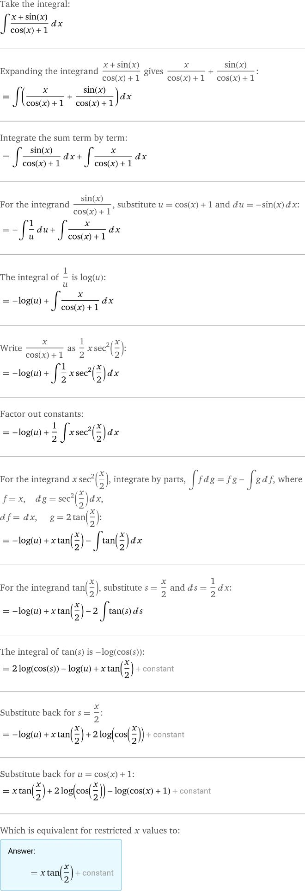

## 积分表

1. $\displaystyle \int k \mathrm{~d} x=k x+C\quad\left(\int 0 \mathrm{~d} x=C\right)$;
2. $\displaystyle \int x^\alpha \mathrm{d} x=\frac{1}{\alpha+1} x^{\alpha+1}+C \quad(\alpha \neq-1)$; *常用形式：*
	- $\displaystyle \int x\mathrm d x=\frac{1}{2}x^{2}$ 
	- $\displaystyle \int \sqrt{x} \mathrm d  x=\frac{2}{3} x^{\frac{3}{2}}+C$
	- $\displaystyle \int \frac{\mathrm d  x}{\sqrt{x}}=2 x^{\frac{1}{2}}+C=2 \sqrt{x}+C$
	- $\displaystyle \int \frac{\mathrm d  x}{x^2}=-x^{-1}+C=-\frac{1}{x}+C$
3. $\displaystyle \int \frac{1}{x} \mathrm{~d} x=\ln \textcolor{orange}{ |x| }+C$;
    - ***P.S.*** $\ln x$ 的定义域为 $x>0$, $\frac{1}{x}$ 的定义域为 $x\neq 0$ 故需要绝对值
   - $\displaystyle \int \frac1{ax+b}\mathrm dx=\frac{\ln|ax+b|}{a}+C$
5.  $\displaystyle \int a^x \mathrm{~d} x=\frac{a^x}{\ln a}+C \quad(0<a \neq 1)$;
	- ***P.S.*** $(a^x)'=\ln a\cdot a^x$
5. $\displaystyle \int \mathrm{e}^x \mathrm{~d} x=\mathrm{e}^x+C$;
6. $\displaystyle \int \sin x \mathrm{~d} x=-\cos x+C$;
7. $\displaystyle \int \cos x \mathrm{~d} x=\sin x+C$;
8. $\displaystyle \int \sec ^2 x \mathrm{~d} x=\tan x+C$;
   
   - $\displaystyle \int \sec x \mathrm d x=\ln\left|\sec x+\tan x\right|+C$
   
9. $\displaystyle \int \csc ^2 x \mathrm{~d} x=-\cot x+C$;
   - $\displaystyle \int \csc x \mathrm d x =-\ln|\csc x+\cot x|+C = \ln\left(\tan \frac{x}{2}\right)$
   
10. $\displaystyle \int \frac{\mathrm{d} x}{a^2+x^2}=\frac{1}{a} \arctan \frac{x}{a}+C(a \neq 0)$;
    
    ***P.S.*** $\left(\frac{1}{a} \arctan \frac{x}{a}\right)^{\prime}=\frac{1}{a} \cdot \frac{1}{a} \frac{1}{1+\left(\frac{x}{a}\right)^2}=\frac{1}{a^2+x^2}$
    
    - $\displaystyle \int\frac{\mathrm dx}{1+x^{2}}=\arctan x+C$
	  
11.  $\displaystyle \int \frac{\mathrm{d} x}{x^2-a^2}=\frac{1}{2 a} \ln \left|\frac{x-a}{x+a}\right|+C\quad(a \neq 0)$;
    
     - $\displaystyle \int \frac{d x}{a^2-x^2}=\frac{1}{2 a} \ln \left|\frac{x+a}{x-a}\right|+C$
	  
12. $\displaystyle \int \frac{\mathrm{d} x}{\sqrt{a^2-x^2}}=\arcsin \frac{x}{a}+C(a>0)$;
    
13. $\displaystyle \int \frac{\mathrm{d} x}{\sqrt{x^2 \pm a^2}}=\ln \left|x+\sqrt{x^2 \pm a^2}\right|+C$.

## 补充不定积分

-  $\int \tan(x) \mathrm d x=\ln(\cos(x))$
- $\int \sqrt{ x^{2}\pm a^{2} } \, dx=\frac{x}{2}\sqrt{ x^{2}\pm a^{2} }\pm \frac{a^{2}}{2}\ln \left| x+\sqrt{ x^{2}\pm a^{2} } \right|+C$
- $\int \sqrt{ a^{2}-x^{2} } \, dx=\frac{x}{2} \sqrt{ a^{2}-x^{2} } +\frac{a^{2}}{2} \arcsin \frac{x}{a} + C$
- $I(m,n)=\int \cos ^{m}x\sin ^{m}x \, dx=\dots$(递推公式)

## 部分积分推导

### $\int \frac{1}{x^2+a^2} \, dx$

> ***Tips*** **"AA"**
> 
> $(\arctan x)'=\frac{1}{1+x^2}$
> 
> $\left(\textcolor{orange}{ \frac{1}{a} } \arctan \frac{x}{\textcolor{Cyan}{ a }}\right)^{\prime}=\textcolor{orange}{ \frac{1}{a} } \cdot \textcolor{Cyan}{ \frac{1}{a} } \frac{1}{1+\left(\frac{x}{a}\right)^2}=\frac{1}{a^2+x^2}$
> 
> ***Solution***
> 
> $$
> \begin{flalign}
> &\text{Assuming } a>0\newline &=\frac{1}{a^{2}}\int \frac{1}{1+\left( \frac{x}{a} \right)^{2} } \, dx \newline &=\frac{1}{a}\int \dfrac{d\left( \frac{x}{a} \right)}{1+\left( \frac{x}{a} \right)^{2}}\newline &=\frac{1}{a}\arctan \frac{x}{a}+C
> \end{flalign}
> $$

### $\int \frac{1}{x^{2}-a^{2}} \, dx$

> ***Tips*** **1/2a ∓** 
> 
> $$
> {\text{凑2a}\implies} \frac{1}{x-a}-\frac{1}{x+a}\implies \dfrac{x-a}{x+a}
> $$
> 
> ***Solution***
> 
> $$
> \begin{flalign}
> &\text{Assuming } a\neq 0\newline &= \int \dfrac{1}{(x+a)(x-a)} \, dx \newline &= \frac{1}{2a}\left( \int \frac{1}{x-a} \, dx - \int \frac{1}{x+a} \, dx  \right)\newline &=\frac{1}{2a}\left( \ln|x-a|-\ln|x+a| \right)+C\newline &=\frac{1}{2a}\ln \left| \dfrac{x-a}{x+a} \right| +C
> \end{flalign}
> $$

### $\int \frac{1}{a^{2}-x^{2}} \, dx$

> ***Solution***
> 
> 类似地
> 
> $$
> \begin{flalign}
> &=-\int \frac{1}{x^{2}-a^{2}} \, dx\newline &=-\frac{1}{2a}\ln \left| \dfrac{x-a}{x+a} \right| +C\newline &=\frac{1}{2a}\ln \left| \dfrac{x+a}{x-a} \right| +C'
> \end{flalign}
> $$

### $\int \frac{1}{\sqrt{ a^{2}-x^{2} }} \, dx$

> ***Tips***
> 
> $(\arcsin x)'=\frac{1}{\sqrt{ 1-x^{2} }}$
> 
> $\textcolor{lightgray}{ (\arccos x)'=-\frac{1}{\sqrt{ 1-x^{2} }} }$
> 
> ***Solution***
> 类似 $\int \frac{1}{x^2+a^2} \, dx$
> 
> $$
> \begin{flalign}\newline &\text{Assuming } a>0\newline &\int \frac{1}{\sqrt{ a^{2}-x^{2} }}\newline &= \frac{1}{a}\int \frac{1}{\sqrt{ 1-\left( \frac{x}{a} \right)^{2} }} \, dx\newline &=\int \frac{1}{\sqrt{ 1-\left( \frac{x}{a} \right)^{2} }} \, d\left( \frac{x}{a} \right)\newline &=\arcsin\left( \frac{x}{a} \right)+C
> \end{flalign}
> $$

### $\int \frac{1}{\sqrt{ x^{2}\pm a^{2} }} \, dx$

#### $\int \frac{1}{\sqrt{ x^{2} + a^{2} }} \, dx$

> ***Tips***
> 
> <b class="md-tag">三角代换</b> 
> 
> 对边：$\sqrt{ x^{2}-a^{2} }$
> 邻边：$a$
> 斜边：$x$
> 
> ***Solution***
> 
> $$
> \begin{flalign}
> &\int \frac{1}{\sqrt{ x^{2}-a^{2} }} \, dx \newline &\xlongequal{ x=a\sec t }\int \frac{1}{a\tan t} \, d\left( a\sec t \right) & 0 < t < \frac{\pi}{2}\newline &=\int \frac{1}{\tan t} t \, d\sec t\newline &=\int \frac{1}{\tan t} \sec t\tan t\, dt \newline &=\int \sec t \, dt \newline &=\ln|\sec t+\tan t| + C\newline &=\ln\left| \frac{x}{a} + \dfrac{\sqrt{ x^{2}-a^{2} }}{a}\right| + C & \bigstar \text{ 还原}
> \end{flalign}
> $$

#### $\int \frac{1}{\sqrt{ x^{2} + a^{2} }} \, dx$

> ***Tips***
> 
> <b class="md-tag">三角代换</b> 
> 
> 对边：$x$
> 邻边：$a$
> 斜边：$\sqrt{ x^{2}+a^{2} }$
> 
> ***Solution***
> 
> $$
> \begin{flalign}
> &\int \frac{1}{\sqrt{ x^{2} + a^{2} }} \, dx\newline &\xlongequal{ x=a \tan t } \int \frac{1}{a\sec t} \, d(a\tan t)\newline &=\int \frac{1}{\sec t}\sec ^{2}t \, dx \newline &=\int \sec t \, dt \newline &\text{同上}\newline &=\ln\left| \frac{x}{a} + \dfrac{\sqrt{ x^{2}+a^{2} }}{a}\right| + C & \bigstar \text{ 还原}
> \end{flalign}
> $$

> **综上**
> 
> $$
> \int \frac{1}{\sqrt{ x^{2}\pm a^{2} }} \, dx = \ln\left| \frac{x}{a} + \dfrac{\sqrt{ x^{2}\pm a^{2} }}{a}\right| + C
> $$

### $\int \tan x\, dx$

> ***Solution***
> 
> $$
> \begin{aligned}
> &=\int \dfrac{\textcolor{orange}{ \sin x }}{\cos x} \, dx\newline &=\textcolor{orange}{ - }\int \frac{1}{\cos x} \, d\textcolor{orange}{ \cos x }\newline &=-\ln \left|\cos x\right|+C
> \end{aligned}
> $$

### $\int \sec x \, dx$

> ***Solution.I***
> 最快，不自然
> 
> $$
> \begin{aligned}
> &=\int \dfrac{\sec x \textcolor{orange}{ \cdot(\sec x+\tan x) }}{\textcolor{orange}{ \sec x+\tan x }} \, dx\newline \because~&(\sec x + \tan x)'=\dfrac{\sin x}{\cos ^{2}x}+\frac{1}{\cos ^{2}x}=\sec x\cdot(\sec x+\tan x)\newline &=\int \dfrac{d(\sec x+\tan x)}{\sec x+\tan x}\newline &=\ln|\sec x+\tan x|+C
> \end{aligned}
> $$
> 
> ***Solution.II***
> 较快， <b class="md-tag">凑微分法</b> 
> 
> $$
> \begin{aligned}
> &=\int \dfrac{\cos x}{\cos ^{2} x} \, dx \newline &=-\int \dfrac{d\sin x}{1-\sin ^{2}x} \, dx \newline &=-\frac{1}{2}\ln\left( \frac{1+\sin x}{1-\sin x} \right)+C
> \end{aligned}
> $$

### $\int \csc x \, dx$

> ***Solution.I***
> 
> $$
> \begin{aligned}
> &=\int \textcolor{orange}{ - }\dfrac{\csc x\textcolor{orange}{ \cdot-(\csc x+\cot x) }}{\textcolor{orange}{ \csc x+\cot x }} \, dx \newline \because~&\left( \csc x+\cot x \right)'=-\csc x\cdot(\csc x+\cot x)\newline &=-\int \dfrac{d(\csc x+\cot x)}{\csc x+\cot x} \, dx \newline &=-\ln|\csc x+\cot x|+C\newline &\textcolor{Gray}{ =-\ln \left| \tan \frac{x}{2} \right|  }
> \end{aligned}
> $$
> 
> ***Solution.II***
> 
> 同上，$\displaystyle=-\frac{1}{2}\ln \left( \dfrac{1+\cos x}{1-\cos x} \right)$

### $I(m,n)=\int \cos ^{m}x\sin ^{m}x \, dx$

> ***Solution***
> <b class="md-tag">分部积分法</b> + 递推构造
> 
> $$
> \begin{flalign}
> I(m,n)&=-\frac{1}{m+1}\int \sin ^{\textcolor{orange}{ n-1 }}x \, d(\cos ^{\textcolor{orange}{ m+1 }}x)\newline &=-\frac{1}{m+1}\left( \sin ^{n-1}x\cos ^{m+1}x-\int \cos ^{m+1}x \, d\sin ^{n-1}x  \right) \dots\text{分部积分}\newline &=-\frac{1}{m+1}\sin ^{n-1}x\cos ^{m+1}x + \dfrac{n-1}{m+1}\int \sin ^{n-2}x \cos ^{m\textcolor{red}{ +2 }}x \, dx \newline &=-\frac{1}{m+1}\sin ^{n-1}x\cos ^{m+1}x + \dfrac{n-1}{m+1}\sin ^{n-2}x\cos ^{m}x\textcolor{red}{ (1-\sin ^{2}x) }\,dx\newline &=-\frac{1}{m+1}\sin ^{n-1}x\cos ^{m+1}x + \dfrac{n-1}{m+1}\sin ^{n-2}x\cos ^{m}x\,dx\\&\qquad+\dfrac{1-n}{m+1}\int \sin ^{n}x\cos ^{m}x \, dx \newline \therefore~ \frac{m+n}{m+1}I(m,n)&=-\frac{1}{m+1}\sin ^{n-1}x\cos ^{m+1}x+ \dfrac{n-1}{m+1}I(m,n-2)\newline \implies I(m,n)&=-\frac{1}{m+n}\sin ^{n-1}x\cos ^{m+1}x+ \dfrac{n-1}{m+n}I(m,n-2)\quad(m\geq 0,n\geq 2)\newline \text{同理: } I(m,n)&=-\frac{1}{m+n}\cos ^{m-1}x\sin ^{n+1}x+ \dfrac{m-1}{m+n}I(m-2,n)\quad(m\geq 2,n\geq 0)
> \end{flalign}
> $$

---

## 典题整理

### 不定积分

#### $\int \dfrac{\arctan x}{x^{2}(x^{2}+1)} \, dx$

> 来源: 作业题

> ***Analysis***
> 
> <b class="md-tag">分部积分法</b> 
> 
> *Hint*
> 1. **裂项** $\displaystyle \frac{1}{x^{2}(x^{2}+1)}=\frac{1}{x^{2}}-\frac{1}{x^{2}+1}$ 
> 2. $\displaystyle \left( -\frac{1}{x}-\arctan x \right)'=\frac{1}{x^{2}}-\frac{1}{x^{2}+1}$
> 3. $\displaystyle \frac{1}{x^{3}+x}=\frac{(x^{2}+1)-\textcolor{Orange}{ x\cdot x }}{\textcolor{Orange}{ x(x^{2}+1) }}=\frac{1}{x}-\frac{x}{x^{2}+1}$
> 4. $\displaystyle \int \frac{x}{x^{2}+1} \, dx\implies \frac{1}{2}\int \frac{1}{x^{2}+1} \, d(x^{2}+1)$
> 
> ***Solution***
> 
> 

#### $\int \dfrac{x+\sin x}{\cos x + 1} \, dx$

> 来源: 作业题

> ***Analysis***
> 
> *Hint*
> 1. 分子加法：拆分
> 2. <b class="md-tag">凑微分法</b> $\left( \cos x+1 \right)'=\sin x$
> 3. 分母 $\cos x+1$ => 二倍角/半角公式消成**单一项**
> 
> ***Solution***
> 
> 

#### $I_{15}=\int \mathrm{e}^x\left(1-\frac{\mathrm{e}^{-x}}{\sqrt{x}}\right) \mathrm{d} x$.

>来源: [微积分每日一题3-187：求不定积分基础26题第15题](https://zhuanlan.zhihu.com/p/671872512)

> ***Analysis***
> 
> 本题考查最基本的积分表运算
> 
> ***Solution***
> 
> $$
> \begin{aligned}
> I_{15} & =\int \mathrm{e}^x\left(1-\frac{\mathrm{e}^{-x}}{\sqrt{x}}\right) \mathrm{d} x=\int\left(\mathrm{e}^x-\frac{\textcolor{orange}{ \mathrm{e}^x \cdot \mathrm{e}^{-x} }}{\sqrt{x}}\right) \mathrm{d} x \newline & =\int \mathrm{e}^x \mathrm{~d} x-\int \frac{\textcolor{orange}{ 1 }}{\sqrt{x}} \mathrm{~d} x=\mathrm{e}^x-2 \int \frac{\mathrm{d} x}{2 \sqrt{x}} \newline & =\mathrm{e}^x-2 \int \mathrm{d}(\sqrt{x})=\mathrm{e}^x-2 \sqrt{x}+C .
> \end{aligned}
> $$
> 
> ***Wrong Answer***
> 
> $$
> \int e^{x} \, d \dfrac{e^{-x}}{\sqrt{ x }}\neq \int 1 \, d \frac{1}{\sqrt{ x }}
> $$
> 不能在分式上挪 $e^{x}$ !

---

### <b class="md-tag">凑微分法</b> 

#### $\int \frac{\mathrm{d} x}{1+x^4}$

> 来源: 较难积分题.pdf

> ***Analysis***
> 
> 运用 <b class="md-tag">添项</b> 和分式中经典的 <b class="md-tag">凑微分法</b> 
> 
> ***Solution***
> 
> $$
> \begin{aligned}
> \int \frac{\mathrm{d} x}{1+x^4} & =\frac{1}{2} \int \frac{\left(1+x^2\right)-\left(x^2-1\right)}{1+x^4} \mathrm{~d} x \quad\dots\text{经典添项}\\&=\frac{1}{2} \int \frac{1+x^2}{1+x^4} \mathrm{~d} x-\frac{1}{2} \int \frac{x^2-1}{1+x^4} \mathrm{~d} x \newline & =\frac{1}{2} \int \frac{1+\frac{1}{x^2}}{x^2+\frac{1}{x^2}} \mathrm{~d} x-\frac{1}{2} \int \frac{1-\frac{1}{x^2}}{x^2+\frac{1}{x^2}} \mathrm{~d} x\quad\dots\text{经典凑微分}\\&=\frac{1}{2} \int \frac{\mathrm{d}\left(x-\frac{1}{x}\right)}{x^2+\frac{1}{x^2}}-\frac{1}{2} \int \frac{\mathrm{d}\left(x+\frac{1}{x}\right)}{x^2+\frac{1}{x^2}} \newline & =\frac{1}{2} \int \frac{\mathrm{d}\left(x-\frac{1}{x}\right)}{\left(x-\frac{1}{x}\right)^2+2}-\frac{1}{2} \int \frac{\mathrm{d}\left(x+\frac{1}{x}\right)}{\left(x+\frac{1}{x}\right)^2-2} \newline & =\frac{1}{2 \sqrt{2}} \arctan \frac{x-\frac{1}{x}}{\sqrt{2}}-\frac{1}{4 \sqrt{2}} \ln \left|\frac{x+\frac{1}{x}-\sqrt{2}}{x+\frac{1}{x}+\sqrt{2}}\right|+C \newline & =\frac{\sqrt{2}}{4} \arctan \frac{x^2-1}{\sqrt{2} x}-\frac{\sqrt{2}}{8} \ln \left|\frac{x^2-\sqrt{2} x+1}{x^2+\sqrt{2} x+1}\right|+C .
> \end{aligned}
> $$

#### 求不定积分: $I=\int \frac{\mathrm{d} x}{\sqrt[2023]{1+x^{2023}}\left(1+x^{2023}\right)}$.

> [微积分每日一题3-109：不定积分凑微分法练习](https://zhuanlan.zhihu.com/p/644614130)

> ***Analysis***
> 
> 利用 <b class="md-tag">凑微分法</b> 即可求解.
> 
> ***Solution***
> 
> $$
> \begin{aligned}
> I & =\int \frac{\mathrm{d} x}{\sqrt[2023]{1+x^{2023}}\left(1+x^{2023}\right)}=\int \frac{\mathrm{d} x}{\left(1+x^{2023}\right)^{\frac{1}{2023}} \cdot\left(1+x^{2023}\right)} \newline & =\int \frac{\mathrm{d} x}{\left(1+x^{2023}\right)^{\frac{1}{2023}+1}}=\int \frac{\mathrm{d} x}{\left[\textcolor{orange}{ x^{2023} }\left(\frac{1}{x^{2023}}+1\right)\right]^{\frac{2024}{2023}}} \newline & =\int \frac{\mathrm{d} x}{\left(1+x^{-2023}\right)^{\frac{2024}{2023}} \cdot x^{2024}}=\int \frac{x^{-2024}}{\left(1+x^{-2023}\right)^{\frac{2024}{2023}} \mathrm{~d} x} \newline & =\int\left(-\frac{1}{2023}\right) \frac{1}{\left(1+x^{-2023}\right)^{\frac{2024}{2023}} \mathrm{~d}\left(x^{-2023}\right)} \newline & =-\frac{1}{2023} \int\left(1+x^{-2023}\right)^{-\frac{2024}{2023}} \mathrm{~d}\left(1+x^{-2023}\right) \newline & =\frac{u=1+x^{-2023}}{-1}-\frac{1}{2023} \int u^{-\frac{2024}{2023}} \mathrm{~d} u \newline & =-\frac{1}{2023} \cdot \frac{1}{-\frac{2024}{2023}+1} \cdot u^{-\frac{2024}{2023}+1}+C \newline & =-\frac{1}{2023 \cdot\left(1-\frac{2024}{2023}\right)} \cdot u^{-\frac{1}{2023}}+C \newline & =-\frac{1}{2023-2024} \cdot\left(1+x^{-2023}\right)^{-\frac{1}{2023}}+C \newline & =-(-1) \cdot\left(1+x^{-2023}\right)^{-\frac{1}{2023}}+C \newline & =\left(1+x^{-2023}\right)^{-\frac{1}{2023}}+C .
> \end{aligned}
> $$

---

### <b class="md-tag">换元积分法</b> 

#### $\int \frac{\sqrt{x-1} \arctan \sqrt{x-1}}{x} d x$

> 来源: 作业题
> 
> ***Solution***
> 
> $$
> \begin{aligned}
> & \int \frac{\sqrt{x-1} \arctan \sqrt{x-1}}{x} d x \newline & \text { 设 } u=\sqrt{x-1} \text {, 则 } x=u^2+1, d x=2 u d u \newline & \text { 原式 }=\int \frac{u \arctan u}{u^2+1} \cdot 2 u d u \newline & =2 \int \frac{\textcolor{orange}{ u^2 } \arctan u}{\textcolor{orange}{ u^2+1 }} d u \newline & =2 \int \arctan u d u-2 \int \frac{\arctan u}{u^2+1} d u \newline & =2 u \arctan u-2 \int \frac{u}{u^2+1} d u-2 \int \arctan u d(\arctan u) \newline & =2 u \arctan u-\int \frac{1}{u^2+1} d\left(u^2\right)-(\arctan u)^2 \newline & =2 u \arctan u-\ln \left(u^2+1\right)-(\arctan u)^2+c \newline & =2 \sqrt{x-1} \arctan \sqrt{x-1}-(\arctan \sqrt{x-1})^2-\ln x+c
> \end{aligned}
> $$

#### 🔴$\int_0^{\frac{\pi}{4}} \sqrt{\tan x} \mathrm{~d} x$

> Chap 5.1 P190 22.(9)

> ***Solution*** <b class="md-tag">换元积分法</b> 
> 
> $$
> \begin{aligned}
> &\xlongequal{t=\tan x} \int_0^1 \sqrt{t} d \arctan t\newline &\xlongequal{m=\sqrt{t}} \int_0^1 m d \arctan m^2\newline & =\int_0^1 \frac{2 m^2}{1+m^4} d m \newline & =\int_0^1 \frac{m^2-1}{1+m^4} d m+\int_0^1 \frac{m^2+1}{1+m^{\varphi}} d m\newline & =\int_0^1 \frac{1-\frac{1}{m^2}}{m^2+\frac{1}{m^2}} d m+\int_0^1 \frac{1+\frac{1}{m^2}}{m^2+\frac{1}{m^2}} d m\newline & =\int_0^1 \frac{d\left(m+\frac{1}{m}\right)}{m^2+\frac{1}{m^2}}+\int_0^1 \frac{d\left(m-\frac{1}{m}\right)}{m^2+\frac{1}{m^2}}\newline & =\int_0^1 \frac{d\left(m+\frac{1}{m}\right)}{\left(m+\frac{1}{m}\right)^2-2}+\int_0^1 \frac{d\left(m-\frac{1}{m}\right)}{\left(m-\frac{1}{m}\right)^2+2}\newline & =\left.\frac{1}{2 \sqrt{2}} \ln \left|\frac{m+\frac{1}{m}-\sqrt{2}}{m+\frac{1}{m}+\sqrt{2}}\right|\right|_0 ^1+\left.\frac{1}{\sqrt{2}} \arctan \frac{m-\frac{1}{m}}{\sqrt{2}}\right|_0 ^1\newline \because~ &\lim _{m \rightarrow 0^{+}}\left(1-\frac{2 \sqrt{2}}{m+\frac{1}{m}+\sqrt{2}}\right)=1-\lim _{m \rightarrow 0^{+}} \frac{2 \sqrt{2} m}{m^2+\sqrt{2} m+1}=1 \newline & \lim _{m \rightarrow 0^{+}}\left(m-\frac{1}{m}\right) \frac{0}{=} \lim _{m \rightarrow 0^{+}} m-\lim _{m \rightarrow 0^{+}} \frac{1}{m}=-\infty \newline \therefore~ &= \frac{1}{2 \sqrt{2}}\left(\ln \frac{2-\sqrt{2}}{2+\sqrt{2}}-0\right)+\frac{1}{\sqrt{2}}(\arctan 0-\arctan -\infty) \newline &= \frac{1}{2 \sqrt{2}} \ln (3-2 \sqrt{2})+\frac{1}{\sqrt{2}}\left(0+\frac{\pi}{2}\right) \newline &= \frac{\sqrt{2}}{2} \ln (\sqrt{2}-1)+\frac{\sqrt{2} \pi}{4} \newline & \approx 0.4875
> \end{aligned}
> $$

---

### 定积分

#### $\int_0^{\frac{\pi}{2}}\sqrt{\tan x}{\mathrm d}x$

> ***Solution***
> 
> $$
> \begin{aligned}
> \int_0^{\frac{\pi}{2}}\sqrt{\tan x}{\mathrm d}x&=2\left(\int_0^1+\int_1^{+\infty}\right)\frac{x^2}{1+x^4}{\mathrm d}x\newline &=2\int_0^1\frac{x^2}{1+x^4}{\mathrm d}x+2\int_0^{1}\frac{1}{1+x^4}{\mathrm d}x\newline &=2\int_0^1 \frac{{\mathrm d}\left(x-\frac{1}{x}\right)}{\left(x-\frac{1}{x}\right)^2+2}\newline &=2\int_{-\infty}^0\frac{{\mathrm d}x}{x^2+2}\newline &=\frac{\pi}{\sqrt{2}}.
> \end{aligned}
> $$

#### $\int_{0}^{1} x\arcsin x \, dx$

> ***Analysis***
> 
> <b class="md-tag">分部积分法</b>  + <b class="md-tag">三角代换</b> 
> 
> ***Solution***
> 
> $$
> \begin{aligned}
> & u=\arcsin x \quad v^{\prime}=x \newline & u^{\prime}=\frac{1}{\sqrt{1-x^2}} \quad v=\frac{x^2}{2} \newline & \int x \arcsin x d x=\frac{x^2}{2} \arcsin x-\frac{1}{2} \int \frac{x^2}{\sqrt{1-x^2}} d x \text {. } \\ \newline &\textcolor{Orange}{\textbf {第二类换元 }} \newline &\text { 故 } x=\sin t . \Rightarrow d x=\cos t d t \newline &\qquad\left(t=\arcsin x\right), \quad x \in[0,1] \Rightarrow t \in\left[0, \frac{\pi}{2}\right] \\ \newline & \int \frac{x^2}{\sqrt{1-x^2}} d x \newline &\xlongequal{ x=\sin t }\int \dfrac{\sin ^{2}t}{\cos t} \, d\sin t \newline & =\int \sin ^2 t d t\newline &=\int \left( \frac{1}{2}-\frac{1}{2} \cos 2 t \right) \,d t\newline & =\frac{1}{2} t-\frac{\sin 2 t}{4}+C \newline \therefore~ & \int x \arcsin x d x\newline &=\left.\frac{x^2}{2} \arcsin x\right|_0 ^1-\left.\frac{1}{2}\left[\frac{1}{2} t-\frac{\sin 2 t}{4}\right]\right|_0 ^{\pi/2} \newline & =\frac{\pi}{4}-\frac{1}{2}\left(\frac{\pi}{4}-0\right) \text {. } \newline & =\frac{\pi}{8} \newline &
> \end{aligned}
> $$

---

### 结合 <b class="md-tag">积分/中值定理</b> 

> [!theorem] 积分/中值定理 
> 设 $f \in C[a, b]$, 则 $\exists \xi \in[a, b]$ 使得
> 
> $$
> \int_{a}^{b} f(x) \mathrm{d} x=f(\xi)(b-a)
> $$

> [!corollary] 积分/中值定理/推广 AKA.积分第一中值公式
> 
> $$
> \displaystyle\int_{a}^{b} f(x)g(x) \, dx =f(\xi)\int_{a}^{b} g(x) \, dx ,~\xi \in[a,b]
> $$

#### 求 $\text {(1)} \lim _{n \rightarrow \infty} \int_0^1 \frac{x^n}{1+x} \mathrm{~d} x$,  

> ***Analysis***
> 
> <b class="md-tag">积分/中值定理/推广</b> 
> 
> ***Solution***
> 
> (1) 由积分中值定理推广 $\int_a^b f(x) g(x) \mathrm{d} x=f(\xi) \int_a^b g(x) \mathrm{d} x$ 可知
> 
> $$
> \int_0^1 \textcolor{orange}{ \frac{1}{1+x} }\cdot x^n \mathrm{~d} x=\textcolor{orange}{ \frac{1}{1+\xi} } \int_0^1 x^n \mathrm{~d} x, \quad 0 \leqslant \xi \leqslant 1 .
> $$
> 
> 又
> 
> $$
> \lim _{n \rightarrow \infty} \int_0^1 x^n \mathrm{~d} x=\lim _{n \rightarrow \infty} \frac{1}{n+1}=0 \text { 且 } \frac{1}{2} \leqslant \frac{1}{1+\xi} \leqslant 1,
> $$
> 
> 故
> 
> $$
> \lim _{n \rightarrow \infty} \int_0^1 \frac{x^n}{1+x} \mathrm{~d} x=0
> $$

#### 求 ${(2)} \lim _{n \rightarrow \infty} \int_n^{n+p} \frac{\sin x}{x} \mathrm{~d} x, p \text { 为自然数. }$

> ***Solution***
> 
> （2）利用积分中值定理.
> 设 $f(x)=\frac{\sin x}{x}$, 显然 $f(x)$ 在 $[n, n+p]$ 上连续, 由积分中值定理得
> 
> $$
> \int_n^{n+p} \frac{\sin x}{x} \mathrm{~d} x=\frac{\sin \xi}{\xi} \cdot p, \xi \in[n, n+p],
> $$
> 
> 当 $n \rightarrow \infty$ 时, $\xi \rightarrow \infty$, 而 $|\sin \xi| \leqslant 1$, 故
> 
> $$
> \lim _{n \rightarrow \infty} \int_n^{n+p} \frac{\sin x}{x} \mathrm{~d} x=\lim _{\xi \rightarrow \infty} \frac{\sin \xi}{\xi} \cdot p=0 .
> $$

### 证明部分

#### 积分第一中值公式

> 作业题

> [!question] 
> 证明 (积分第一中值公式) 若 $f(x)$ 是 $[a, b]$ 上的连续函数, $g(x)$ 是 $[a, b]$ 上的非负可积函数, 则存在 $\xi \in[a, b]$, 使得
> $$
> \int_a^b f(x) g(x) \mathrm{d} x=f(\xi) \int_a^b g(x) \mathrm{d} x .
> $$

> ***Proof***
> 
> 记 $f([a, b])=[c, d]$, 易知 ==$f$有界==
> $$
> c g(x) \leqslant f(x) g(x) \leqslant d g(x), \text { a. e. } x \in[a, b] .
> $$
> 
> 将上式积分, 我们有
> $$
> c \int_a^b g(x) \mathrm{d} x \leqslant \int_a^b f(x) g(x) \mathrm{d} x \leqslant d \int_a^b g(x) \mathrm{d} x .
> $$
> 
> 若 $I=\int_a^b g(x) \mathrm{d} x>0$, 则用它来除上式两端可得
> $$
> c \leqslant \frac{\int_a^b f(x) g(x) \mathrm{d} x}{I} \leqslant d .
> $$
> 
> 由 $f(x)$ 的 <b class="md-tag">闭区间连续函数介值性</b> 可知, 存在 $\xi \in[a, b]$, 使得
> $$
> f(\xi)=\frac{\int_a^b f(x) g(x) \mathrm{d} x}{\int_a^b g(x) \mathrm{d} x} .
> $$
> 
> 此即 (5.14) 式.
> 若 $I=0$, 则 $g(x)=0$, a. e. $x \in[a, b]$, 从而 (5.14) 式两端皆为零. 此时 $\xi$ 可任意地选取.