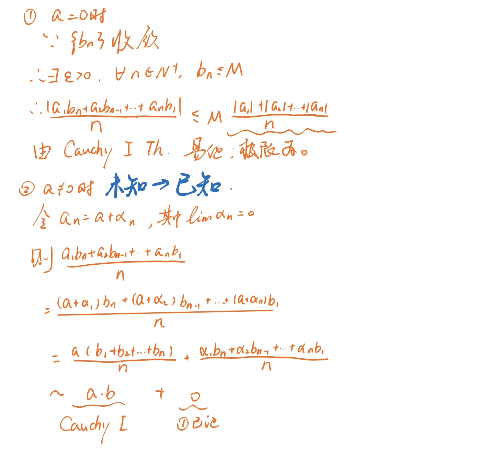

写在前面：

> [!tips]
> - 注意讨论分母是否为0
> - 注意讨论极限是否存在
> - 适当讨论是否为0可以化简/求出部分
> - 极限差为0而商不一定为1（$a=0$不行，$a\ne0$为1（国科大讲义P3）


> [!contents]
> ```table-of-contents
> not available in web
> ```

# 奇奇怪怪但是很重要的东西

## 数列重要极限

$\lim C=C$

$\lim \dfrac1{n^{k}}=0,k>0$

$\lim q^{n}=0,|q|<1$

$\lim \sqrt[n]a=1,a>0$

$\lim \dfrac {a^{n}}{n!}=0$

$\lim \sqrt[n] n=1$

证明见[二项式定理](MA.Add01.%E5%A5%87%E5%A5%87%E6%80%AA%E6%80%AA%E7%9A%84%E6%80%9D%E8%B7%AF%E5%92%8C%E6%8A%80%E5%B7%A7%EF%BC%81.md)

## 函数重要极限
- $\lim\limits_{x\to x_{0}}f(x)=f(x_{0})$ 连续
- $\lim\limits_{x\to 0}a^{x}=1$ <small>教材P<small>38</small></small> **注意左右极限相等**
- $\lim\limits_{x\to x_{0}}a^{x}=a^{x_{0}}$
- $\lim\limits_{x\to x_{0}}\ln x = \ln x_{0}$（其他底数可以使用换底公式）
- $\lim\limits_{\square\to 0}\dfrac{\sin\square}{\square}=1,\ \lim\limits_{\square\to \infty}\dfrac{\sin\square}{\square}=0$（利用 $\cos x<\dfrac{\sin x}x<1$）
- $\lim\limits_{x\to 0}(x)\sin(\square)=0$ 夹逼定理
- $\lim\limits_{\square\to\infty}(1+\dfrac1\square)^{\square}=e,\ \lim\limits_{\square\to 0}(1+\square)^\frac1{\square}=e$<br>（利用$\left(1+\frac1{[x]+1}\right)^{[x]}<(1+\dfrac1x)^{x}<\left(1+\frac1{[x]}\right)^{[x]+1}\dots[x] \leq x <[x]+1$）

## 函数等价无穷小

> $x\to0\begin{cases}x\sim\sin x\sim \tan x\sim \ln(1+x)\sim e^{x}-1\\1-\cos x\sim \frac12x^{2}\\x^{2}±x^{3}\sim x^{2}\\(1+x)^{\alpha}\sim1+\alpha x\\\arctan x \sim x\end{cases}$
> 
> 如：看到$\sqrt{1+x^{2}}-1\sim \frac{1}{2} x^2$
> 
> > $x\to0$ 次数高=作用小
> 
> $x\to\infty\begin{cases}x^{2}+x^{3}\sim x^{3}\\\end{cases}$

## 基本导数表


---

# 奇奇怪怪的公式

## 二项式定理

$\lim \sqrt[n]{n}=1\quad(n>1)$


## <b class="md-tag">和差化积</b>

> [!tip]
> <b class="md-tag">和差化积</b>
>  
>
>- - -
> <b class="md-tag">积化和差</b>
> 
>

## 绝对值不等式

$$
|a+b|\leq |a|+|b|,\ 当a,b同号
$$

推广：

$$
|a_{1}+a_{2}+\dots+a_{n}|\leq|a_1|+\dots|a_{n}|,\ 当a_{i}同号
$$

$$
||a|-|b|| \leq |a-b| \leq |a| + |b|
$$

即 

$$
|两边之差| \leq 第三边 \leq 两边之和
$$

两边之差小于第三边 + 两边之和大于第三边


## 伯努利不等式、均值不等式


## $e$的泰勒展开

$\lim\limits_{n\to \infty}n\sin(2\pi n! e)=?$

**解：**
由泰勒公式：$e=1+\frac{1}{1!}+\frac{1}{2!}+\cdots+\frac{1}{n!}+\frac{1}{(n+1)!}+\frac{\theta_{n+1}}{(n+1)!(n+1)}\;(0<\theta_{n+1}<1)$

$[n!e=\smash{\underbrace{n!\left(1+\frac{1}{1!}+\frac{1}{2!}+\cdots+\frac{1}{n!}\right)}_{\text{整数部分舍弃}}+\frac{n!}{(n+1)!}}+\frac{n!\theta_{n+1}}{(n+1)!(n+1)}]$
$\begin{align*} \lim_{n\to\infty}n\sin(2\pi en!)&=\lim_{n\to\infty}n\sin\bigg[2\pi en!-\overbrace{2\pi n!\Big(1+\frac{1}{1!}+\frac{1}{2!}+\cdots+\frac{1}{n!}\Big)}^{\sin(x\pm2k\pi)=\sin x\,,\;k\in\mathbb{Z}}\bigg]\\ &=\lim_{n\to\infty}n\sin\left[\frac{2\pi}{n+1}+\frac{\theta_{n+1}}{(n+1)^2}\right]\\ &=\lim_{n\to\infty}n\left(\frac{2\pi}{n+1}+\frac{\theta_{n+1}}{(n+1)^2}\right)\\&=2\pi \end{align*}$

# 奇奇怪怪的证明

## <b class="md-tag">极限与无穷小的转化</b> 

>[!example]
>若$\lim a_{n}=a,\ \lim b_{n}=b$,
>试证明: $\lim\dfrac{a_{1}b_{n}+a_{2}b_{n-1}+\dots+a_{n}b_{1}}{n}=ab$
>---
> <b class="md-tag">极限与无穷小的转化</b> + <b class="md-tag">Cauchy第一定理</b> 
> **证:**
>

^13b407

## <b class="md-tag">收敛数列保号性</b> 

### 极限除法

#epsilon-N定义 + <b class="md-tag">收敛数列保号性</b> 

**证明：**
$\exists N_1\in\mathbb{N},$

$使得\forall n>N_{1},\ |b_{n}|>\dfrac{|b|}2$ <b class="md-tag">收敛数列保号性</b> 

$\because \lim a_{n}=a$

$\therefore \forall \varepsilon>0,\ \exists N_{2}\in\mathbb{N},\ \forall n>N_{2},$

$使得|a_{n}-a|<\color{blue}\dfrac{|b|}4\varepsilon\dots(*)$

$类似地,\ \exists N_{3}\in\mathbb{N},\ \forall n>N_{3},$

$使得|b_{n}-b|<\color{blue}\dfrac{b^2}{4|a|+1}\varepsilon\cdots(**)$

$欲证\left|\dfrac {a_{n}}{b_{n}}-\dfrac ab\right|<\varepsilon$

$=\dfrac{|ba_{n}-ab_{n}|}{|b\cdot b_{n}}$

$=\dfrac{|a_{n}b\textcolor{red}{-ab+ab}-ab_{n}|}{|b\cdot b_{n}|}$ <b class="md-tag">分子拆分</b> 

$\leq \dfrac {|b||a_{n}-a|+|a||b_{n}-b|}{|b\cdot b_{n}|}$

$=\dfrac{|a_{n}-a}{|b_{n}|}+\dfrac{|a|}{|b\cdot b_{n}|}$

运用 <b class="md-tag">收敛数列保号性$|b_{n}|>\dfrac</b> b2$
$<\dfrac2{|b|}|a_{n}-a|+\dfrac{2|a|}{b^2}|b_{n}-b|$

$<\dfrac2{|b|}\textcolor{blue}{\dfrac{|b|}4\varepsilon^{(*)}}+\dfrac{2|a|}{b^2}\textcolor{blue}{\dfrac{b^2}{4|a|\textcolor{lime}{+1}}^{(**)}}$ $\textcolor{lime}{避免分类讨论}$

$< \varepsilon$

### 开方

$\lim a_{n}^{m}=a^{m},\ (a>0,m\in\mathbb{N}_{+})$

**证明：**
$|\sqrt[3] {a_{n}}-\sqrt[3] a|=\dfrac{|a_{n}-a|}{\sqrt[3]{a_{n}}+\sqrt[3] a}$$<\dfrac{|a_{n}-a|}{a_{n}^\frac23+a_{n}^\frac13a^\frac13+a^\frac23}<\dfrac{|a_{n}-a|}{a^\frac23}$

$a_{n}^\frac13a^\frac13$可以存在运用了 <b class="md-tag">收敛数列保号性</b> 

> More about: [次方差展开](MA.Add01.%E5%A5%87%E5%A5%87%E6%80%AA%E6%80%AA%E7%9A%84%E6%80%9D%E8%B7%AF%E5%92%8C%E6%8A%80%E5%B7%A7%EF%BC%81.md)

## <b class="md-tag">次方差展开</b>

^6bb0cf


</br>$\begin{aligned} a^n-b^n &=(a-b)\sum_{i=0}^{n-1}{a^ib^{n-1-i}}\\ &=(a-b)(b^{n-1}+ab^{n-2}+a^2b^{n-3}+\cdots+a^{n-3}b^{2}+a^{n-2}b+a^{n-1})\\ &=(a-b)(a^{0}b^{n-1}+a^{1}b^{n-2}+\cdots+a^{n-2}b^{1}+a^{n-1}b^{0})\\ \end{aligned}$

证明：

$\begin{aligned} a^n-b^n &=b^n\Big[(\frac{a}{b})^n-1\Big]\\ &=b^n\Big(\frac{a}{b}-1\Big)\sum_{i=0}^{n-1}{(\frac{a}{b})^i}=\Big(\frac{a-b}{b}\Big)b^n\sum_{i=0}^{n-1}{(\frac{a}{b})^i}\\ &=(a-b)\cdot b^{n-1}\sum_{i=0}^{n-1}{(\frac{a}{b})^i}=(a-b)\sum_{i=0}^{n-1}{b^{n-1}(\frac{a}{b})^i}\\ &=(a-b)\sum_{i=0}^{n-1}{a^ib^{n-1-i}}\\ \end{aligned}$ ^4e250d

## <b class="md-tag">实数公理</b> -> <b class="md-tag">确界原理</b>

$$
\begin{align*}
&令\ Y=\{y|y \geq x, \forall x \in X\}\\
&\quad 则\ M \in Y,\ 且\forall x \in X,\ y\in Y\ 有x \leq Y\\
&运用实数公理:\\
&\quad\exists\ a \in \mathbb{R}\\
&\quad使\ \forall x \in X,\ y\in Y,\ 有\\
&\quad x \leq a \leq y&(\Delta)\\
&下证:\ a=\sup X\\
&\quad\forall x \in X,\ x \leq a&①上界\\
&\quad\forall \varepsilon > 0,\ a-\varepsilon<a\\
&\quad\because a-\varepsilon <a \leq \forall y\\
&\quad\therefore a-\varepsilon \not\in y\\
&\quad\therefore a-\varepsilon不为X上界\\
&\quad\therefore \forall \varepsilon>0,\ \exists x_\varepsilon \in X,\ 使得\ a-\varepsilon<x_\varepsilon&②最小
\end{align*}
$$

## <b class="md-tag">调和级数</b>

思路： <b class="md-tag">基本列</b> 中 $p$，$\varepsilon$ 的任意性 + 放缩 + <b class="md-tag">Cauchy收敛准则</b> 


单调数列+发散=>发散到**正无穷**

## <b class="md-tag">和差化积</b> + 极限

例题：证明 $\lim\limits_{x \to x_{0}}\cos x=\cos x_{0}$

**证：** $$\begin{aligned}\left| \cos x-\cos x_{0}\right| &=\left| -2\times \sin \dfrac{x-x_{0}}{2}\times \sin \dfrac{x+x_{0}}{2}\right| \\
&\leq 2\times \left| \sin \dfrac{x-x_{0}}{2}\right| \\
&\leq 2\times \left| \dfrac{x-x_{0}}{2}\right| \\
&=\left| x-x_{0}\right|<\varepsilon 
\end{aligned}$$
$\therefore \forall\varepsilon>0,\ \exists\delta>0:\ |x-x_{0}|<\delta\Rightarrow\cdots$

## $e$ $\gamma$


## <b class="md-tag">构造辅助函数</b>

> 证明方程$x\ln x=1在(0,+\infty)上有且仅有一根$
> 即：$x\ln x-1 = 0$有解
> **简证：**
> 存在性： <b class="md-tag">零值定理</b> 1，e
> 唯一性： $\Rightarrow\ln x-\dfrac1x$单调！
> 下略

## 任何奇次多项式至少有一个实零点

---

# 奇奇怪怪的方法

## 如何证明数列收敛

### <b class="md-tag">单调有界定理</b> 

### <b class="md-tag">子数列归并性定理</b> 

### <b class="md-tag">Cauchy收敛准则</b> 


## 如何求解数列极限

### 简化证明


### <b class="md-tag">epsilon-N定义</b> 


### <b class="md-tag">Stolz定理</b> 


### Cauchy定理

算数平均


几何平均


连乘


### <b class="md-tag">夹逼定理</b> 

见下

## 如何证明函数极限存在

### <b class="md-tag">Heine归并定理</b> 


### <b class="md-tag">单调函数单侧极限定理</b> 


### <b class="md-tag">Cauchy判别准则</b> 


## 如何求解函数极限

### <b class="md-tag">夹逼定理</b> 

见下

### 幂指函数


---

> [!example]
>$\lim\limits_{x → 0} [\frac{a_1^x + a_2^x + .....+ a_n^x}{n}]^{\frac{1}{x}} = (a_1\cdot a_{2}\dots a_n)^{\frac{1}{n}}$
#e的转化 
>
> 解：
> $L:=\lim\limits_{x\to0}e^{\tfrac{\ln(a_1^x+\dots+a_n^x)-\ln n}{x}}$
> $=e^{\lim\limits_{x\to0}\tfrac{\ln(a_1^x+\dots+a_n^x)-\log n}{x}}$
> 
> **法一：**
> <b class="md-tag">LHospital法则</b> 
> $\lim\limits_{x\to 0}\dfrac{\ln(a_1^x+\dots+a_n^x)-\ln n}{x}$
> $=\lim\limits_{x\to0}\dfrac{(\ln(\dots))'}1$
> $=\lim\limits_{x\to0}\dfrac{a_1^x\log a_1+\dots+a_n^x\log a_n}{a_1^x+\dots+a_n^x}$
> $=\lim\limits_{x\to0}\dfrac{\ln a_{1}+\ln a_{2}+\dots+\ln a_{n}}n$
> $=$
> Therefore, 
> $L=e^{\tfrac1n\ln(a_{1}\cdot a_{2}\dots a_{n})}$
> $\quad=(a_{1}\cdot a_{2}\dots a_{n})^{\frac 1n}$
> 
> **法二：**
> 


## 想不到的放缩与 <b class="md-tag">夹逼定理</b>

> [!warning] 夹逼定理的规范使用
> - 写出不等式
> - **判断敛散性**
> - 带入$\lim$符号
>
> 不能对极限直接比较大小

- $\left(1+\dfrac1{n+2}\right)^{n}\leq \left(1+\dfrac1n-\dfrac1{n^{2}}\right)^{n}<\left(1+\dfrac1n\right)^{n},$ $n \geq 2$
	- $\Rightarrow \left(1+\dfrac1n-\dfrac1{n^{2}}\right)^{n}\to e$
- $\sqrt[n]{n!} \geq \dfrac ne$
	- Taylor: $e^{n}=1+n+\dfrac {n^{2}}{2!}+\dots+\dfrac{n^{n} }{n!}\geq\dfrac{n^{n}}{n!}$

# 奇奇怪怪

## 又神秘的东西

### 如何定义一个开集

$$\begin{align*}
我们称x为集合A的一个内点\\
\exists \delta > 0, C(x,\delta)\subset A\quad(O(x,\delta)\overset{\Delta}{=}\left\{y\;|\;||x-y||<\delta\right\})\\
开集合：只含有内点的集合称为开集\\
[a,b]\\
a\in[a,b]\\
\forall \varepsilon>0, (a-\varepsilon,a+\varepsilon),\exists(a-\varepsilon,a)\not\subset[a,b]\\
\\\\
(0,1)\bigcup_{n=1}^\infty(0,\dfrac1n)
\end{align*}
$$

线性空间满足八条原则

### 什么是数域？

### 什么是拓扑空间？
$$
\begin{align*}
设X为一个集合,F为x的幂集的子集（所有子集的集合）\\
若：\\
\not o \in F, x \in F\\
对于任意的U,V\in F,都有U\cap V \in F\\
\forall U_\alpha \in F, \alpha \in I,其中I为指标集,都有\bigcup_{\alpha\in I}U_{\alpha}\in F\\
则称F为一个拓扑空间
\end{align*}
$$

### 势

$1,2,3...$：可以排序：可数、可列
$[0,1]\to\mathbb R$：不可数、不可列

#### 连续统假设

$[0,1]\to N_{0}\to2^{N_{0}}$

> Reference：《实变函数论》

---
 
> 序结构：分析学
> 
> 代数结构：代数学
> 
> 拓扑结构：几何学

### 区域不变性

### 数分观点下的不动点

$设f\in C[a,b],且f([a,b])\subset[a,b]则$
$存在\xi\in[a,b],使得f(\xi)=\xi(即为[a,b]中的不动点)$

> [!example]
> $设f(x)在x处可微,\alpha_{n}<x_{0}<\beta_{n},$ $\lim\limits_{n\to \infty}\alpha_{n}=\lim\limits_{n\to \infty}\beta_{n}=x_{0}$
> $证明:\lim\limits_{n\to \infty}\dfrac{f(\beta_{n})-f(\alpha_{n})}{\beta_{n}-\alpha_{n}}=f'(x_{0})$

***Solution:***
> <b class="md-tag">添项</b> 
> $$\begin{align*}
\dfrac{f(\beta_{n})-f(\alpha_{n})}{\beta_{n}-\alpha_{n}}&=\dfrac{f(\beta_{n})-f(x_{0})+f(x_{0})-f(\alpha_{n})}{\beta_{n}-\alpha_{n}}\\
&=\dfrac{\beta_0-x_0}{\beta_n-\alpha_n}\dfrac{f(\beta_{n})-f(x_0)}{\beta_{n}-x_{0}}\\&\quad-\dfrac{f(\beta_{n})-f(\alpha_{n})}{\beta_{n}-\alpha_{n}}\dfrac{f(\beta_{n})-f(\alpha_{n})}{\beta_{n}-\alpha_{n}}
\end{align*}$$

> [!example]
> $设f(x),g(x),h(x)\in C[a,b]\cap D[a,b],试证$
> $存在\begin{vmatrix}f(a) & g(a) & h(a)\\f(b) & g(b) & h(b)\\ f'(\xi) & g'(\xi) & h'(\xi)\end{vmatrix}=0$

***Solution:***
>$F(x):=\begin{vmatrix}f(a) & g(a) & h(a)\\f(b) & g(b) & h(b)\\ f(x) & g(x) & h(x)\end{vmatrix}$

> [!example]
> $\bigstar设f(x)在[a,b]上连续,且f(a)=f(b),证明:$
> $$M(x)=\sup\limits_{a \leq t \leq x}f(t),~m(x)=\inf\limits_{a \leq t \leq x} f(t)$$
> $在[a,b]上连续$

### 一些常考 Theorem

需要掌握从**实数公理**推到每一个Th
以及Th之间互推！

1. Declekind分割原理
2. 确界限存在原理
3. 单调有界原理
4. 区间套定理
5. 有限覆盖定理
6. 聚点定理
7. 有界数列必有收敛子列
8. Cauchy收敛准则