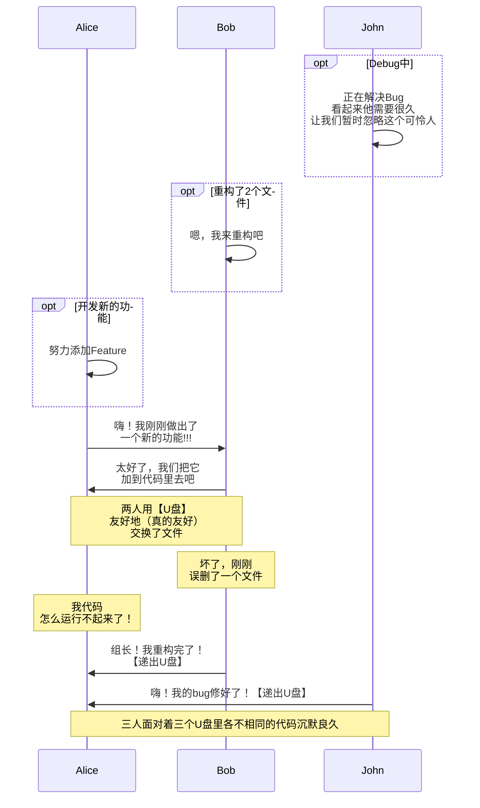
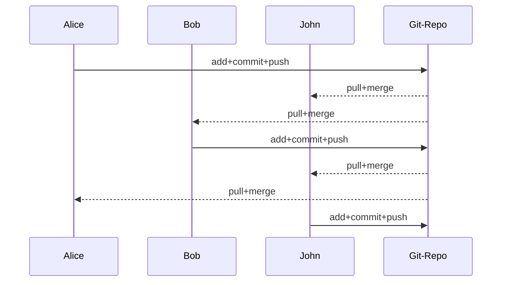
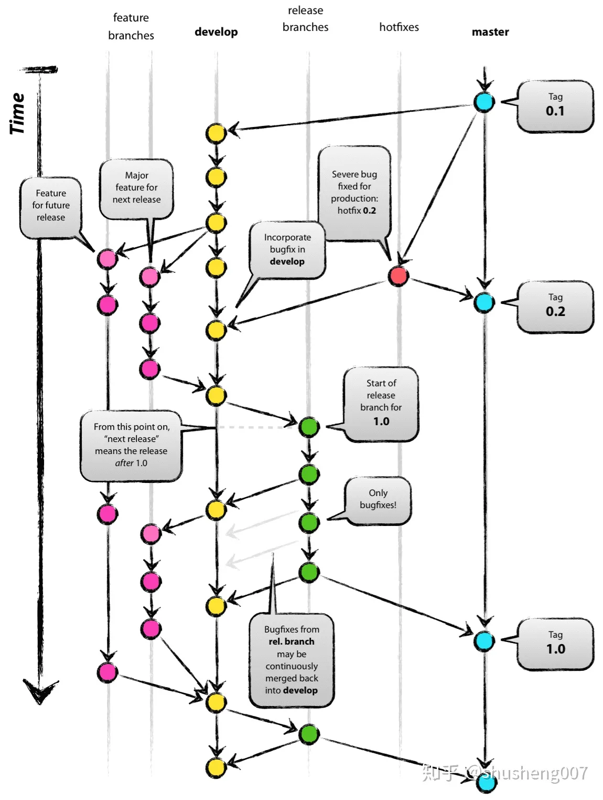
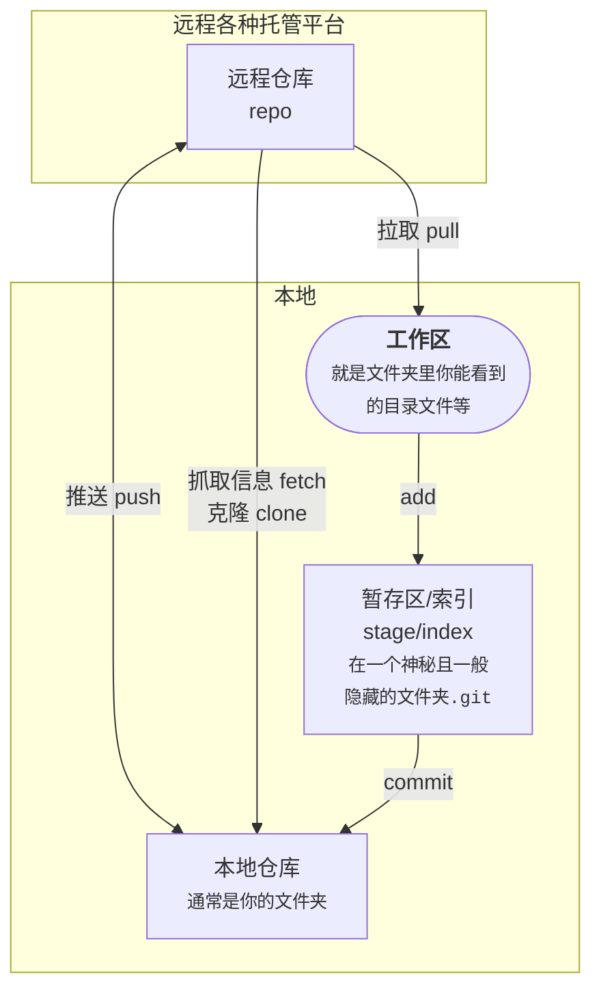

大家好呀

这篇 Markdown 旨在与大家分享如何使用 `Git` 这一个**版本控制工具**

> *Written by **ZAMBAR** *<br>
> *2023 Fall*

## 推荐阅读

> *由 [**Asta**](https://github.com/AstatineAi) 倾情推荐*

[OhShitGit](https://ohshitgit.com/zh) Git避坑指南

[GitCheatSheet](https://education.github.com/git-cheat-sheet-education.pdf) Github官方CheatSheet

## Intro

### 什么是 Git ？我为什么需要它？

假设你（Alice）和你同学（Bob、John）在一起做SI100B的Project

你可能遇到以下情况



所以你会发现，有的时候增、删、改代码都需要一次**及时并且简单的同步**，那么没关系，Git就会帮你解决这个问题

它能够（在绝大多数情况下）智能地识别你对代码的修改，基本上只要不是不同人进行了同一处地方的操作，基本都不会有问题的啦！

以上的问题，放在Git的工作流中，就会变得非常简单了！

你的工作流可能就变成了这样：



当然，Git 还有强大的分支管理功能，我们可以拉取出一个分支用来专注地进行一个特性的开发，一次紧急的 bug 修复等等，这样就避免了我们因无关的事情而进行非必要的拉取与合并。

如果你学会了分支，复杂的工作流就可以更进一步简化：


这一个像地铁线路一样的图，就是我们树枝状工作流的时间线啦！

当然，你会说，**我误删了一个代码！** 或者 **老板说用第一版！**

没关系，**Git 是一个基于修改进行记录的工具**，也就是说，你的每一次修改，**都可以无缝回滚**！对于改着改着代码就跑不起来了的程序员来说，简直就是福音！就让他来代替你的 `Ctrl`+`Z` 吧！

即便是大公司的日常的开发，也大多就是下图这样了！



所有我们需要的，只是安安心心建一个远程的代码仓库，然后一顿`add` + `commit` + `push` 组合拳，就好了！

### Git 是如何工作的？

Git 就像你的秘书，因为它是一种类似**增量**备份的一种模式，会记录下每一次你的**增、改、删**，而不是单纯的记录文件。这也是为什么它叫做**版本控制工具**，有了 Git，你就可以轻松地在不同的代码版本中切换、更新和回滚。

一般的 Git 的结构如下



> 更具体的请参见 
> [这个页面](https://www.runoob.com/git/git-workspace-index-repo.html)

### 另：fork 和 use template

- use template：对远程仓库发动“拿来把你”，~~对方由于开源精神不得不把代码连同之前的所有commit都给你（bushi~~<br>
  当然没有开源精神也不肯能会设置成模板的（

- fork：对远程仓库发动“借我使使”，对方的仓库**仍然与你有关联**，也就是对方未来的代码修改和commit你仍然可以直接合并到你 fork 的仓库。<br>
由于一般我们没有办法直接对对方的仓库进行直接的修改，所以往往会 fork 一份到本地，本地进行修改之后，如果觉得有必要可以向对方请求合并，也就是 pull request 到对方仓库（即：给你康康，你要不要嘛），对方可以考虑是否合并你的修改。

### 基本命令操作

#### `git init`

在**当前文件夹**下初始化一个本地仓库，本质上就是新建了那个神秘的 `.git` 文件夹

#### `git clone [url]`

> [!example] 
> ```bash
> git clone https://github.com/HeZeBang/ONU.git
> ```

克隆一个远程仓库/下载一个项目到当前文件夹（通常也会帮你建立好本地的仓库）

#### `git status`

显示当前的状态，包括：

- 当前分支的名称。
- 当前分支与远程分支的关系（例如，是否是最新的，领先/落后了几个 commit）。
- 未暂存的修改：显示已修改但尚未使用 `git add` 添加到暂存区的文件列表。
- 未跟踪的文件：显示尚未纳入版本控制的新文件列表。

##### `git status -s`

输出当前状态的更简短的结果，格式如下：

```
XY PATH
XY ORIGINAL_PATH -> NEW_PATH # 通常是移动了文件
```

其中，每个文件的开头会有两位的字母来代表当前文件的状态，请参考：

```
第一位X  第二位Y  Meaning
-------------------------------------------------
	     [AMD]   not updated
M        [空MTD] updated in index
T        [空MTD] type changed in index
A        [空MTD] added to index
D                deleted from index
R        [空MTD] renamed in index
C        [空MTD] copied in index
[MTARC]          index and work tree matches
[空MTARC]   M    work tree changed since index
[空MTARC]   T    type changed in work tree since index
[空MTARC]   D    deleted in work tree
	        R    renamed in work tree
	        C    copied in work tree
-------------------------------------------------
D           D    unmerged, both deleted
A           U    unmerged, added by us
U           D    unmerged, deleted by them
U           A    unmerged, added by them
D           U    unmerged, deleted by us
A           A    unmerged, both added
U           U    unmerged, both modified
-------------------------------------------------
?           ?    untracked
!           !    ignored
-------------------------------------------------
```

这个格式的含义与 VSCode 中显示工作区文件变化的方式一样（也就是你的文件名为什么会是绿的多了个U，红的多了个M等等）

#### `git add .`

让 Git 将当前目录下的所有文件**目前**看起来的样子记录下来，并丢到**暂存区**

#### `git commit -m [MESSAGE]`

> 来自作者的一句劝：好好写 commit message，**特别是你的代码还能跑起来的时候**

将**暂存区**内容添加到**本地仓库**中，并这一些更改附上 `[MESSAGE]` 的说明

> 你可能还想知道：
> - [完蛋，我刚提交 commit 就发现还有一个小改动需要添加！](https://ohshitgit.com/zh#change-last-commit)
> - [我草，我要修改我刚刚 commit 提交的信息！](https://ohshitgit.com/zh#change-last-commit-message)

#### `git push`

将**本地仓库**推送到**远程仓库**

#### `git pull`

将**远程仓库**拉取到**本地仓库**

#### Git 时光机

参阅：[哎呦我去，我刚才好像犯了个大错，能不能给我台时光机啊!?!](https://ohshitgit.com/zh#magic-time-machine)

## 准备工作

### 安装 Git

#### On Windows

如果你是使用 Windows 的用户，请

1. **右键**你的开始菜单，选择
`终端（管理员）`
或者
`Windows PowerShell（管理员）`
打开命令行/终端，
如果提示出需要管理员权限（UAC窗口），点`是`即可

2. 输入
```powershell
winget install git.git
```


3. 接下来也可能会弹出需要管理员权限的窗口，同样点`是`即可

4. 接下来就会出现Git的安装页面啦！别着急，安装完后就会自动关闭的


5. 安装完成

此时，**关闭并重新打开终端**，在终端里输入
```powershell
git -v
```
就会显示Git的版本了

#### On Mac OS / Linux

请查找对应系统 / 发行版的安装方式

### 配置身份信息 —— Tell Git who you are

> 如果你使用了 Github Desktop，请参阅[配置 Github Desktop](Git%20Guide.md#github-desktop)

在终端运行

```bash
git config --global user.email "you@example.com"
git config --global user.name "Your Name"
```

填写你的邮箱和名字

这样，在每次进行提交代码的时候，Git就可以追踪来源，也就是知道你的身份了！这样在 Code Review 的时候就可以知道是谁贡献的这个代(shi)码(shan)。

这样做可以用来区分代码贡献者，相当于一个没有密码的账号或者名片。

## 尝试图形化的交互—— Github Desktop

### 下载 Github Desktop

[这里下载](https://desktop.github.com/)

### 配置 Github Desktop

1. 选择 `Sign in to github.com` 
2. 在**浏览器**里面点`Authorize desktop`授权 
3. **非常重要！** ==这一步是配置Git的用户信息==！也就是课上出现的`Please tell me who you are`的时候的配置
   - 此处输入你的邮箱和名称即可
   - 如果进行了这一步，**上文配置Git中的配置用户身份信息的步骤就可以跳过了**
   - 

### 开始克隆一个仓库

> 相当于 `git clone`

1. 打开主界面 
2. 点击`Clone a repository from the Internet...`<br>
   此时可以选择`Local Path`来确定你的本地仓库的存放位置
   
3. 此时就可以使用图形化的操作界面啦！

### 从远程仓库拉取

> 相当于 `git pull`


点击`Pull origin`

### 做一些更改，并提交到远程仓库

> 相当于 `add` + `commit` + `push`

#### add

在 Github Desktop ，文件默认是帮你全部追踪过了的，也就是相当于帮你执行了`git add .`


#### commit

我们可以在这里 commit 一个更改，键入 Summary 作为 Commit message

点击 `Commit to main`，相当于执行了 `commit` 命令


#### push

点击 `Push origin`


## 使用 VSCode 集成的 Git 工具

