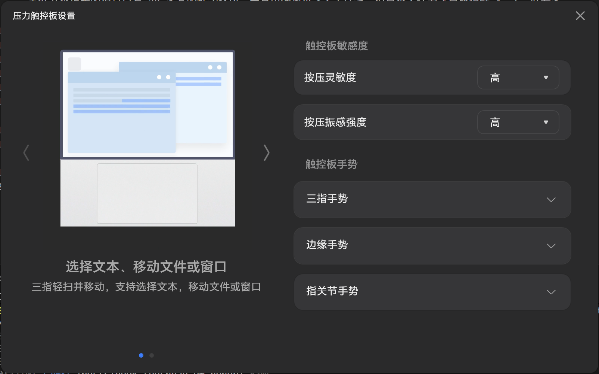
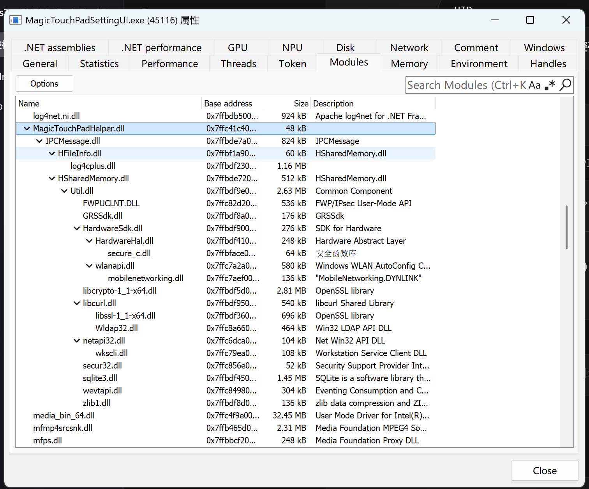
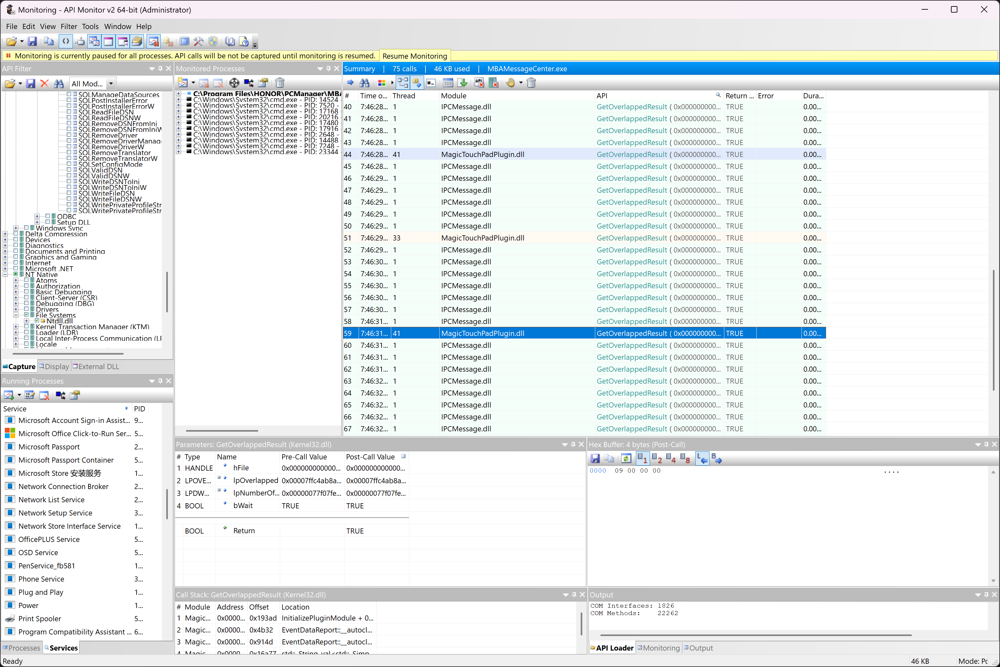
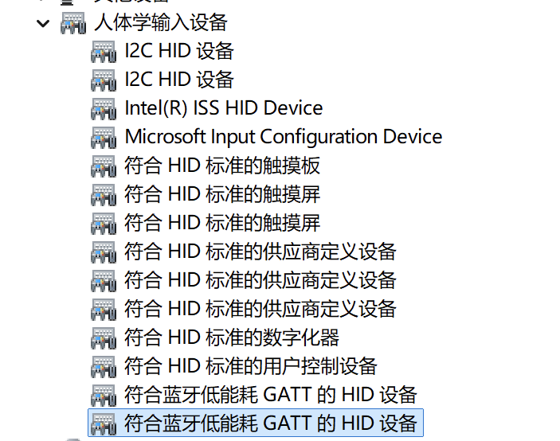
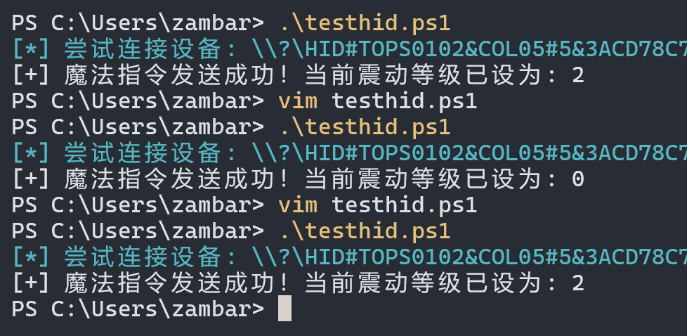

年前买了一个荣耀 MagicBook Art 14，不得不说这台机器深得我心：不止可收纳摄像头这一设计让触摸屏幕有惊人的覆盖率，还搭载了华为同款 **全域压感触控板**。要知道 40W 性能释放的 MateBook X Pro 可是我的白月光！虽然这个丐版的模具只有 20 多瓦的性能释放，而且电池也小还不支持笔，但是个人认为还是比隔壁 Apple 好看多了~

---

# 一切的开始

起因是我最近还是怀念无比我的 Hyprland 桌面，感觉没了平铺就少了点灵魂。 Komorebi 还是有各种神秘的小 bug 让我不太舒服，因此我决定把我觉得最重要的一些功能逆向并逐渐迁移到 Linux 之后再换回我的 Manjaro。

话说回来，荣耀的触控板其实有一个单独的控制面板。支持控制按压灵敏度和反馈力度（库克！苹果！），同时还支持调整边缘手势，为了简单起见，我先决定把震动反馈的设置逆向出来。



# 从控制面板入手

## UI 入口 - `MagicTouchPadSettingUI.exe`

这个控制 UI 是用 C# 写的，所以直接拖到 dnSpy 中反编译就好，可谓是最简单的一步。

首先搜索出了这些常量：

```cs
// Token: 0x0200001B RID: 27
public class GlobalConstantDefinitions
{
    // Token: 0x040000DE RID: 222
    public static string RegisterKeyForTouchPadEnableWay = "SOFTWARE\\PCManager\\TouchPadSetting";

    // Token: 0x040000DF RID: 223
    public static string RegisterKeyForSensitivityWaykey = "sensitivity";

    // Token: 0x040000E0 RID: 224
    public static string RegisterKeyForShockWaykey = "shock";

    // Token: 0x040000E1 RID: 225
    public static string RegisterKeyForTouchpadGesturesKey = "TouchpadGestures";
}
```

顺藤摸瓜，找到了下面的代码，说明他们是把配置存储在注册表的：

```cs
private string ConvertLevelTextToNumber_VibrationIntensity(string level)
{
    LogTools.LOGGER_DEBUG("ConvertLevelTextToNumber_VibrationIntensity enter", null);
    if (string.IsNullOrEmpty(level))
    {
        return "1";
    }
    string text = this.VibrationIntensityLevelResourceKeyList.FirstOrDefault(delegate(string p)
    {
        string level2 = level;
        object obj = Application.Current.TryFindResource(p);
        return level2 == ((obj != null) ? obj.ToString() : null);
    });
    if (string.IsNullOrEmpty(text))
    {
        return "1";
    }
    if (text.EndsWith("HIGH"))
    {
        return "2";
    }
    if (text.EndsWith("MIDDLE"))
    {
        return "1";
    }
    if (text.EndsWith("LOW"))
    {
        return "0";
    }
    return "1";
}
```

```powershell
> reg query HKCU\SOFTWARE\PCManager\TouchPadSetting

HKEY_CURRENT_USER\SOFTWARE\PCManager\TouchPadSetting
    touchpadenable    REG_SZ    1
    sensitivity    REG_SZ    1
    shock    REG_SZ    2
    ThreeFingerDrag    REG_SZ    0
    TripleFingerLightTouch    REG_SZ    0
    EdgeGestureAdjusBrightness    REG_SZ    1
    EdgeGestureAdjusVolume    REG_SZ    1
    EdgeGestureOpenHiCenter    REG_SZ    1
    EdgeGestureCloesOrMinWnd    REG_SZ    0
    KnuckleScreenShot    REG_SZ    1
    KnuckleRecordScreen    REG_SZ    1
    TouchpadGestures    REG_SZ    1,2,3,4,5,6,15,16,17,18,20,26,27
```

但是随后，我发现这个注册表并不与配置直接关联，这个注册表只起到保存配置的作用。

于是继续查看，发现了这个关键 `DllImport`

```cs
// Token: 0x0600003B RID: 59
[DllImport("MagicTouchPadHelper.dll")]
public static extern void ChangeShockOpt(int value);
```

## Helper Dll - `MagicTouchPadHelper.dll`

一开始我以为所有逻辑都在这个 dll 里面了，谁知拖入 IDA Pro 发现没有任何 HID / WriteFile 等相关的代码，事情就开始奇怪起来了。尝试用 API Monitor 抓设备交互，用 ProcMon 抓事件都无果，直到我尝试看了一眼程序的依赖。



居然有一个 IPC 的 `dll`，明白这个软件实际上只能发送 IPC，至于操控驱动肯定另有其人。

其实这一块之前走了很多弯路，因为我发现这个的依赖有一些类似 sdk 的库，于是对他们苦苦调试了许久，都没有抓到相关，最后只能再回来读一读 IDA 反编译的结果，打开 IDA Pro 从 Export 出口来一步一步回溯。

```asm
sub_180001960 proc near

var_18= dword ptr -18h
arg_0= qword ptr  8
arg_8= dword ptr  10h

mov     [rsp+arg_8], edx
mov     [rsp+arg_0], rcx
sub     rsp, 38h
mov     eax, [rsp+38h+arg_8]
mov     [rsp+38h+var_18], eax
xor     r9d, r9d
mov     r8d, 2400003h
mov     edx, 2400000h
mov     rcx, [rsp+38h+arg_0]
call    sub_180001C20
add     rsp, 38h
retn
sub_180001960 endp
```

这段代码给出了 `arg1` 和 `arg2` 的常量值：

```
arg0 = device handle / client
arg1 = 0x2400000
arg2 = 0x2400003
arg3 = 0
```

另外观察上下文：

```
var_48 = arg_8
var_40 = arg_10
var_3C = arg_18
```

`shock level` 对应 `mov eax, [rsp+arg_8]`，也就是 UI 传进来的 `value`，因此可以推测出 IPC 的载体大概是如下结构：

```py
opcode = 0x2400000
subcmd = 0x2400003
value  = shock_level
```

具体加上 PAD 之后：

```cpp
struct TagIPCMessageItem {
    DWORD MsgClass;      // Offset 0x00 (var_48) = 0x02400000 (消息大类)
    DWORD _pad1;         // Offset 0x04
    DWORD CommandId;     // Offset 0x08 (var_40) = 0x02400003 (调节震动的具体命令)
    DWORD Flags;         // Offset 0x0C (var_3C) = 0
    BYTE  _pad2[12];     // Offset 0x10
    DWORD DataLength;    // Offset 0x18 (var_30) = 1  (表示携带了1个单位的数据)
    DWORD _pad3;         // Offset 0x1C
    void* DataPtr;       // Offset 0x20 (var_28) = &value (指向你传入的 震动强度值 的指针)
};
```

最终沿着 `sub_180002740`（一个检查 IPC 的函数） 到 `sub_1800036B0`，现在估计就是一个完整的 IPC 调用链了，最后调用的是 `IPCMessageClient::PostIPCMessage`，说明这个库真的只是一个发送端。

## 谁是幕后？

其实一开始我想逆向出对应的 IPC 地址，把整个协议打通，但是常量池里面四分五裂的字符串，就是没有找到 `pipe` 相关的东西，即使有似乎也是例如 `iMateBookAssistant` 之类比较没用的东西。（话说这个居然是 MateBook？预备，唱：哦~爸爸妈妈给我的不少不多~）

就当我以为走头无路的时候，突然想起来，所谓的 `CommandId` 肯定有别的地方会出现，也就是 `0x02400003` 我只需要搜索 `03 00 40 02` 的小端序的特征就可以了！

于是立马交给 Gemini，由于我手头美妆 MinGW，因此让他直接用 PowerShell 写了一个：

```powershell
# 搜索目录下所有 exe 和 dll 文件
$files = Get-ChildItem -Path . -Include *.exe,*.dll -Recurse

# 定义我们要找的特征（ASCII 字符串和十六进制字节）
$searchString = "IPCMessage"
$hexPattern = "03 00 40 02" # 0x02400003 的小端序

Write-Host "开始扫描目录寻找 Service 提供者..." -ForegroundColor Cyan

foreach ($file in $files) {
    try {
        # 1. 搜字符串
        $content = Get-Content -Path $file.FullName -Raw -Encoding ascii -ErrorAction SilentlyContinue
        if ($content -match $searchString) {
            Write-Host "[!] 找到匹配字符串 '$searchString' 的文件: $($file.Name)" -ForegroundColor Green
        }

        # 2. 搜 Hex 特征码 (读取前 5MB 避免内存爆炸)
        $bytes = [System.IO.File]::ReadAllBytes($file.FullName)
        $hexString = [System.BitConverter]::ToString($bytes) -replace '-'
        $targetHex = $hexPattern -replace ' '
        
        if ($hexString.Contains($targetHex)) {
            Write-Host "[★] 找到核心指令码 '0x02400003' 的文件: $($file.Name) (极大可能是目标服务端！)" -ForegroundColor Yellow
        }
    } catch {
        # 忽略无法读取的文件
    }
}
Write-Host "扫描完成。" -ForegroundColor Cyan
```

于是找到了 `plugins/MagicTouchPadPlugin.dll` 这个头号嫌疑，但是我该追踪谁呢？

```powershell
> tasklist /m MagicTouchPadPlugin.dll

映像名称                       PID 模块
==========================================================
MBAMessageCenter.exe         15460 MagicTouchPadPlugin.dll
```

这样就明白了，宿主进程是 `MBAMessageCenter.exe`，查阅这个 `dll` 的 Exoprts 也发现了 `InitializePluginModule` 和 `UninitializePluginModule`，说明这就是用来注册各种插件的，其中触摸模块也是一个插件。

## HID - `MagicTouchPadPlugin.dll`

接下来继续尝试用 API Monitor 找 `MBAMessageCenter.exe` 的 Device 相关的请求，发现并没抓到，此时其实有点怀疑是 WMI，所以用

```powershell
Get-WmiObject -Namespace "root\wmi" -List | Where-Object {$_.Name -match "Touch" -or $_.Name -match "Haptic" -or $_.Name -match "Honor" -or $_.Name -match "Huawei"}
```

找了一下，也没有，此时我翻了翻 ImportTable，发现里面有 `WriteFile`，并且有 `SETUPAPI` 用来硬件寻址，当然也发现它导入了 `WMI` 相关的函数。于是我从 API Monitor 里面多抓了各种类型的 Device 交互和 File 交互，结果真的在每次切换的时候抓到了一个与众不同的载体：

```
#    Type    Name    Pre-Call Value    Post-Call Value
1    HANDLE    hFile    0x0000000000000b34    0x0000000000000b34
2    LPOVERLAPPED    lpOverlapped    0x00007ffc4ab8ac60 = { Internal = 0, InternalHigh = 9, { { Offset = 0, OffsetHigh = 0 }, Pointer = NULL }  ...}    0x00007ffc4ab8ac60 = { Internal = 0, InternalHigh = 9, { { Offset = 0, OffsetHigh = 0 }, Pointer = NULL }  ...}
3    LPDWORD    lpNumberOfBytesTransferred    0x00000077f1afeec8 = 9    0x00000077f1afeec8 = 9
4    BOOL    bWait    TRUE    TRUE
                
    BOOL    Return        TRUE
```



首先这是一个异步传输，而且是用来等待结果的，说明我并没抓到它通信的发送阶段，但是它告诉我们 `lpNumberOfBytesTransferred = 9` 说明向硬件发送的完整控制指令长度刚好是 9 个字节。

可惜其实我一直没找到任何 Write File 的报告，也许是权限不够？总之我还是选择找 IDA 了。

# 最后 9 字节

还是从 export table 入手，按 `X` 查到 `WriteFile` 相关的有两个：
第一个是：
```cpp
char __fastcall sub_180018F00(__int64 a1, const void *a2, DWORD a3)
{
  __int64 v3; // rax
  DWORD v4; // eax
  __int64 v6; // rax
  DWORD LastError; // eax
  __int64 v8; // rax
  DWORD v9; // eax
  __int64 v10; // [rsp+48h] [rbp-240h]
  __int64 macro_body_oss; // [rsp+58h] [rbp-230h]
  __int64 v12; // [rsp+68h] [rbp-220h]
  __int64 v13; // [rsp+70h] [rbp-218h]
  const struct log4cplus::Logger *v14; // [rsp+78h] [rbp-210h]
  __int64 v15; // [rsp+90h] [rbp-1F8h]
  __int64 v16; // [rsp+98h] [rbp-1F0h]
  __int64 v17; // [rsp+A0h] [rbp-1E8h]
  __int64 v18; // [rsp+A8h] [rbp-1E0h]
  __int64 v19; // [rsp+B0h] [rbp-1D8h]
  __int64 v20; // [rsp+C0h] [rbp-1C8h]
  const struct log4cplus::Logger *Logger; // [rsp+C8h] [rbp-1C0h]
  __int64 v22; // [rsp+E0h] [rbp-1A8h]
  __int64 v23; // [rsp+E8h] [rbp-1A0h]
  __int64 v24; // [rsp+F0h] [rbp-198h]
  __int64 v25; // [rsp+F8h] [rbp-190h]
  __int64 v26; // [rsp+100h] [rbp-188h]
  __int64 v27; // [rsp+110h] [rbp-178h]
  const struct log4cplus::Logger *v28; // [rsp+118h] [rbp-170h]
  __int64 v29; // [rsp+130h] [rbp-158h]
  __int64 v30; // [rsp+138h] [rbp-150h]
  __int64 v31; // [rsp+140h] [rbp-148h]
  __int64 v32; // [rsp+148h] [rbp-140h]
  __int64 v33; // [rsp+150h] [rbp-138h]
  char v34[32]; // [rsp+178h] [rbp-110h] BYREF
  char v35[32]; // [rsp+198h] [rbp-F0h] BYREF
  char v36[32]; // [rsp+1B8h] [rbp-D0h] BYREF
  char v37[32]; // [rsp+1D8h] [rbp-B0h] BYREF
  char v38[32]; // [rsp+1F8h] [rbp-90h] BYREF
  char v39[32]; // [rsp+218h] [rbp-70h] BYREF
  DWORD NumberOfBytesWritten; // [rsp+238h] [rbp-50h] BYREF
  char v41[16]; // [rsp+240h] [rbp-48h] BYREF
  char v42[16]; // [rsp+250h] [rbp-38h] BYREF
  char v43[16]; // [rsp+260h] [rbp-28h] BYREF

  NumberOfBytesWritten = 0;
  ResetEvent(*(HANDLE *)(a1 + 88));
  if ( WriteFile(
         *(HANDLE *)(a1 + 24),
         a2,
         *(unsigned __int16 *)(a1 + 10),
         &NumberOfBytesWritten,
         (LPOVERLAPPED)(a1 + 64))
    || GetLastError() == 997 )
  {
    if ( WaitForSingleObject(*(HANDLE *)(a1 + 88), a3) )
    {
      Logger = GetLogger();
      sub_1800031F0(v42, Logger);
      if ( log4cplus::Logger::isEnabledFor((log4cplus::Logger *)v42, 40000) )
      {
        macro_body_oss = log4cplus::detail::get_macro_body_oss();
        v22 = sub_180010FC0(v37, &unk_18004A508, "WriteToDev WaitForSingleObject error, ErrorCode:");
        v6 = sub_18000FA60(v22);
        v23 = sub_180011090(macro_body_oss, v6);
        LastError = GetLastError();
        v24 = std::wostream::operator<<(v23, LastError);
        v25 = sub_180011090(v24, "(");
        v26 = sub_180011090(v25, "HIDClient::WriteToDev");
        sub_180011090(v26, ")");
        sub_18000FA80(v37);
        v27 = sub_18000AC00(macro_body_oss, v38);
        log4cplus::detail::macro_forced_log(
          v42,
          40000i64,
          v27,
          "D:\\CDE_WORK\\workspace\\common_compile\\src\\increment\\sourcecode\\PCManager\\feature\\MagicTouchPad\\MagicT"
          "ouchPadPlugin\\HIDClient.cpp",
          226,
          "bool __cdecl HIDClient::WriteToDev(unsigned char *,unsigned long)");
        std::wstring::~wstring(v38);
      }
      log4cplus::Logger::~Logger((log4cplus::Logger *)v42);
      return 0;
    }
    else if ( GetOverlappedResult(*(HANDLE *)(a1 + 24), (LPOVERLAPPED)(a1 + 64), &NumberOfBytesWritten, 1) )
    {
      return 1;
    }
    else
    {
      v28 = GetLogger();
      sub_1800031F0(v43, v28);
      if ( log4cplus::Logger::isEnabledFor((log4cplus::Logger *)v43, 40000) )
      {
        v12 = log4cplus::detail::get_macro_body_oss();
        v29 = sub_180010FC0(v39, &unk_18004A508, "WriteToDev GetOverlappedResult error, ErrorCode:");
        v8 = sub_18000FA60(v29);
        v30 = sub_180011090(v12, v8);
        v9 = GetLastError();
        v31 = std::wostream::operator<<(v30, v9);
        v32 = sub_180011090(v31, "(");
        v33 = sub_180011090(v32, "HIDClient::WriteToDev");
        sub_180011090(v33, ")");
        sub_18000FA80(v39);
        v13 = sub_18000AC00(v12, v34);
        log4cplus::detail::macro_forced_log(
          v43,
          40000i64,
          v13,
          "D:\\CDE_WORK\\workspace\\common_compile\\src\\increment\\sourcecode\\PCManager\\feature\\MagicTouchPad\\MagicT"
          "ouchPadPlugin\\HIDClient.cpp",
          232,
          "bool __cdecl HIDClient::WriteToDev(unsigned char *,unsigned long)");
        std::wstring::~wstring(v34);
      }
      log4cplus::Logger::~Logger((log4cplus::Logger *)v43);
      return 0;
    }
  }
  else
  {
    v14 = GetLogger();
    sub_1800031F0(v41, v14);
    if ( log4cplus::Logger::isEnabledFor((log4cplus::Logger *)v41, 40000) )
    {
      v10 = log4cplus::detail::get_macro_body_oss();
      v15 = sub_180010FC0(v35, &unk_18004A508, "WriteToDev WriteFile error, ErrorCode:");
      v3 = sub_18000FA60(v15);
      v16 = sub_180011090(v10, v3);
      v4 = GetLastError();
      v17 = std::wostream::operator<<(v16, v4);
      v18 = sub_180011090(v17, "(");
      v19 = sub_180011090(v18, "HIDClient::WriteToDev");
      sub_180011090(v19, ")");
      sub_18000FA80(v35);
      v20 = sub_18000AC00(v10, v36);
      log4cplus::detail::macro_forced_log(
        v41,
        40000i64,
        v20,
        "D:\\CDE_WORK\\workspace\\common_compile\\src\\increment\\sourcecode\\PCManager\\feature\\MagicTouchPad\\MagicTou"
        "chPadPlugin\\HIDClient.cpp",
        218,
        "bool __cdecl HIDClient::WriteToDev(unsigned char *,unsigned long)");
      std::wstring::~wstring(v36);
    }
    log4cplus::Logger::~Logger((log4cplus::Logger *)v41);
    CancelIo(*(HANDLE *)(a1 + 24));
    return 0;
  }
}
```

第二个是：

```cpp
char __fastcall sub_180018F00(__int64 a1, const void *a2, DWORD a3)
{
  __int64 v3; // rax
  DWORD v4; // eax
  __int64 v6; // rax
  DWORD LastError; // eax
  __int64 v8; // rax
  DWORD v9; // eax
  __int64 v10; // [rsp+48h] [rbp-240h]
  __int64 macro_body_oss; // [rsp+58h] [rbp-230h]
  __int64 v12; // [rsp+68h] [rbp-220h]
  __int64 v13; // [rsp+70h] [rbp-218h]
  const struct log4cplus::Logger *v14; // [rsp+78h] [rbp-210h]
  __int64 v15; // [rsp+90h] [rbp-1F8h]
  __int64 v16; // [rsp+98h] [rbp-1F0h]
  __int64 v17; // [rsp+A0h] [rbp-1E8h]
  __int64 v18; // [rsp+A8h] [rbp-1E0h]
  __int64 v19; // [rsp+B0h] [rbp-1D8h]
  __int64 v20; // [rsp+C0h] [rbp-1C8h]
  const struct log4cplus::Logger *Logger; // [rsp+C8h] [rbp-1C0h]
  __int64 v22; // [rsp+E0h] [rbp-1A8h]
  __int64 v23; // [rsp+E8h] [rbp-1A0h]
  __int64 v24; // [rsp+F0h] [rbp-198h]
  __int64 v25; // [rsp+F8h] [rbp-190h]
  __int64 v26; // [rsp+100h] [rbp-188h]
  __int64 v27; // [rsp+110h] [rbp-178h]
  const struct log4cplus::Logger *v28; // [rsp+118h] [rbp-170h]
  __int64 v29; // [rsp+130h] [rbp-158h]
  __int64 v30; // [rsp+138h] [rbp-150h]
  __int64 v31; // [rsp+140h] [rbp-148h]
  __int64 v32; // [rsp+148h] [rbp-140h]
  __int64 v33; // [rsp+150h] [rbp-138h]
  char v34[32]; // [rsp+178h] [rbp-110h] BYREF
  char v35[32]; // [rsp+198h] [rbp-F0h] BYREF
  char v36[32]; // [rsp+1B8h] [rbp-D0h] BYREF
  char v37[32]; // [rsp+1D8h] [rbp-B0h] BYREF
  char v38[32]; // [rsp+1F8h] [rbp-90h] BYREF
  char v39[32]; // [rsp+218h] [rbp-70h] BYREF
  DWORD NumberOfBytesWritten; // [rsp+238h] [rbp-50h] BYREF
  char v41[16]; // [rsp+240h] [rbp-48h] BYREF
  char v42[16]; // [rsp+250h] [rbp-38h] BYREF
  char v43[16]; // [rsp+260h] [rbp-28h] BYREF

  NumberOfBytesWritten = 0;
  ResetEvent(*(HANDLE *)(a1 + 88));
  if ( WriteFile(
         *(HANDLE *)(a1 + 24),
         a2,
         *(unsigned __int16 *)(a1 + 10),
         &NumberOfBytesWritten,
         (LPOVERLAPPED)(a1 + 64))
    || GetLastError() == 997 )
  {
    if ( WaitForSingleObject(*(HANDLE *)(a1 + 88), a3) )
    {
      Logger = GetLogger();
      sub_1800031F0(v42, Logger);
      if ( log4cplus::Logger::isEnabledFor((log4cplus::Logger *)v42, 40000) )
      {
        macro_body_oss = log4cplus::detail::get_macro_body_oss();
        v22 = sub_180010FC0(v37, &unk_18004A508, "WriteToDev WaitForSingleObject error, ErrorCode:");
        v6 = sub_18000FA60(v22);
        v23 = sub_180011090(macro_body_oss, v6);
        LastError = GetLastError();
        v24 = std::wostream::operator<<(v23, LastError);
        v25 = sub_180011090(v24, "(");
        v26 = sub_180011090(v25, "HIDClient::WriteToDev");
        sub_180011090(v26, ")");
        sub_18000FA80(v37);
        v27 = sub_18000AC00(macro_body_oss, v38);
        log4cplus::detail::macro_forced_log(
          v42,
          40000i64,
          v27,
          "D:\\CDE_WORK\\workspace\\common_compile\\src\\increment\\sourcecode\\PCManager\\feature\\MagicTouchPad\\MagicT"
          "ouchPadPlugin\\HIDClient.cpp",
          226,
          "bool __cdecl HIDClient::WriteToDev(unsigned char *,unsigned long)");
        std::wstring::~wstring(v38);
      }
      log4cplus::Logger::~Logger((log4cplus::Logger *)v42);
      return 0;
    }
    else if ( GetOverlappedResult(*(HANDLE *)(a1 + 24), (LPOVERLAPPED)(a1 + 64), &NumberOfBytesWritten, 1) )
    {
      return 1;
    }
    else
    {
      v28 = GetLogger();
      sub_1800031F0(v43, v28);
      if ( log4cplus::Logger::isEnabledFor((log4cplus::Logger *)v43, 40000) )
      {
        v12 = log4cplus::detail::get_macro_body_oss();
        v29 = sub_180010FC0(v39, &unk_18004A508, "WriteToDev GetOverlappedResult error, ErrorCode:");
        v8 = sub_18000FA60(v29);
        v30 = sub_180011090(v12, v8);
        v9 = GetLastError();
        v31 = std::wostream::operator<<(v30, v9);
        v32 = sub_180011090(v31, "(");
        v33 = sub_180011090(v32, "HIDClient::WriteToDev");
        sub_180011090(v33, ")");
        sub_18000FA80(v39);
        v13 = sub_18000AC00(v12, v34);
        log4cplus::detail::macro_forced_log(
          v43,
          40000i64,
          v13,
          "D:\\CDE_WORK\\workspace\\common_compile\\src\\increment\\sourcecode\\PCManager\\feature\\MagicTouchPad\\MagicT"
          "ouchPadPlugin\\HIDClient.cpp",
          232,
          "bool __cdecl HIDClient::WriteToDev(unsigned char *,unsigned long)");
        std::wstring::~wstring(v34);
      }
      log4cplus::Logger::~Logger((log4cplus::Logger *)v43);
      return 0;
    }
  }
  else
  {
    v14 = GetLogger();
    sub_1800031F0(v41, v14);
    if ( log4cplus::Logger::isEnabledFor((log4cplus::Logger *)v41, 40000) )
    {
      v10 = log4cplus::detail::get_macro_body_oss();
      v15 = sub_180010FC0(v35, &unk_18004A508, "WriteToDev WriteFile error, ErrorCode:");
      v3 = sub_18000FA60(v15);
      v16 = sub_180011090(v10, v3);
      v4 = GetLastError();
      v17 = std::wostream::operator<<(v16, v4);
      v18 = sub_180011090(v17, "(");
      v19 = sub_180011090(v18, "HIDClient::WriteToDev");
      sub_180011090(v19, ")");
      sub_18000FA80(v35);
      v20 = sub_18000AC00(v10, v36);
      log4cplus::detail::macro_forced_log(
        v41,
        40000i64,
        v20,
        "D:\\CDE_WORK\\workspace\\common_compile\\src\\increment\\sourcecode\\PCManager\\feature\\MagicTouchPad\\MagicTou"
        "chPadPlugin\\HIDClient.cpp",
        218,
        "bool __cdecl HIDClient::WriteToDev(unsigned char *,unsigned long)");
      std::wstring::~wstring(v36);
    }
    log4cplus::Logger::~Logger((log4cplus::Logger *)v41);
    CancelIo(*(HANDLE *)(a1 + 24));
    return 0;
  }
}
```

其中，我们发现硬编码的 `bool __cdecl HIDClient::WriteToDev(unsigned char *,unsigned long)` 签名，说明这肯定就是 HID 的协议了。

继续推参数：

```cpp
WriteFile(
    *(HANDLE *)(a1 + 24),    // 设备句柄 (0xb34)
    a2,                      // 9字节 Payload
    *(unsigned __int16 *)(a1 + 10), // 发送的长度 9
    &NumberOfBytesWritten,
    (LPOVERLAPPED)(a1 + 64)  // 异步结构体
)
```

由于这个 `sub_180018F00` 其实就是 `HIDClient::WriteToDev`，所以继续找上一层才是具体的构造，看来近在咫尺了。

```
Direction	Type	Address	Text
Up	p	sub_1800048B0+ED	call    sub_180018F00
Up	p	sub_180004A40+ED	call    sub_180018F00
Up	p	sub_180004BD0+ED	call    sub_180018F00
Up	p	sub_180004D60+ED	call    sub_180018F00
Up	p	sub_180004EF0+ED	call    sub_180018F00
Up	p	sub_180004EF0+1BA	call    sub_180018F00
Up	p	sub_180005160+ED	call    sub_180018F00
Up	p	sub_1800052F0+ED	call    sub_180018F00
Up	p	sub_180005480+ED	call    sub_180018F00
Up	p	sub_180005610+ED	call    sub_180018F00
Up	p	sub_1800057A0+ED	call    sub_180018F00
Up	p	sub_180005930+ED	call    sub_180018F00
Up	p	sub_180005AC0+D3	call    sub_180018F00
Up	p	sub_180005BC0+ED	call    sub_180018F00
Up	p	sub_180005D50+ED	call    sub_180018F00
Up	p	sub_180005EE0+ED	call    sub_180018F00
Up	p	sub_180006070+ED	call    sub_180018F00
Up	p	sub_180006200+ED	call    sub_180018F00
Up	p	sub_180006590+177	call    sub_180018F00
Up	p	sub_180007300+1A7	call    sub_180018F00
Down	o	.pdata:000000018004CAD0	RUNTIME_FUNCTION <rva sub_180018F00, rva algn_18001959B, \
```

所幸，最近的两个函数刚好是我们想要的，里面还正好有我们需要的硬编码的 `shock` 和 `sensitivity`，刚好对应了反馈强度和敏感度。

```cpp
__int64 __fastcall sub_1800048B0(__int64 a1, unsigned __int8 a2)
{
  __int64 v2; // rax
  __int64 v3; // rax
  __int64 v4; // rax
  unsigned __int8 *v6; // [rsp+28h] [rbp-A0h]
  void *v7; // [rsp+30h] [rbp-98h]
  __int64 v8; // [rsp+38h] [rbp-90h]
  __int64 v9; // [rsp+58h] [rbp-70h]
  __int64 v10; // [rsp+60h] [rbp-68h]
  char v11[32]; // [rsp+68h] [rbp-60h] BYREF
  char v12[32]; // [rsp+88h] [rbp-40h] BYREF
  char v13[8]; // [rsp+A8h] [rbp-20h] BYREF

  EventDataReport::__autoclassinit2((EventDataReport *)v13, 8ui64);
  v2 = sub_1800171E0();
  v7 = operator new(*(unsigned __int16 *)(v2 + 10));
  std::_Unique_ptr_base<std::_Facet_base,std::default_delete<std::_Facet_base>>::_Unique_ptr_base<std::_Facet_base,std::default_delete<std::_Facet_base>>(
    v13,
    v7);
  v6 = (unsigned __int8 *)unknown_libname_132(v13);
  v8 = *(unsigned __int16 *)(sub_1800171E0() + 10);
  v3 = sub_1800171E0();
  memset_s(v6, *(unsigned __int16 *)(v3 + 10), 0i64, v8);
  *v6 = 14;
  v6[1] = 1;
  v6[2] = a2;
  v4 = sub_1800171E0();
  sub_180018F00(v4, v6, 0x7530u);
  v9 = sub_180002D00(v11, v6[2]);
  v10 = std::wstring::wstring(v12, L"sensitivity");
  sub_180006390(a1, v10, v9);
  return sub_18000AC60(v13);
}

__int64 __fastcall sub_180004A40(__int64 a1, unsigned __int8 a2)
{
  __int64 v2; // rax
  __int64 v3; // rax
  __int64 v4; // rax
  unsigned __int8 *v6; // [rsp+28h] [rbp-A0h]
  void *v7; // [rsp+30h] [rbp-98h]
  __int64 v8; // [rsp+38h] [rbp-90h]
  __int64 v9; // [rsp+58h] [rbp-70h]
  __int64 v10; // [rsp+60h] [rbp-68h]
  char v11[32]; // [rsp+68h] [rbp-60h] BYREF
  char v12[32]; // [rsp+88h] [rbp-40h] BYREF
  char v13[8]; // [rsp+A8h] [rbp-20h] BYREF

  EventDataReport::__autoclassinit2((EventDataReport *)v13, 8ui64);
  v2 = sub_1800171E0();
  v7 = operator new(*(unsigned __int16 *)(v2 + 10));
  std::_Unique_ptr_base<std::_Facet_base,std::default_delete<std::_Facet_base>>::_Unique_ptr_base<std::_Facet_base,std::default_delete<std::_Facet_base>>(
    v13,
    v7);
  v6 = (unsigned __int8 *)unknown_libname_132(v13);
  v8 = *(unsigned __int16 *)(sub_1800171E0() + 10);
  v3 = sub_1800171E0();
  memset_s(v6, *(unsigned __int16 *)(v3 + 10), 0i64, v8);
  *v6 = 14;
  v6[1] = 2;
  v6[2] = a2;
  v4 = sub_1800171E0();
  sub_180018F00(v4, v6, 0x7530u);
  v9 = sub_180002D00(v11, v6[2]);
  v10 = std::wstring::wstring(v12, L"shock");
  sub_180006390(a1, v10, v9);
  return sub_18000AC60(v13);
}
```

同样查看对于 `v6` 载体的构造，我们可以整理出：

| Offset | Hex | Desc |
| --- | --- | --- |
| 0 | `0x0E` | Report ID，写死|
| 1 | `0x02` | Command ID，`0x01` 代表灵敏度，`0x02` 代表反馈强度 |
| 2 | `0x0?` | 具体的 Value |
| 3~8 | `0x00` | Padding |

🎊 终于逆向出来了！

# Windows 上的测试

话不多说，先让 Gemini 生成一个 Powershell 脚本用来测试。

```powershell
# 1. ！！！把这里替换为你在设备管理器里复制的“设备实例路径”！！！
$instancePath = "HID\VID_0000&PID_0000\5&12345678&0&0000"

# 2. 自动将其转换为 Windows 底层 CreateFile 所需的设备系统路径 (加入 HID GUID)
$devicePath = "\\?\" + ($instancePath -replace '\\', '#') + "#{4d1e55b2-f16f-11cf-88cb-001111000030}"
Write-Host "[*] 尝试连接设备: $devicePath" -ForegroundColor Cyan

# 3. 嵌入 C# 代码调用底层的 Kernel32.dll
$code = @"
using System;
using System.Runtime.InteropServices;
using Microsoft.Win32.SafeHandles;

public class TouchpadHaptic {
    [DllImport("kernel32.dll", SetLastError = true, CharSet = CharSet.Auto)]
    public static extern SafeFileHandle CreateFile(string lpFileName, uint dwDesiredAccess, uint dwShareMode, IntPtr SecurityAttributes, uint dwCreationDisposition, uint dwFlagsAndAttributes, IntPtr hTemplateFile);

    [DllImport("kernel32.dll", SetLastError = true)]
    public static extern bool WriteFile(SafeFileHandle hFile, byte[] lpBuffer, uint nNumberOfBytesToWrite, out uint lpNumberOfBytesWritten, IntPtr lpOverlapped);

    public static void SetShockLevel(string path, byte level) {
        // 0xC0000000 = GENERIC_READ | GENERIC_WRITE
        // 3 = FILE_SHARE_READ | FILE_SHARE_WRITE
        // 3 = OPEN_EXISTING
        SafeFileHandle handle = CreateFile(path, 0xC0000000, 3, IntPtr.Zero, 3, 0x00000080, IntPtr.Zero);
        
        if (handle.IsInvalid) {
            int err = Marshal.GetLastWin32Error();
            if (err == 5) Console.WriteLine("[-] 错误 5: 拒绝访问。请确保使用管理员权限运行 PowerShell！");
            else if (err == 32) Console.WriteLine("[-] 错误 32: 共享冲突。官方软件正在占用触控板，请先在任务管理器中结束 MBAMessageCenter 进程！");
            else Console.WriteLine("[-] 无法打开设备，错误码: " + err + " (请检查设备实例路径是否正确)");
            return;
        }

        // 构造我们的 9 字节弹药！
        byte[] buffer = new byte[9];
        buffer[0] = 0x0E;  // Report ID
        buffer[1] = 0x02;  // Command: 调节震动
        buffer[2] = level; // 震动强度 (0, 1, 2)
        // 剩下的 [3] 到 [8] 在 C# 中默认初始化为 0x00，无需手动赋值

        uint written = 0;
        bool success = WriteFile(handle, buffer, (uint)buffer.Length, out written, IntPtr.Zero);
        
        if (success && written == 9) {
            Console.WriteLine("[+] 魔法指令发送成功！当前震动等级已设为: " + level);
        } else {
            Console.WriteLine("[-] 写入失败，错误码: " + Marshal.GetLastWin32Error());
        }
        
        handle.Close();
    }
}
"@

# 编译并加载 C# 类型
Add-Type -TypeDefinition $code

# ==========================================
# 4. 你可以修改这里的数字测试：0 (低), 1 (中), 2 (高)
[TouchpadHaptic]::SetShockLevel($devicePath, 2)
# ==========================================
```

然后我们需要获取设备具体的地址。



从设备管理器看到还是有很多 HID 设备的，当然，我第一步测试的是 `符合 HID 标准的触摸板`，地址在 `TOPS0102&COL03`，结果不出所料失败了。

此时我以为是系统管家占用了通道，退出之后发现他还是失败。在 Gemini 指点下发现：

> 在 Windows 中，负责“移动鼠标指针”和“多指手势”的核心触控板节点，会被 Windows 系统的内核驱动（如 mouhid.sys 或 mtconfig.sys）独占锁定，防止恶意软件读取你的输入。
> 
> OEM 厂商为了绕过 Windows 的这个锁定，会在同一个物理设备上暴露多个 Top-Level Collection

于是继续看它们的硬件 ID，找到含有 `TOPS0102` 的，发现一个是 `TOPS0102&COL05`，立马填上去……

# 成功！



终于！通信正常，同时也发现触感调节也是正常的。

# 下一步还有什么？

虽然这一步结束了，但是接下来还有一些目标没有实现：

- 首先就是移植到 Linux 进行测试
- 其次，一般而言，退出了管家就没有边缘手势调节音量和亮度的触感反馈和功能了
- 但是之前调用发现，即使退出了管家，在设置了震动强度之后，仍然有边缘手势的触感反馈，只是没有效果
- 因此，似乎边界调节音量的 hook 也有可能？
- 以此类推，指关节截图功能？真的可以实现吗……

_未完待续……_