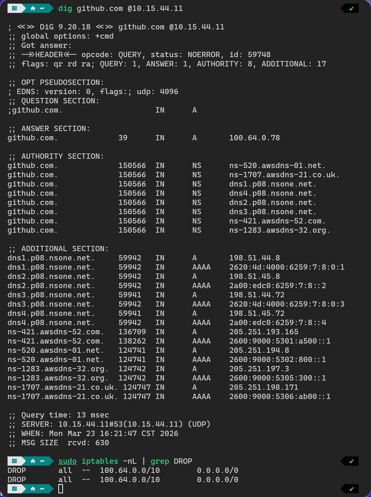

我的 Tailscale 在 Windows 下运行的非常好，可以直接通过单域名补全来美美访问例如 `zambar-nas` 这样的短域名并补全。但是在 Linux 下面有一点问题。

## 校园网的透明代理

其实我不太记得这个问题到底是 Linux 独有还是 Windows 也有但是没有表现出来，实际上在我使用的时候，我 `dig github.com` 发现校园网会将 DNS 查询劫持到校内代理服务器，但是由于它刚好是和 Tailscale 的保留网段重合，所以会被直接 DROP 掉，非常苦恼。



其实这是因为 Tailscale 独占了这个网段之后为了安全起见，所有非 Tailscale 进入该网段的都会被当成非法伪造而 DROP，但是偏偏预留网段这么多，就是在这里撞上了，也是苦恼……

## 转向 MagicDNS

于是我在 MagicDNS 上指定了，对于 `github.com` domain 使用 Cloudflare 的 DNS 来解析，这套系统最初在 Windows 上工作良好，至少我在 clone 的时候都没有遇到别的问题了。

但是在 Linux 下，即便我打开了 Tailscale 的接管 DNS，我发现一个很诡异的问题：

> **我的 DNS 会时而返回正常的公网 IP，时而又会返回 100.64.0.78**，而且都还是 100.100.100.100 这个 Tailscale DNS 返回的！

## 劫持

这里就不得不说我们学校为了加速或者重定向到内网 IP，会劫持 DNS 的习惯了（虽然可能大多数学校都这么做？但是劫持还是真的流氓啊）。因此我推测，当我们走 UDP 发送非 DoH 的 DNS 请求的时候，会导致它被 sniff 到然后强制替换成学校的 DNS 结果……事实虽然不能直接证明，但是看到 dig 返回的是一模一样的 SECTION 结果，这个原因真的不能再真……

## `systemd-resolved`

于是我把目光转向 resolved，由于当前 DNS 是 NetworkManager 管理的，所以首先就是备份 `/etc/resolve.conf` 然后软链接：

```bash
sudo ln -sf /run/systemd/resolve/stub-resolv.conf /etc/resolv.conf
```

接下来编辑 `/etc/systemd/resolved.conf`，这里面我射值得是对 GitHub 类域名特判：

```ini
[Resolve]
# ...
DNS=1.1.1.1 1.0.0.1 100.100.100.100
FallbackDNS=9.9.9.9#dns.quad9.net 2620:fe::9#dns.quad9.net 1.1.1.1#cloudflare-dns.com 2606:4700:4700::1111#cloudflare-dns.com 8.8.8.8#dns.google 2001:4860:4860::8888#dns.google
Domains=~github.com ~githubusercontent.com ~githubassets.com
DNSSEC=allow-downgrade
DNSOverTLS=opportunistic # 虽然是防止劫持，但 yes 太严格了，可能会 fallback 到校内 DNS 失败
# ...
```

接下来重启服务就好了……吗？

## 让 Tailscale 识别到 resolved

如果 Tailscale 没识别到任何 DNS 管理器就会直接替换 `/etc/resolve.conf`。所以我们重启一次 Tailscale 服务就可以了。这时 `tailscale up --accept-dns=true` 就可以发挥作用了。

## Search Domain

默认情况下，自动生成的 `/etc/resolv.conf` 里

```
search .
```

这就等价于“永远不补全”，但是实际上，我们的短 hostname 是以来 Tailscale 分配给你的 `*.<your-id>.ts.net` 的补全的，因此在开启 `--accept-dns` 之后就会改成

```
search <your-id>.ts.net
```

因此你就能快乐地使用直域名了！

> Cover 来自我喜欢的画师 [上倉エク](https://www.pixiv.net/users/299299)
> 
> 