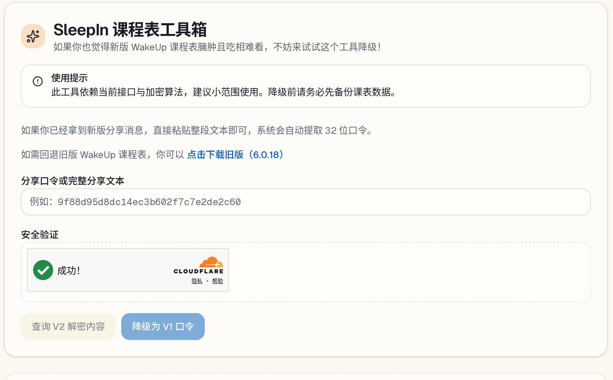

# 开发动机

我是 WakeUp 课程表的忠实用户，他一直陪伴了我整个大学生活。当时为了支持开发者，在“解锁高级功能”里自发捐赠过。

不过现在的 WakeUp 似乎被招安了，充斥着 AI 和账户这些没用的功能，每次启动还要看广告。特别是最近的版本，还把备份功能删除了。美其名曰“保护隐私”，实际上就是防止降级。

如果直接调用旧版 API 获取新版的课程表，会提示你版本过旧。新版本 API 还有神秘的百度 SDK 签名和保护，吃相过于难看了。

配合 Frida 和 Unidbg 一通操作之后，也算是半逆向出来了这个的签发逻辑。这一段踩了不少坑，不过时代变了，AI 还是帮助真大。

所幸数据格式没怎么变（说明招安之后净塞广告去了！！！），加了点简单验证和包装之后做成了个网站，希望能帮到降级的朋友们。

https://wakeup.zambar.dev/

目前网站支持提取并转换成旧版链接，或者干脆绕过服务器，转换成备份文件给旧版直接导入。为了防止滥用加了一个 Turnstile 验证，不过目前闭源，毕竟这种东西还是最好闷声大发财（x，如果有课程表想来集成我的功能，也欢迎来联系我！

# 关于 Sleep In

Wake Up 意为起床，因此我给这个项目也取了一个动词+小品词的反义词短语——Sleep In，意为赖床。之后也许还会开发成 SleepIn 课程表呢 XD，那么 SleepIn 企划也算是从此开始了。也希望各位的大学生活能多多赖床，远离早八！